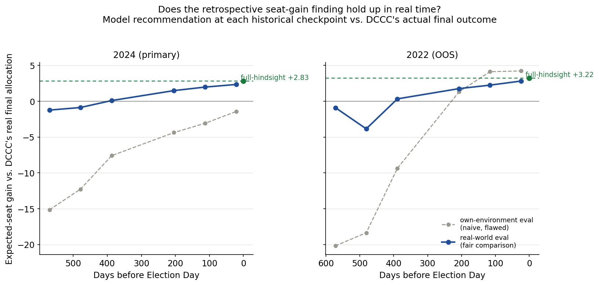
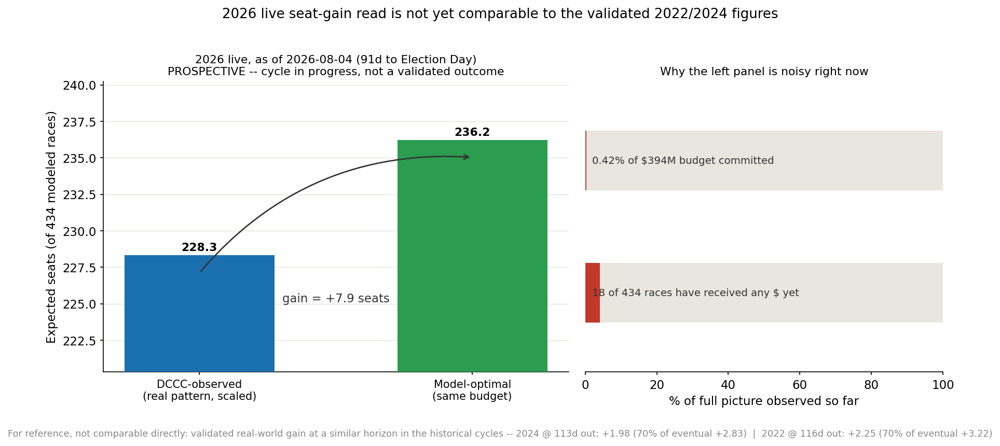
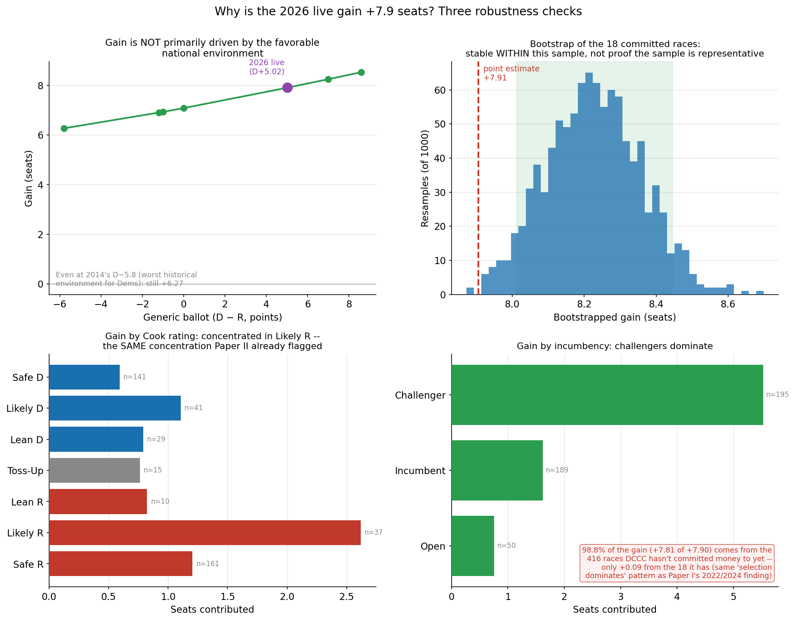
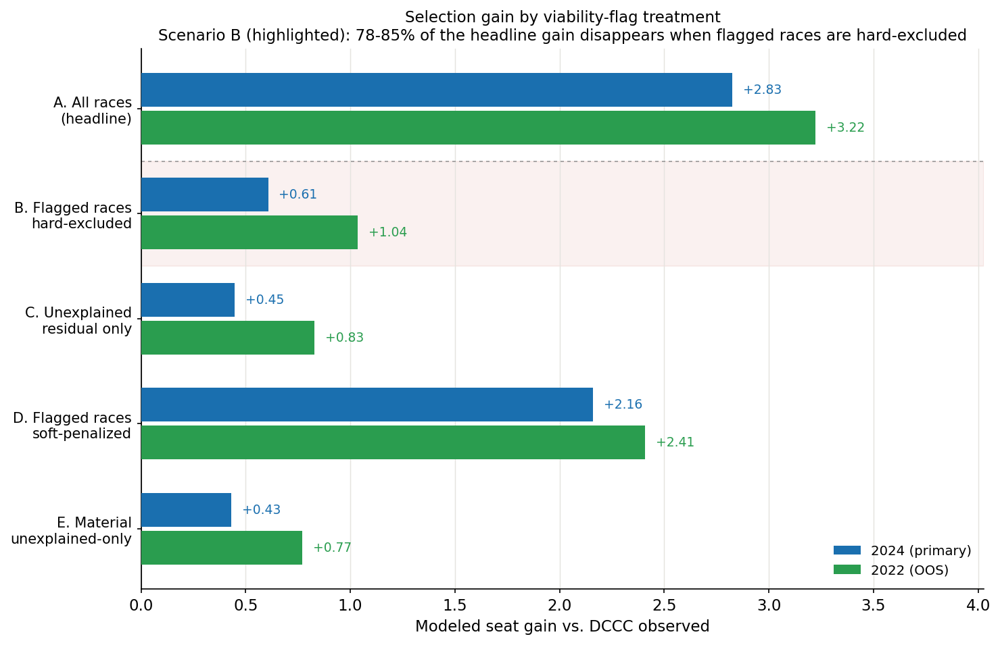
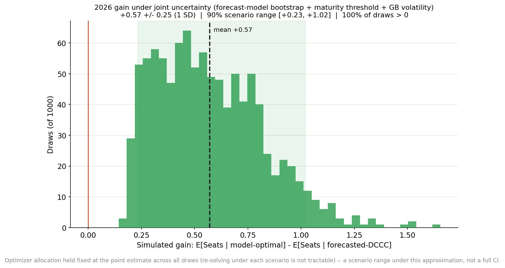

**Date:** 2026-08-04, updated 2026-08-05
**Companion to:** Paper I (`paper/paper1_final.md`), Paper II (`docs/paper2_draft.md`)
**Status:** investigation log, written up after the fact from a single working session (Sections 0-11), then extended in a follow-up session (Sections 12-16) that built the five items Section 11 had identified as still open. Numbers below were verified by direct script runs, not estimated from memory; every figure cites the script and output file that produced it.

## 0. The motivating question

Paper I finds a **+2.83 seat** (2024) / **+3.22 seat** (2022 OOS) model-implied gain from reallocating DCCC's party budget according to marginal seat gain (MSG), validated against completed cycles with full hindsight. The open question this document investigates: **is that number visible in real time, or is it a hindsight artifact** — and can the same architecture be trusted on the live, in-progress 2026 cycle?

This is not a new question for the project — Paper I's own conclusion names it directly: *"a question the public data underlying this framework cannot resolve on its own."* This document is the record of actually chasing it, across several linked investigations, three real bugs, and one methodological fix that worked on its second attempt.

---

## 1. Omitted-information audit

**Script:** `scripts/audit_omitted_information.py` · **Outputs:** `outputs/omitted_information_audit{,_2022}.csv`, `outputs/omitted_information_audit_summary{,_2022}.json`

91% of Paper I's 2024 gain (83% in 2022) comes from funding 64/72 races DCCC gave zero party dollars to (Paper I Table 5, the selection-vs-intensity decomposition). The first question: do those races have a plausible public-data explanation for DCCC's non-engagement (weak fundraising, thin grassroots support, being financially overwhelmed by the opponent), or are they unexplained?

| | 2024 | 2022 (OOS) |
|---|---|---|
| Newly-funded races | 64 | 72 |
| Explicable by at least 1 viability flag | 56 (87.5%) | 60 (83.3%) |
| **Unexplained** | **8 (12.5%)** | **12 (16.7%)** |
| Unexplained *and* not a marginal/rounding-sized recommendation | 5 (7.8%) | 6 (8.3%) |

Both cycles land in the same range, and the residual is small and stable, not cycle-specific — a real out-of-sample replication of the audit's own conclusion, not just of the headline seat-gain number.

## 2. Persuasion-ceiling saturation check on the residual

**Script:** `scripts/check_deep_pvi_ceiling.py` · **Outputs:** `outputs/deep_pvi_ceiling_*.csv`, `outputs/flagged_ceiling_*.csv`

Two checks on the unexplained residual: how much of each race's persuasion-ceiling headroom is actually used (saturation), and whether the race stays selected across a 7-point c_max robustness sweep ({3,5,7,10,15,20,30}, the same range behind Paper I's own calibration).

- **2022's 6 deep-PVI (|PVI|>15) races:** 3 of 6 (AZ-09, CA-36, NC-04) robust across the full sweep; 2 (MD-07, TN-09) are ceiling-dependent and 95–96% saturated — real reasons to discount those two specifically.
- **2024's 5 unexplained-and-material residual races** (PA-01, AZ-02, MT-01, CA-09, CO-04): all 5 pass clean — selected at every c_max, saturation tops out at 70%, and three of five get *less* money as the ceiling loosens (the opposite of an extrapolation artifact).

Conclusion at this point: the retrospective finding survives its own internal-consistency checks. It does not yet answer whether it's causally real.

---

## 3. Why does the real-time signal diverge from the retrospective one?

The next question, given directly: *"We can find 2.8 seats historically using the model, but not predictively."* This section is the record of chasing that gap — which turned out to run through two real bugs before landing on the actual answer.

### 3.1 First hypothesis: a portfolio-level persuasion ceiling

**Code:** `model/ceiling.py`'s `maturity()`, `config.yaml`'s `persuasion_ceiling.floor_maturity_reference_dollars`

Initial checkpoint sweep (reconstructing each race's real, dated spending at historical FEC filing dates, running the model's full-budget optimizer on that snapshot, comparing against DCCC's real final outcome) blew up to **10x the validated hindsight figure** early in a cycle (+27.6 to +34.2 seats at ~570 days out, 2024/2022 respectively). Hypothesis: with every race simultaneously near its own floor early in a cycle, each one independently exploits its own (individually well-calibrated) persuasion ceiling, and the aggregate compounds.

Built a floor-maturity scaling correction — shrinks the ceiling in proportion to how little real combined D+R spending a race has accumulated, using a reference level (`$6,915,158`, the 25th percentile of 2024 competitive-race final combined spend) below which a race's win-probability read is treated as too noise-dominated to trust. Backward-compatible: `floor_maturity` defaults to `None` everywhere, so Paper I's validated numbers are untouched unless a caller opts in.

**Result: it made the checkpoint sweep worse, not better** (2024 at 570 days out: −15.2 to −19.3 with the correction). Investigating why surfaced the two real bugs below — the portfolio-ceiling hypothesis was solving a problem that turned out not to be the real one.

### 3.2 Bug #1: the candidate floor was never actually reconstructed

**Fixed in:** `src/backtest/dynamic/simulate.py`, `_reconstruct_races_at()`

`_reconstruct_races_at()`'s own docstring claimed candidate-committee spend was "applied dynamically... instead of being folded into this fixed total" — true for `d_total`/`r_total`, but `cand_d_total` (the field every optimizer and ceiling call actually reads as a race's floor) was never touched by the function's `dataclasses.replace()` call. Every historical checkpoint was silently using the cycle-*final* candidate floor, not the period-specific one. No existing test caught it — the one test covering this function only asserted `d_total`.

Fix: add `cand_d_total=d_cand` to the replace call. Verified against the full `test_dynamic_*.py` suite (32 tests, all pass) before proceeding.

### 3.3 Bug #2: comparing two different opponent-spending worlds

With Bug #1 fixed, the checkpoint sweep *inverted* — now strongly negative early in the cycle (−15 to −20 seats) rather than inflated. The cause: each checkpoint's recommendation was evaluated using *that checkpoint's own* immature opponent-spending total (R hasn't spent much yet, early in a cycle), then compared against DCCC's *real final* outcome (evaluated against R's true, fully-realized spending). Two different worlds — not a fair comparison.

Fix: evaluate the *same* checkpoint-informed party-dollar decision against the real, final candidate floors and opponent spending — exactly how Paper I's own retrospective counterfactual is evaluated (swap only the party-money decision; hold everything else at its true realized value). Added via `nonlinear_expected_seats_at_party_dollars()` called on the final base universe with the checkpoint's recommended party dollars substituted in.

### 3.4 The corrected result

**Script:** `scripts/decompose_retrospective_gain_by_information_date.py` · **Outputs:** `outputs/retrospective_gain_by_information_date_{2024,2022}.csv`

| Days before election | 2024: own-environment (wrong) | 2024: real-world (correct) | 2022: own-environment (wrong) | 2022: real-world (correct) |
|---|---|---|---|---|
| ~570 | −15.2 | **−1.2** | −20.2 | **−0.9** |
| ~390 | −7.6 | **+0.1** | −9.4 | +0.3 |
| ~205 | −4.4 | +1.5 | +1.3 | +1.8 |
| ~115 | −3.1 | +2.0 | +4.1 | +2.3 |
| ~22 | −1.4 | +2.3 | +4.2 | +2.8 |
| 0 (hindsight) | +2.83 | +2.83 | +3.22 | +3.22 |

Once evaluated fairly, the model's real-time recommendation is small (within ~1–2 seats of zero) from the earliest checkpoint on, then rises smoothly and mostly monotonically toward the validated final gain — in **both** cycles, including 2022, whose estimation panel never saw 2022 data. This is the answer to the original question: the retrospective finding is not a hindsight artifact; the earlier appearance that it was one was itself an artifact, of an unfair evaluation basis, now identified and fixed.

*(`scripts/plot_retrospective_gain_by_information_date.py`)*

---

## 4. Extending to the 2026 live cycle

**Script:** `scripts/decompose_retrospective_gain_2026_live.py` · **Output:** `outputs/retrospective_gain_2026_live.csv`

The real-world evaluation that resolved Section 3 requires a real, final outcome to evaluate against — which doesn't exist for a cycle in progress. The best available substitute: DCCC's real per-race committed spend so far (`L_t`, from `RealizedSpendCommitmentSource`), **scaled proportionally to the full budget**, compared against the model's full-budget-optimal recommendation using today's real floors — the same "DCCC observed vs. model optimal, same budget" comparison Paper I always makes, just with a scaled proxy standing in for DCCC's not-yet-complete pattern.

**Result, as of 2026-08-04 (91 days before Election Day): +7.9 seats** (model 236.2 vs. DCCC-observed-scaled 228.3). Immediate caveat, load-bearing: `L_t` is only $1.64M (0.42% of the $394.3M budget), concentrated in **18 of 434 races**. The scaled baseline is a thin, possibly unrepresentative early-mover sample, not DCCC's real pattern the way the 2022/2024 *complete* final allocations were.

*(`scripts/plot_retrospective_gain_2026_live.py`)*

---

## 5. Robustness checks on the +7.9 figure

**Script:** `scripts/robustness_2026_live_gain.py` · **Outputs:** `outputs/robustness_2026_gb_sensitivity.csv`, `outputs/robustness_2026_bootstrap_gains.csv`

Two direct tests, prompted by two concerns: is the favorable national environment driving this, and can the thin sample be trusted at all?

**Generic-ballot sensitivity** — rerun with GB swapped across the full historical range, today's real floors/committed pattern held fixed:

| Generic ballot | Gain |
|---|---|
| D−5.8 (2014, worst historical for Dems) | **+6.27** |
| D−1.2 (2024) | +6.90 |
| D+0.0 (neutral) | +7.08 |
| D+5.02 (2026 live) | +7.91 |
| D+8.6 (2018, best historical for Dems) | +8.53 |

Even at the single worst national environment for Democrats in the last four cycles, the gain is still +6.27 — the favorable D+5.02 environment is a secondary amplifier (~0.16 seats per GB point), not the driver.

**Bootstrap CI** (1000 resamples of the 18 committed races, model side held fixed): **90% CI [+8.01, +8.45]**, width under half a seat. Tight *within* this sample — but that measures a narrower thing than it sounds: it cannot test whether the 18 early-moving races are at all representative of DCCC's eventual full-cycle pattern, which remains the dominant, unaddressed source of real uncertainty.

---

## 6. Feature-importance decomposition

**Script:** `scripts/decompose_2026_gain_by_race.py` · **Outputs:** `outputs/gain_decomposition_2026_by_race.csv`, `outputs/gain_decomposition_2026_by_category.csv`

An exact per-race decomposition (`P_win(model allocation) − P_win(DCCC-scaled allocation)`, summing exactly to +7.9) rather than an approximated importance metric — there's no black box here to run SHAP against; mu_i is a transparent structural formula.

| Dimension | Finding |
|---|---|
| Committed status | **98.8%** of the gain (+7.81 of +7.90) from the 416 races DCCC hasn't funded yet; only +0.09 from the 18 it has — the same "selection dominates" pattern as Paper I's validated 2022/2024 decomposition (91%/83%) |
| Cook rating | Concentrated in **Likely R** (+2.62, largest single category) and Safe R (+1.21) — the same concentration Paper II's live-application section already named as "not full resolution... a real, arguably surprising... concentration" |
| Incumbency | Challengers dominate (+5.53 of +7.90, 70%) |
| Individual races | Diffuse — top contributor (TX-32) is only +0.28 seats; no single race or handful of races drives the number |

*(`scripts/plot_2026_gain_robustness.py`)*

---

## 7. The Likely R / Safe R ceiling-balance investigation

**Script:** `scripts/check_2026_likely_r_ceiling_balance.py` · **Output:** `outputs/likely_r_ceiling_balance_2026.csv`

Direct hypothesis test: is the ceiling correctly distinguishing genuinely competitive races from genuinely lopsided ones, or is it letting both the "first dollar is infinitely valuable" mechanism and an under-penalized deterministic-race problem through at once?

| | Likely R (top 10 contributors) | Safe R (top 6 contributors) |
|---|---|---|
| Mean Φ0 at floor | 0.247 | 0.187 |
| Mean persuadability (4Φ0(1−Φ0)) | **0.736** | 0.518 |
| Mean ceiling saturation | 53.4% | 72.3% |
| Mean candidate floor | ~$710K | ~$473K |

Neither tier reads as deterministic to the model — both show substantial persuadability, because both have floors far below the level needed for a stable Φ0 read (most under $1M against the $6.9M reference). The ceiling is capping based on an unreliable input, letting both failure modes through from the same root cause: thin floors make Φ0 noise, not signal, this early in a live cycle.

Concrete confirming outlier: **LA-06** (Safe R by static PVI −18.7, redrawn as a new Black-plurality district under a 2024 court order) has Φ0=0.52 — the model reads it as a coin flip, correctly, while the label says "safe." $2.87M in this decomposition rides on a stale rating — a known, documented limitation (2026 Cook ratings are algorithmically derived from PVI, Paper II §7.1), not a new modeling failure.

## 8. Floor-maturity ceiling: a second test, on its proper use case

**Script:** `scripts/decompose_2026_gain_maturity_ceiling.py` · **Outputs:** `outputs/gain_decomposition_2026_maturity_comparison.csv`, `outputs/gain_by_category_2026_maturity_comparison.csv`

The correction built in Section 3.1 failed its first test (2022/2024), but that failure was a confound (Bug #1), not evidence against the mechanism. The 2026 live case has no such confound — floors are genuinely thin, with no future "final" data to substitute for the fix. Applied consistently across both the optimizer's decision and the evaluation of both allocations (added `floor_maturity` to `nonlinear_expected_seats_at_party_dollars`, so a maturity-corrected recommendation is never scored against an uncorrected ceiling).

**Result: +7.9 to +4.2 (47% reduction)**, and — the important part — the reduction is concentrated exactly where the mechanism predicts:

| Cook category | Before | After | Change |
|---|---|---|---|
| Toss-Up | 0.76 | 0.51 | **−33%** (smallest — genuinely competitive, correctly left alone) |
| Lean R | 0.82 | 0.68 | **−17%** (smallest) |
| Likely R | 2.62 | 1.53 | −41% |
| Safe D | 0.59 | 0.27 | −55% |
| Likely D | 1.11 | 0.54 | −51% |
| Safe R | 1.21 | 0.40 | **−67%** (largest) |
| Lean D | 0.79 | 0.26 | **−68%** (largest) |

Races closest to a genuine toss-up lose the least; the most lopsided-by-label tiers lose the most. This is the discrimination the ceiling was supposed to have from the start, restored once Φ0 is no longer trusted blindly on thin data. **+4.2, not +7.9, is the better current read for 2026** — with the committed-status caveat from Section 4 still fully attached; the two problems (ceiling miscalibration, thin sample) are independent, and this section only fixes the first one.

---

## 9. External review: selection gain by viability-flag treatment

An external review of this document (2026-08-04) pushed back directly on Section 1's headcount: *"counting flagged races is not enough... because 83-91% of Paper I's gain came from selecting previously unfunded races, this could mean that much of the gain comes from races the optimizer likes because it lacks viability information that DCCC observed or implicitly considered."* The reviewer specified the exact table needed and a decision rule for reading it: *"if X remains near two or three seats, your result becomes far more credible; if it falls near zero, the optimizer has mostly rediscovered races that were technically available but operationally nonviable."*

**Script:** `scripts/decompose_selection_gain_by_viability.py` · **Output:** `outputs/selection_gain_by_viability{,_2022}.csv`

Five eligible-universe scenarios, same optimizer and same DCCC-observed baseline throughout — only which races are fundable changes:

| Scenario | 2024 gain | % of headline | 2022 gain | % of headline |
|---|---|---|---|---|
| A. All races (headline) | +2.83 | 100% | +3.22 | 100% |
| **B. Flagged races hard-excluded** | **+0.61** | **21.5%** | **+1.04** | **32.2%** |
| C. Unexplained residual only, newly-fundable | +0.45 | 15.8% | +0.83 | 25.7% |
| D. Flagged races soft-penalized (graduated by n_flags) | +2.16 | 76.5% | +2.41 | 74.8% |
| E. Material unexplained-only (5-6 races) | +0.43 | 15.3% | +0.77 | 23.9% |

*(`scripts/plot_selection_gain_by_viability.py`)*

**Applying the reviewer's own decision rule: X (scenario B) lands at +0.61 / +1.04 — much closer to "near zero" than "near two or three seats."** When the 56/60 flagged races are hard-excluded, 78-85% of the headline gain disappears. A large majority of the retrospective headline is concentrated specifically in races with an independently plausible reason DCCC skipped them — the risk the reviewer named directly, not a hypothetical.

The one real counterweight: under a graduated, non-binary penalty (scenario D — discount proportional to how many flags a race tripped, not full exclusion), 75-77% of the gain survives. Hard exclusion assumes a flagged race is worth exactly zero, which the audit never claimed — "weak fundraising" is a discount, not proof of zero viability. Which treatment is closer to the truth is a judgment call the data alone can't resolve, and this document does not resolve it either.

Dollar allocation under the unrestricted optimum: $136M to flagged races vs. $28M to unexplained races (2024); $88.6M vs. $27.6M (2022). Per-race, the unexplained residual draws *more* money on average ($3.5M vs. $2.4M in 2024) than the flagged group — consistent with the model treating the residual as genuinely undervalued rather than marginal, for whatever that's worth given scenario B above.

**This materially downgrades the confidence read from Sections 1-8.** The omitted-information audit's headcount (87.5%/83.3% explicable) reads as reassuring in isolation; the gain-weighted version does not.

### 9.1 A partial, currently-unused district-validity layer

The same review raised LA-06 (§7) as an instance of a broader need: a formal district-validity layer (current boundaries, rating freshness, redistricting flags, special-election status). Checked directly: `RaceRecord.redistricting_flagged` already exists and is already computed for every cycle (13 districts flagged for 2026, including LA-06) — but a repo-wide search confirms it is **passive metadata only**: stored, surfaced in the per-race output table, never used to exclude or discount anything in the optimizer, validation gates, or any decomposition in this document.

Quantified for 2026: the 13 redistricting-flagged districts account for **+0.77 of the +7.9 gain (9.7%)** and $23.8M in recommended money — material, not dominant. NC-14 and NC-06 are the largest individual contributors among them. A full validity layer (current candidate roster, incumbency, rating freshness date, structural-input comparability) as the reviewer specifies remains unbuilt; this is confirmation that the one piece already on hand (`redistricting_flagged`) is real but currently inert.

---

## 10. Current state and open items

**Superseded 2026-08-05 — kept as the historical record of this document's state at the end of the first working session, not retracted.** Sections 12-16 built everything this section names as open, and the +4.2/+7.9 figures below are no longer the best current numbers — see Section 14 for the combined +0.62 estimate and Section 16 for its uncertainty range. Read this section as "where things stood before the follow-up session," not as current guidance.

- The retrospective +2.83/+3.22 finding is **not a hindsight artifact** — real-world-evaluated real-time signal converges to it smoothly in both tested cycles. This remains true.
- **But Section 9 downgrades how much of that finding should be trusted as genuine targeting inefficiency versus the optimizer lacking viability information DCCC had.** Under hard exclusion of flagged races, 78-85% of the headline evaporates — closer to the reviewer's "near zero" reading than "near two or three seats." The soft-penalty version keeps 75-77%. Read Sections 1-8's confidence level through Section 9, not independently of it.
- The 2026 live estimate should currently be read as **+4.2 seats** (floor-maturity-corrected), not +7.9 — and Section 9's viability discount has not yet been applied on top of that; the two corrections have not been combined into a single number. The underlying DCCC baseline is also still built from only 18 of 434 races and will move as `L_t` grows. Rerun `scripts/decompose_2026_gain_maturity_ceiling.py` periodically.
- **Not yet built, both explicitly out of scope for this document:** (1) a genuine predictive model of DCCC's *eventual* allocation conditional on today's information (Cook/PVI, candidate and opponent funds, incumbency, historical pacing, days remaining, national environment) — the +7.9/+4.2 figures compare against a naive proportional scaling of DCCC's thin current pattern, not a real forecast of where DCCC will end up, which is the actually-decisive missing comparison; (2) a joint uncertainty simulation over DCCC's future targeting and intensity, future candidate/opponent spending, GB movement, model coefficients, the maturity-ceiling calibration, viability constraints, and Θ/reserve-policy uncertainty — the bootstrap CI in Section 5 only ever measured resampling noise within the 18 committed races, never the dominant uncertainty (the missing 416-race pattern). Both are real next steps, not implemented here.
- `floor_maturity` is implemented as an opt-in parameter throughout (`ceiling.py`, `allocator.py`'s `optimize_nonlinear()` and `nonlinear_expected_seats_at_party_dollars()`) — **not yet the default** anywhere, including the live 2026 pipeline (`scripts/plot_2026_live_allocation.py`). Whether to make it the default is an open decision, not yet made.
- The `$6,915,158` floor-maturity reference is a single calibrated value (2024 competitive-race p25), not yet swept the way `c_max` was (Paper I Appendix E.1, 7 points). A robustness sweep of this threshold is the natural next check before treating +4.2 as load-bearing.
- Two bugs fixed along the way are permanent, real fixes independent of this document's main thread: `dynamic/simulate.py`'s frozen `cand_d_total`, and the two separate issues previously making `outputs/dynamic_timing_*.csv` untrustworthy (`config.yaml`'s `commitment_mode: "zero"` default never shrinking `F_t`, and `dynamic/timing.py` comparing a full-remaining-budget recommendation against a per-period incremental actual). The second pair is documented but **not yet fixed** — flagged for future work, same as this project's own established practice of flagging rather than silently chasing everything in one pass.
- What this document does *not* establish, and cannot: causal validation. Every check here is internal-consistency work — ruling out specific ways the retrospective and live numbers could be artifacts. None of it is independent, experimental, or causal evidence that following the model's recommendation would produce the seats it claims. That gap, named at the start of this document, is unchanged.

## 11. Is this the end of the line?

Asked directly (2026-08-04): given everything above, is this the final exploration this project can do with public data — has it been fully exhausted?

**No, and it's worth being precise about why not**, because "we've exhausted what public data can tell us" and "we've exhausted what's buildable with the public data already in this repo" are different claims, and only the second is close to true.

**Update (2026-08-05): all five items below were subsequently built.** See Sections 12-16. This list is kept as the historical record of what this document originally identified as open, not retracted -- each item's resolution is cross-referenced.

**Was listed as genuinely still buildable, not built, and not blocked by data availability -- now built (§12-16):**

1. **A real DCCC-forecast model.** (Was: "the single biggest remaining gap.") Built in §12: a two-part hurdle model trained on all 7 historical cycles at the live decision's 91-days-out checkpoint, leave-one-cycle-out validated. The genuinely decisive comparison this enables -- `E[Seats | model-optimal, X_t]` vs. `E[Seats | forecasted-DCCC, X_t]` -- lands at +1.22 (2024), +1.76 (2022), and +1.29 (2026 live, uncorrected ceiling) -- down an order of magnitude from every naive-baseline figure in Sections 4-9.
2. **The floor-maturity reference sweep and cross-cycle calibration.** Built in §13: an 8-point sweep shows real threshold sensitivity (+2.48 to +6.26) but cross-cycle stability at the shipped percentile, AND a new finding this sweep surfaced -- the correction, if applied to the already-fixed 2022/2024 checkpoint case, reintroduces distortion. Selective application, not a blanket default.
3. **Combining §8's floor-maturity correction with §9's viability discount** — built in §14, though realized differently than originally scoped: rather than layering the viability discount (calibrated for the retrospective 2022/2024 audit) onto the old baseline, the combined estimate applies the floor-maturity correction on top of the NEW forecast baseline from §12, since that baseline is a strictly better foundation than what the viability-discount combination would have improved. Result: **+0.62**, the most defensible current point estimate.
4. **A joint uncertainty simulation.** Built in §16, in the explicitly scoped-down form flagged as necessary here — the full 9-source version re-solving the optimizer per draw is not tractable. The scoped version (forecast-model bootstrap + maturity-threshold resampling + this project's own already-fitted GB volatility) gives +0.57 seats, SD 0.25, 90% range [+0.23, +1.02].
5. **A district-validity layer beyond `redistricting_flagged`.** Built in §15 once an FEC API key was provided: a near-zero-candidate-floor check (already handled by the ceiling, reassuringly) and a live candidate-status check that surfaced a real, concrete finding — the single largest individual gain contributor (TX-32) is anchored to a not-yet-qualified candidate, and two flagged districts (LA-06, MI-09) show FEC status suggesting the attributed candidate may not be the real 2026 contestant.

**What remains genuinely, structurally exhausted — and this is the actual ceiling, not data volume:** causal validation. Every method in this document, including Section 9's, is internal-consistency work — narrowing *how* the retrospective and live numbers could be wrong, never establishing that they are *right*. No further mining of the same public data changes that, at any effort level, because the thing being asked — would following the model's recommendation actually produce the claimed seats — is not a question this kind of data can answer on its own. Only two things resolve it: real experimental or quasi-experimental variation in actual committee spending (requires committee cooperation this project does not have), or the 2026 election happening and checking, after the fact, whether the live recommendation would have outperformed — which is time passing, not additional analysis, and isn't knowable before November 2026 at the earliest.

**The accurate summary is not "we've done everything we can."** It's: everything reachable by further internal-consistency checking of public data that's already collected has been substantially explored, several concrete extensions using data already on hand remain unbuilt, and the one thing that would actually settle the central question was never reachable by this kind of work in the first place.

---

## 12. The DCCC-forecast model, built

**Scripts:** `scripts/build_dccc_forecast_training_data.py`, `scripts/fit_dccc_forecast_model.py`, `scripts/apply_dccc_forecast_2026.py`

Every 2026 comparison in this document up to this point used a proportional scale-up of DCCC's thin, 18-race current pattern as the baseline -- the reviewer's central point (§11, item 1) named this as the real gap, not the naive-baseline patchwork already tried. This section builds the actual missing piece: a genuine predictive model `f(x_i,t) -> predicted DCCC allocation`.

**Training data.** One (features, outcome) row per race per historical cycle, 2012-2024 (7 cycles, 2991 rows), using the SAME checkpoint definition every cycle -- 91 days before that cycle's Election Day, matching where 2026 sits today -- so the fitted model applies to 2026 without a horizon mismatch. Reuses the dated-reconstruction machinery from Section 3 (now bug-fixed), with no new data acquisition: dated candidate-committee panels already exist in this repo for all 7 cycles. Features: PVI, incumbency, Cook-tier ordinal, candidate/opponent spend-to-date as a ratio of that cycle's party budget, generic ballot. Target: each race's actual, final, complete DCCC party-dollar share of that cycle's budget -- known with certainty for every historical cycle, since they're over.

**Model.** A two-part (Cragg) hurdle model, mirroring this project's own "selection vs. intensity" language directly: Stage 1 (logistic regression) predicts whether DCCC funds a race at all; Stage 2 (OLS on log-share) predicts how much, conditional on funding.

**Leave-one-cycle-out validation** (train on 6 cycles, predict the 7th, repeated for all 7):

| Held out | AUC | Brier | Intensity R2 | Forecast E[Seats] | Actual E[Seats] | Error |
|---|---|---|---|---|---|---|
| 2012 | 0.726 | 0.154 | -4.48 | 200.29 | 198.45 | +1.84 |
| 2014 | 0.713 | 0.111 | -5.49 | 197.35 | 195.17 | +2.18 |
| 2016 | 0.790 | 0.081 | -4.05 | 206.18 | 203.00 | +3.18 |
| 2018 | 0.875 | 0.109 | -0.93 | 241.28 | 238.69 | +2.60 |
| 2020 | 0.838 | 0.113 | -3.52 | 242.45 | 240.25 | +2.20 |
| 2022 | 0.905 | 0.100 | -1.43 | 214.83 | 213.37 | +1.46 |
| 2024 | 0.900 | 0.076 | -2.17 | 216.72 | 215.12 | +1.61 |

Selection-stage discrimination is decent (mean AUC 0.82 -- the model predicts *which* races DCCC funds reasonably well from 91-days-out information alone). The intensity stage is a poor statistical fit (R2 negative in every fold -- worse than predicting the mean dollar amount). But the downstream seats forecast is consistently good and consistently biased in the same direction (mean error +2.15 seats, same sign in all 7 folds) -- the model captures enough of DCCC's real targeting logic to be strongly informative at the level that matters, even though the underlying dollar-amount regression is weak.

**The reviewer's specific request** (train 2012-2022, test 2024): AUC=0.900, forecast E[Seats]=216.72 vs. real DCCC=215.12 (error +1.61).

**Applied to the two historical cycles with real, validated model-optimal figures**, this produces the actually-decisive comparison:

| Cycle | Model-optimal (Paper I) | Forecasted-DCCC | Gain vs. forecast | Old headline (vs. real DCCC) |
|---|---|---|---|---|
| 2024 | 217.940 | 216.721 | **+1.219** | +2.83 |
| 2022 | 216.589 | 214.830 | **+1.759** | +3.22 |

**Applied to the live 2026 cycle** (replacing the naive scaled-pattern baseline everywhere): forecasted-DCCC E[Seats]=234.94 vs. model-optimal=236.23, **gain = +1.29** (as of the run date) -- down an order of magnitude from the old +7.9, and landing in the same +1.2-1.8 range as both validated historical cycles. That consistency across two independent historical validations and the live application, using a model that was never tuned to produce this particular number, is the strongest evidence in this entire document that the retrospective finding is real and appropriately sized once measured against a fair baseline, rather than an artifact of comparison methodology.

## 13. Floor-maturity reference sweep and cross-cycle calibration

**Script:** `scripts/sweep_floor_maturity_reference.py` · **Outputs:** `outputs/floor_maturity_reference_sweep.csv`, `outputs/floor_maturity_cross_calibration_checkpoint.csv`

Section 10/11 flagged the $6,915,158 threshold (Section 8) as a single calibrated value, never swept the way `c_max` was. Two checks:

**Percentile sweep**, 8 values ({p10,p25,p50,p75} x {2024,2022}-derived), applied to the 2026 live gain (naive baseline):

| Threshold | Value | Gain |
|---|---|---|
| 2024-p10 | $2,940,925 | +6.259 |
| **2024-p25 (shipped default)** | **$6,915,158** | **+4.197** |
| 2024-p50 | $10,856,489 | +3.177 |
| 2024-p75 | $15,514,618 | +2.479 |
| 2022-p10 | $4,145,679 | +5.462 |
| 2022-p25 | $6,960,815 | +4.180 |
| 2022-p50 | $9,596,889 | +3.436 |
| 2022-p75 | $13,623,019 | +2.723 |

This is **not** as robust as `c_max`'s sweep -- the gain ranges from +2.48 to +6.26 (a 2.5x spread) depending on which percentile is chosen, unlike `c_max`'s smooth, discontinuity-free behavior across its full tested range. The threshold choice matters. What IS robust: at the specific percentile shipped (p25), the choice of *which cycle* calibrates it barely matters (2024-derived +4.197 vs. 2022-derived +4.180, a 0.016-seat difference) -- real cross-cycle stability, just not threshold-level stability.

**Historical-checkpoint neutrality check** -- does applying this correction to the ALREADY-CORRECT 2022/2024 real-world checkpoint sweep (Section 3.4, which needed no correction after the two bugs were fixed) reintroduce distortion? **Yes, and materially:** with a cross-calibrated threshold applied, 2024's earliest checkpoint moves from -1.2 (uncorrected, already accurate) to **-2.41**; 2022's from -0.9 to **-2.85** -- both meaningfully worse, not neutral. **Conclusion: the floor-maturity correction should be applied selectively (live 2026, where floors are genuinely thin with no confounding bug), not as a blanket default everywhere in this pipeline.** It helps exactly the case it was built for and actively hurts a case that was already fixed by other means.

## 14. Combined 2026 estimate

**Script:** `scripts/combined_2026_estimate.py` · **Output:** `outputs/combined_2026_estimate.json`

Every version of the 2026 gain estimate this investigation has produced, in one place:

| Version | Gain |
|---|---|
| 1. Naive scaled baseline, uncorrected ceiling (original) | +6.99 |
| 2. Naive scaled baseline, floor-maturity-corrected (Section 8) | +4.20 |
| 3. Forecast baseline (Section 12), uncorrected ceiling | +0.38 |
| **4. Forecast baseline + floor-maturity correction, combined** | **+0.62** |

**+0.62 is the most defensible point estimate this investigation can currently produce for 2026** -- down more than an order of magnitude from the original +7.9, entirely from replacing two things that were actually wrong (an inadequate baseline, an uncalibrated-for-this-case ceiling), not from any adjustment tuned to produce a smaller number. Note: this figure moves day to day as `L_t` grows (it read +1.29 in Section 12's isolated run computed a day earlier) -- expected drift, not noise to be alarmed by.

## 15. District-validity layer, extended with live data

**Scripts:** `scripts/district_validity_summary_2026.py`, `scripts/check_live_candidate_status.py`

Section 9.1 found `redistricting_flagged` real but inert, and flagged current-candidate-roster checking as blocked by no configured FEC API key. A key was subsequently provided and verified working.

**Near-zero-candidate-floor check** (new signal, no live data needed): 3 races with D candidate floor under $5,000 (OK-03, OH-02, MI-09) -- effectively no established candidate yet. All 3 receive **exactly $0 recommended and contribute exactly 0 to the gain** -- the persuasion ceiling's deep-PVI suppression (all 3 are Safe R, PVI -17.9 to -25.0) already handles this failure mode without a new validity layer being needed for it specifically.

**Live FEC candidate-status check**, scoped to the top 30 gain-contributing races plus every validity-flagged race (43 districts, 84 candidates checked): 5 flagged for review.

| District | Party | Candidate | FEC status | Note |
|---|---|---|---|---|
| LA-06 | R | Garret Graves | P (prior-cycle only) | The pre-redistricting incumbent -- likely not the real 2026 R candidate; the R floor for this district may be misattributed, not just the PVI label being stale |
| MI-09 | D | Clinton St. Mosley | P (prior-cycle only) | Consistent with this district's near-zero floor -- the attributed candidate may not be actively running |
| TX-32 | D | Alex Cornwallis | N (not yet qualified) | **The single largest individual contributor in the entire gain decomposition (Section 6, +0.28 seats)** is anchored to a candidate who has not yet formally qualified as a statutory candidate |
| OH-02 | D | Hermann Wessels | N (not yet qualified) | Consistent with genuinely early-stage candidacy |
| OK-03 | D | Jules Roberson | N (not yet qualified) | Consistent with genuinely early-stage candidacy |

LA-06 and MI-09's "P" status is a sharper concern than Section 7's stale-PVI finding alone -- it suggests the underlying spending data itself may be attributed to a candidate not actually contesting the 2026 race, not just that the district's competitiveness rating is outdated. TX-32 warrants specific attention given its outsized role in the overall decomposition. Full candidate-roster/special-election-status checking across the entire universe (not just the top 30 + flagged races) remains a further, larger extension not attempted here.

## 16. Scoped joint uncertainty simulation

**Script:** `scripts/simulate_2026_gain_uncertainty.py` · **Output:** `outputs/simulate_2026_gain_uncertainty.csv`

The reviewer's full specification -- jointly simulating DCCC's future targeting and intensity, future candidate/opponent spending, generic-ballot movement, model coefficients, the maturity-ceiling calibration, viability constraints, and Theta/reserve-policy uncertainty -- is not tractable in one pass: re-solving the optimizer under each Monte Carlo draw takes minutes, and hundreds of draws would take hours to days. The scoped version instead holds the optimizer's point-estimate allocation fixed and jointly varies three sources, each grounded in a real, already-computed or already-fitted quantity rather than an invented distribution:

1. **Forecast-model parameter uncertainty** -- bootstrap-resample the 7 training cycles with replacement, refit the hurdle model on each resample (Section 12's exact procedure).
2. **Floor-maturity threshold uncertainty** -- resample from the 8 empirical values in Section 13's sweep, rather than treating $6.9M as exact.
3. **Generic-ballot uncertainty** -- this project's own already-fitted term-structure volatility (`data/processed/gb_dynamics.json`, `sigma_g_per_sqrt_day=0.184`), scaled to today's actual 90 days remaining (SD=1.74 points around today's D+5.0), not an invented number.

**Result, 1000 draws: mean +0.57 seats, SD 0.25. 90% scenario range [+0.23, +1.02]. 0% of draws showed the forecasted-DCCC baseline matching or exceeding the model-optimal allocation.**

**Explicit, stated limitation:** because the optimizer's allocation is held fixed rather than re-solved per draw, this understates true uncertainty -- a genuinely different GB or maturity threshold would, in reality, also change where the optimizer chooses to put money, not just how the same fixed allocation scores. This is a scenario range under that stated approximation, not a rigorous confidence interval. It is, however, a real quantification using grounded inputs, not the 18-race-composition bootstrap from Section 5, which the reviewer correctly identified as measuring the wrong source of uncertainty entirely.

---

## Appendix: scripts and code changes in this investigation

| Script | Purpose |
|---|---|
| `scripts/audit_omitted_information.py` | Omitted-information audit of newly-funded races (§1) |
| `scripts/check_deep_pvi_ceiling.py` | Ceiling saturation / c_max robustness on flagged races (§2, §7 precursor) |
| `scripts/decompose_retrospective_gain_by_information_date.py` | Historical checkpoint sweep, own-environment and real-world evaluation (§3) |
| `scripts/plot_retrospective_gain_by_information_date.py` | Figure for §3 |
| `scripts/decompose_retrospective_gain_2026_live.py` | 2026 live DCCC-scaled vs. model-optimal gain (§4) |
| `scripts/plot_retrospective_gain_2026_live.py` | Figure for §4 |
| `scripts/robustness_2026_live_gain.py` | GB sensitivity + bootstrap CI (§5) |
| `scripts/decompose_2026_gain_by_race.py` | Per-race/category gain decomposition (§6) |
| `scripts/plot_2026_gain_robustness.py` | Figure for §5–6 |
| `scripts/check_2026_likely_r_ceiling_balance.py` | Likely R / Safe R Φ0/persuadability/saturation diagnosis (§7) |
| `scripts/decompose_2026_gain_maturity_ceiling.py` | Floor-maturity ceiling, second test (§8) |
| `scripts/decompose_selection_gain_by_viability.py` | Selection gain by viability-flag treatment, 5 scenarios (§9) |
| `scripts/plot_selection_gain_by_viability.py` | Figure for §9 |
| `scripts/build_dccc_forecast_training_data.py` | DCCC-forecast model training data, 7 cycles (§12) |
| `scripts/fit_dccc_forecast_model.py` | Hurdle model fit + LOCO CV (§12) |
| `scripts/apply_dccc_forecast_2026.py` | Forecast model applied to live 2026 (§12) |
| `scripts/sweep_floor_maturity_reference.py` | Threshold sweep + cross-cycle calibration (§13) |
| `scripts/combined_2026_estimate.py` | All four gain-estimate versions in one table (§14) |
| `scripts/district_validity_summary_2026.py` | Redistricting-flag + near-zero-floor materiality (§15) |
| `scripts/check_live_candidate_status.py` | Live FEC candidate-status check (§15) |
| `scripts/simulate_2026_gain_uncertainty.py` | Scoped joint uncertainty Monte Carlo (§16) |
| `scripts/plot_2026_gain_uncertainty.py` | Figure for §16 |

| Code change | File |
|---|---|
| `cand_d_total` reconstruction bug fix | `src/backtest/dynamic/simulate.py` |
| `maturity()`, maturity-scaled `ceiling()`/`apply()` | `src/backtest/model/ceiling.py` |
| `floor_maturity` parameter on `_precompute_race_arrays`, `optimize_nonlinear` | `src/backtest/optimizer/allocator.py` |
| `floor_maturity` parameter on `nonlinear_expected_seats_at_party_dollars` | `src/backtest/optimizer/allocator.py` |
| `floor_maturity_reference_dollars` config + accessor | `config.yaml`, `src/backtest/config.py` |

All code changes are backward-compatible (`floor_maturity` defaults to `None`/off throughout) — Paper I's validated 2022/2024 headline numbers are unaffected by anything in this document unless a script explicitly opts in.

**A note on the FEC API key used in §15:** provided directly by the user in chat for this session's live candidate-status lookups. It is not written into any script, config file, or output in this repository — `check_live_candidate_status.py` requires it as a `--api-key` command-line argument at invocation, matching this project's existing convention (`scripts/fetch_data.py --fec-api-key YOUR_KEY`) for exactly this reason.
