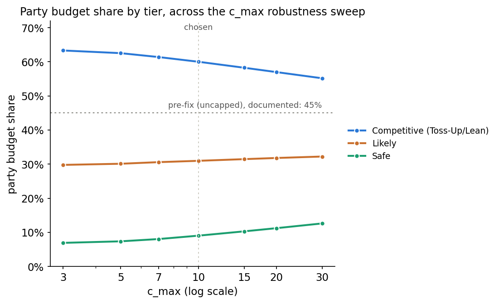
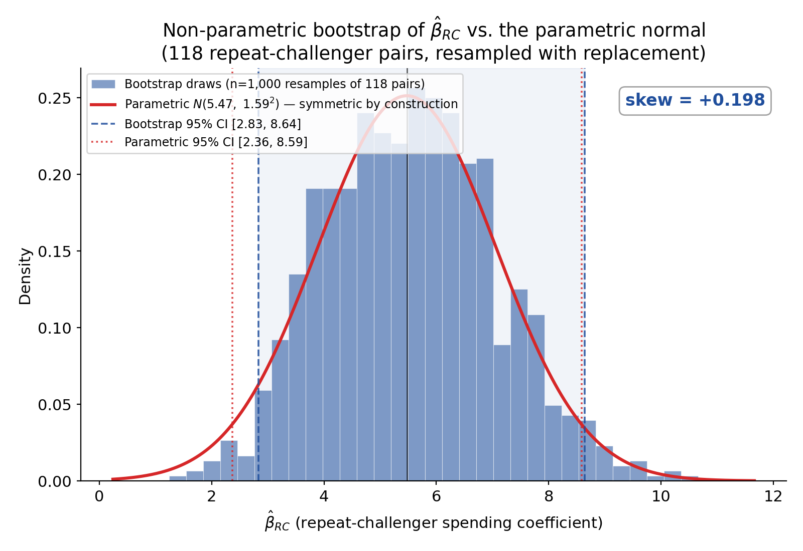
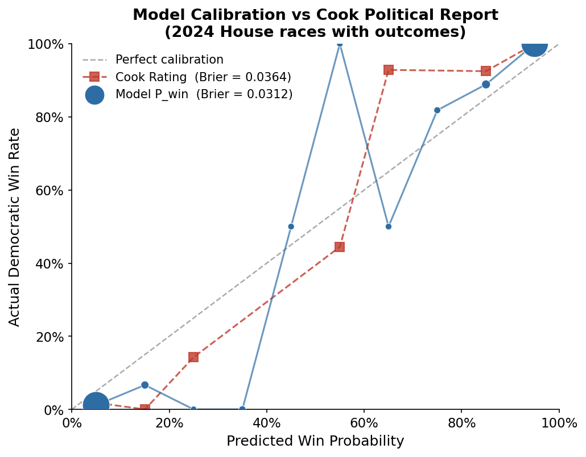
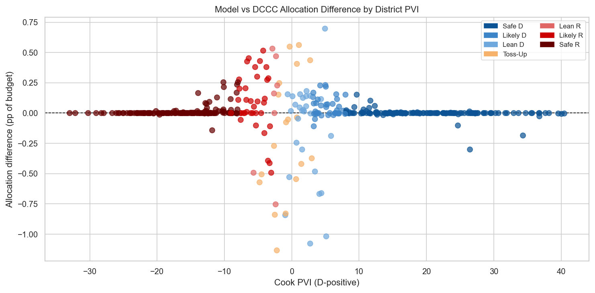
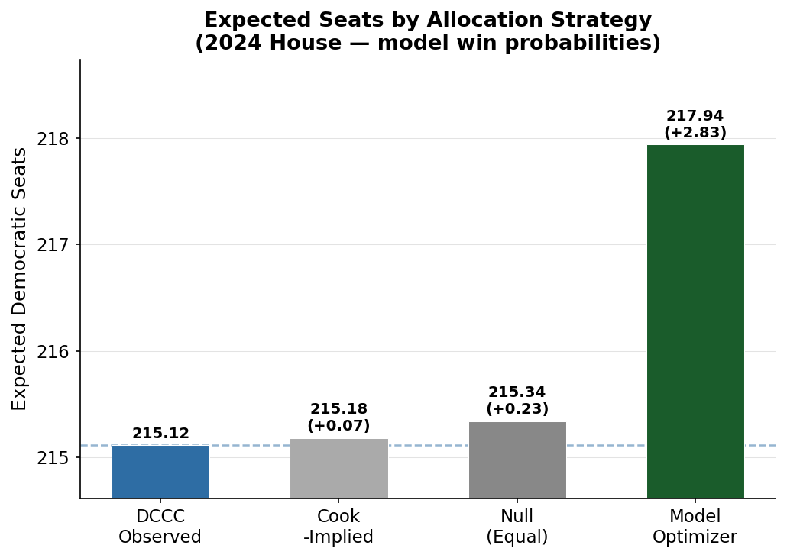
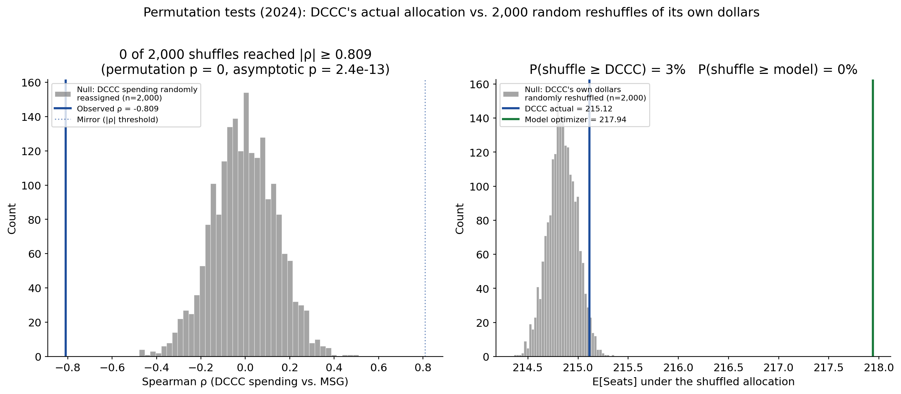
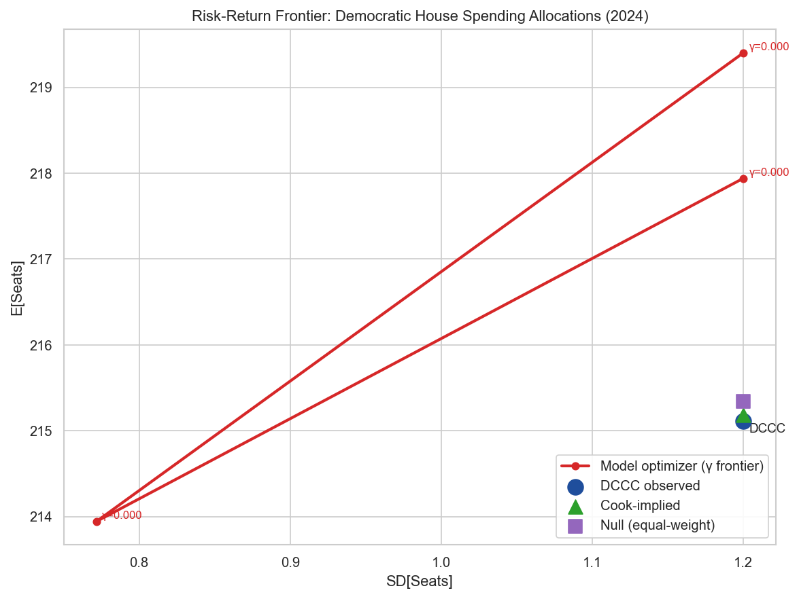
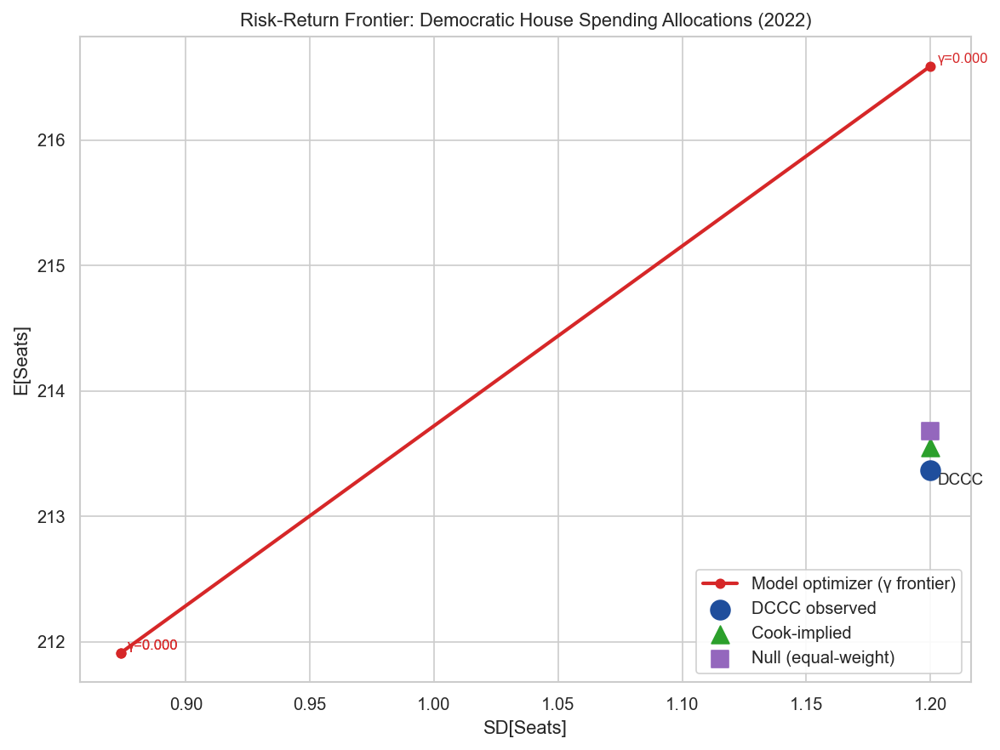
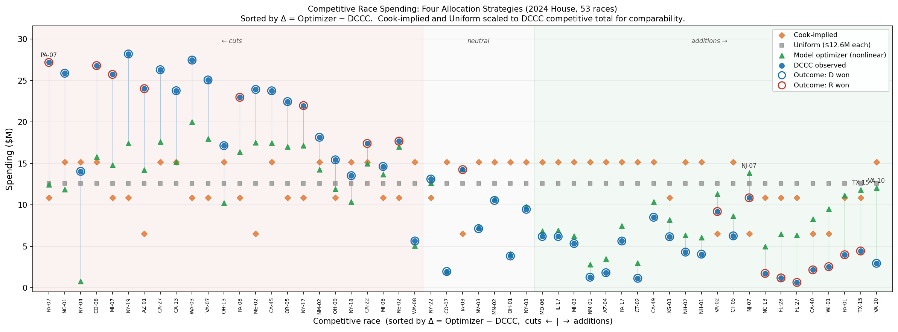
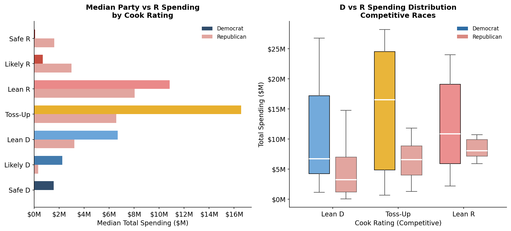

\begin{abstract}
\noindent
Congressional campaign committees allocate hundreds of millions of dollars each election cycle largely through polling judgment, strategist intuition, and historical precedent rather than formal optimization. This paper reframes campaign finance as a constrained capital allocation problem and develops a complete pipeline for solving it: a spending response surface identified via a repeat-challenger causal design, a nonlinear margin-to-win-probability conversion, a portfolio risk model built on a common national-environment factor, and a nonlinear optimizer that maximizes expected seats subject to a fixed party budget. The central mathematical contribution addresses a defect intrinsic to any log-ratio spending specification: the marginal seat gain gradient is proportional to $1/D_i$ as a race's own spending floor $D_i \to 0$, so an uncapped model extrapolates an unbounded persuasion effect into safe districts with no historical support for the implied magnitude. We derive this singularity analytically, state the formal requirements a correction must satisfy, and introduce an endogenous, bounded, differentiable \emph{persuasion ceiling} $C(\Phi_0) = C_{\max}\cdot 4\Phi_0(1-\Phi_0)$, where $\Phi_0$ is a race's win probability at its own candidate-only spending floor. The ceiling is calibrated by an eight-point robustness sweep rather than fixed by hand. Using exclusively public data (FEC filings, MIT Election Lab results, Cook PVI, 2012--2024) and a Levitt (1994) repeat-challenger identification strategy extended to open seats via Bayesian shrinkage, we estimate the framework on 433 competitive-and-safe U.S. House races and find that observed 2024 DCCC spending is \emph{negatively} rank-correlated with model-estimated marginal seat gain ($\rho = -0.809$, $p<0.001$, $n=53$ competitive races) -- the opposite sign implied by efficient allocation. A model-optimal reallocation of the identical party budget yields an estimated $+2.83$ expected seats; both findings replicate out-of-sample on the 2022 cycle ($\rho=-0.847$, $+3.22$ seats) using a model estimated exclusively on 2012--2020 data, and both survive permutation tests against 2,000 random reallocations of DCCC's own dollars. The paper's contribution is simultaneously a mathematical one -- a general, endogenous regularization mechanism for any diminishing-returns spending model with a floor singularity -- and an empirical one, providing campaign committees and researchers a reproducible, publicly replicable framework for evaluating whether political capital is deployed where the marginal dollar matters most.
\end{abstract}

\vspace{0.5em}
\noindent\textbf{Keywords:} campaign finance, resource allocation, portfolio optimization, marginal treatment effects, election forecasting, constrained optimization, persuasion ceiling, capital budgeting

\newpage

# Introduction

## Motivation

U.S. congressional campaign committees allocate hundreds of millions of dollars every two-year election cycle. The Democratic Congressional Campaign Committee (DCCC) alone controlled roughly \$465 million in coordinated and independent party expenditures across House races in the 2024 cycle, a sum comparable to the market capitalization of a mid-sized public company, deployed across scores of simultaneous, correlated, binary-outcome contests. Despite this scale, allocation decisions remain largely heuristic: informed by polling averages, strategist judgment, historical precedent, and third-party race ratings, but rarely by an explicit model of the marginal return on the next dollar spent in a given district.

This is a striking gap relative to comparable capital-allocation domains. A portfolio manager deploying a nine-figure book of risky assets does so against an explicit model of expected return, volatility, and covariance. A firm allocating capital across competing internal projects uses net-present-value and hurdle-rate methods dating to the 1950s. Campaign finance, by contrast, has no analogous standard practice, even though the underlying decision problem -- allocate a fixed budget across many uncertain, correlated, binary-outcome opportunities to maximize an aggregate payoff -- is formally the same class of problem.

The absence of formal optimization is not for lack of data. Federal Election Commission (FEC) disbursement records, district-level election results, and partisan-lean indices are all public, machine-readable, and available for every cycle since at least 2012. What is missing is not data but a specific quantity: an estimate of the *marginal* seat gain produced by an *additional* dollar in a *specific* race, conditional on that race's current spending level and structural characteristics. Existing research does not estimate this quantity, for reasons developed in Section 2.

## Research Gap

Four adjacent literatures study pieces of this problem without solving it. Election forecasting (Cook Political Report ratings, FiveThirtyEight-style probabilistic models, Bayesian dynamic models such as Sides, Vavreck, and Warshaw 2022) estimates the *probability* of an outcome conditional on the current state of a race, but is not built to answer how that probability would change under a counterfactual spending decision. Campaign finance research (Jacobson 1978, 1990; Levitt 1994; Gerber 1998; Erikson and Palfrey 2000) estimates the *causal effect* of spending on vote share or margin, typically as a population-average treatment effect, but stops short of embedding that effect in a budget-constrained optimization across a portfolio of races. Polling research improves the precision of the state estimate that forecasting models consume, but is once again silent on the allocation question. Causal inference methodology (repeat-challenger designs, instrumental variables, randomized field experiments) supplies the identification strategies an allocation model needs to avoid confounding fundraising strength with electoral strength, but the methodology papers themselves do not extend to a constrained-optimization setting.

None of these literatures asks the question a sitting campaign committee actually faces: *given a fixed budget and a portfolio of competitive races, where should the next dollar go, and can we tell whether the committee's past decisions were efficient?* Answering it requires marginal, not average, treatment effects; it requires a portfolio-level objective that accounts for covariance across correlated races, not race-by-race point estimates; and it requires translating a continuous causal estimate into a constrained-optimization solution with well-defined comparative statics. This is a capital-allocation problem, not a forecasting or causal-inference problem, and it has not been formulated as one.

## Overview of the Proposed Framework

The framework developed in this paper has four moving parts, described here without derivation (Sections 3--4 supply the full formalism).

First, campaign spending affects the *expected vote margin* $\mu_i$ in race $i$, not the win/loss outcome directly. The effect is estimated as a function of the *ratio* of a candidate's spending to total two-party spending in the race, following the equilibrium logic of Erikson and Palfrey (2000): what matters is relative, not absolute, spending.

Second, the margin $\mu_i$ is converted into a win probability through $P_i = \Phi(\mu_i/\sigma_i)$, where $\sigma_i$ is the race's outcome uncertainty and $\Phi$ is the standard normal CDF. This conversion is what makes the problem genuinely nonlinear: the marginal value of a dollar depends on how close a race already is to the 50--50 tipping point, not merely on the size of the margin shift the dollar buys.

Third, because campaign committees care about the *number of seats won*, not any single race in isolation, and because election outcomes move together with the national political environment, the portfolio objective must account for cross-race covariance. A single common factor -- the generic congressional ballot -- links races through their sensitivity to national conditions, exactly as a market factor links otherwise-idiosyncratic stocks in a one-factor asset-pricing model.

Fourth, and this is the paper's central mathematical contribution, the spending-response specification that makes the first three pieces work has an unpriced defect: its gradient is unbounded as a race's own baseline spending approaches zero. Left uncorrected, a constrained optimizer will exploit this defect and recommend implausibly large sums in the safest, least-competitive districts in the data. We derive why this occurs, state what a correction must satisfy mathematically, and supply one: an endogenous, bounded "persuasion ceiling" that caps the achievable margin shift as a smooth function of how close to competitive a race already is.

The complete pipeline -- causal identification, margin and uncertainty estimation, portfolio covariance, the persuasion ceiling, and constrained nonlinear optimization -- is then applied to real FEC and election data to test whether the DCCC's observed 2022 and 2024 allocations are consistent with the efficiency the framework implies.

## Contributions

This paper makes four explicit contributions.

1. **Formulates campaign budgeting as a constrained, portfolio-theoretic capital allocation problem**, with an explicit objective (expected seats, optionally risk-adjusted), decision variables (per-race spending), and constraints (a fixed party budget and per-race caps), rather than treating campaign finance as a forecasting or average-treatment-effect estimation exercise.
2. **Derives and proves the existence of an unbounded-gradient singularity** in the standard log-ratio spending specification as a race's own spending floor approaches zero, and introduces an endogenous, bounded, differentiable persuasion-ceiling function, $C(\Phi_0) = C_{\max}\cdot 4\Phi_0(1-\Phi_0)$, that corrects it without requiring an exogenously imposed spending cap.
3. **Develops a fully reproducible calibration pipeline** using exclusively public data -- FEC bulk filings, MIT Election Data and Science Lab results, and Cook PVI -- with a Levitt (1994) repeat-challenger causal identification strategy, Bayesian shrinkage extrapolation to open seats, non-parametric bootstrap and permutation-based inference, and an eight-point sensitivity sweep for the ceiling's single free parameter.
4. **Demonstrates, empirically and out-of-sample, that observed committee spending is inefficiently allocated relative to the model's estimated marginal seat gain**: a strongly negative rank correlation between spending and marginal seat gain in both the 2024 primary sample and the 2022 out-of-sample replication, and a model-optimal reallocation of the identical budget that recovers 2.8--3.2 additional expected seats, robust to permutation tests, winsorization, and Cook-category stratification.

## Paper Roadmap

Section 2 situates the framework relative to the campaign finance, election forecasting, and operations research literatures and states precisely what no existing work combines. Section 3 formalizes the allocation problem: notation, decision variables, constraints, and objective. Section 4 develops the theoretical core -- the baseline probability model, the spending response function, the marginal-value-of-capital derivation, the singularity this derivation implies, and the persuasion ceiling that corrects it. Section 5 describes the public data sources and the final analysis dataset. Section 6 details parameter estimation and calibration, including the ceiling's sensitivity sweep and bootstrap inference. Section 7 specifies the optimization algorithm and computational environment. Section 8 reports empirical results: internal validation, the main efficiency test, baseline comparisons, sensitivity analysis, and robustness checks. Section 9 discusses the political and strategic interpretation of the findings and the framework's generalizability beyond campaign finance. Section 10 states the framework's data, modeling, computational, and deployment limitations. Section 11 concludes.

\newpage

# Related Literature

## Campaign Finance

The campaign finance literature has principally sought to identify the causal effect of spending on vote share, treating spending as a single scalar treatment and outcome as a population-average response. Jacobson (1978, 1990) established that challenger spending exerts a substantially larger effect on vote share than incumbent spending, a finding that shaped both the academic and practitioner consensus that incumbents are comparatively insensitive to marginal spending. Levitt (1994) addressed the central endogeneity concern in this literature -- campaigns spend more where races are competitive, so cross-sectional spending-outcome correlations confound resource allocation with underlying competitiveness -- using a repeat-challenger design that compares the same challenger against the same incumbent across consecutive cycles, differencing out time-invariant matchup characteristics. Gerber (1998) pursued a complementary identification strategy in Senate races using instrumental variables exploiting exogenous variation in seat competitiveness. Green and Gerber (2008) moved to randomized field experiments, estimating the effect of specific voter-contact activities (canvassing, direct mail) rather than aggregate spending, and providing a causal microfoundation for the sign and plausible magnitude of spending effects at the activity level. Erikson and Palfrey (2000) modeled campaign spending as a simultaneous strategic game between two candidates, establishing that the *ratio* of spending, not its absolute level, is the theoretically appropriate unit of analysis because the marginal value of a dollar to one side depends on the other side's spending.

These studies share a common estimand: $\mathbb E[Y(s+\Delta)] - \mathbb E[Y(s)]$ for a representative race, i.e., the *average* causal effect of a spending increment. None estimates the *conditional marginal* effect $\partial \mathbb E[Y]/\partial s_i$ at race $i$'s specific, current spending level -- the object a capital-allocation decision requires, and one that a fixed average-effect estimate cannot supply because it does not vary with a race's existing spending intensity or structural characteristics.

## Election Forecasting

A separate literature forecasts election outcomes conditional on the current information state. Cook Political Report and similar outlets translate district characteristics and qualitative judgment into ordinal race ratings (Safe, Likely, Lean, Toss-Up). Poll-aggregation forecasters, following the general approach popularized by FiveThirtyEight, combine polling averages with historical fundamentals into probabilistic win estimates, typically via ensemble or Bayesian dynamic linear models. Sides, Vavreck, and Warshaw (2022) demonstrate the viability of dynamic Bayesian forecasting for congressional and presidential races, producing calibrated, continuously updated win-probability estimates.

Forecasting models of this kind estimate $P(\text{win}_i \mid \text{information to date})$, a state-conditional probability. They are not built to answer a counterfactual spending question: how would $P(\text{win}_i)$ change under a specified change in future spending? Because forecasting models generally do not include a structural spending term with an estimated causal coefficient, they cannot be differentiated with respect to a spending decision, and therefore cannot directly supply a marginal seat gain estimate even though they estimate a closely related quantity (the level of $P_i$) with considerable sophistication.

## Operations Research

The mathematical structure of the allocation problem this paper poses is well studied outside political science, under three related headings. Mean-variance portfolio theory (Markowitz 1952) formalizes the allocation of a fixed budget across assets with uncertain, correlated returns, trading expected return against variance -- a template this paper adapts directly, with expected seats in place of expected return and a covariance matrix induced by a national-environment factor in place of asset covariance. Dynamic programming and the Bellman equation (Bellman 1957) formalize sequential decision problems in which a state evolves and decisions must account for future consequences; while the present paper's allocation problem is solved as a single-period static optimization (Section 3), the multi-period extension in which a committee re-allocates continuously as new information arrives over a cycle is a direct application of this framework, developed in a companion paper. Classical resource-allocation and capital-budgeting problems -- the knapsack problem, the general resource-allocation problem of Ibaraki and Katoh (1988), and net-present-value capital budgeting -- formalize the discrete or continuous allocation of a scarce budget across competing projects with heterogeneous, often diminishing, returns, precisely the structure of the spending-response function developed in Section 4.

None of these operations-research frameworks, on its own, specifies where its inputs -- the expected-return function, the transition law, the project-level return curve -- come from in a political context. They supply the mathematical machinery; they do not supply the causally identified, empirically calibrated inputs a real application requires.

\newpage

# Problem Formulation

## Notation

Table 1 defines every symbol used in Sections 3--4. Race-level quantities carry subscript $i \in \{1,\dots,N\}$; where a time or cycle index is needed it is written $t$.

**Table 1: Notation Reference**

| Symbol | Meaning |
|---|---|
| $N$ | number of races in the analysis universe |
| $B$ | total party budget available for allocation |
| $x_i$ (also $s_i$, $p_i$ in code) | party dollars allocated to race $i$ (decision variable) |
| $D_i$ | total Democratic-aligned spending in race $i$ ($D_i = f_i + x_i$, candidate floor plus party allocation) |
| $R_i$ | total Republican-aligned spending in race $i$ |
| $T_i$ | $D_i + R_i$, total two-party spending in race $i$ |
| $f_i$ | race $i$'s candidate-committee spending floor (money already raised by the candidate, not reallocable) |
| $\text{ratio}_i$ | $D_i/T_i$, Democratic share of two-party spending |
| $\mu_i$ | expected Democratic vote margin (percentage points) in race $i$ |
| $\sigma_i$ | standard deviation of the margin distribution in race $i$ |
| $P_i$ | $P(\text{win}_i) = \Phi(\mu_i/\sigma_i)$ |
| $\Phi, \varphi$ | standard normal CDF and PDF |
| $\Phi_0^{(i)}$ | race $i$'s win probability evaluated at its own candidate-only floor ($x_i = 0$) |
| $\text{MSG}_i$ | marginal seat gain, $\partial P_i/\partial x_i$ |
| $\alpha_0,\dots,\alpha_5$ | control-surface coefficients of the margin model (PVI, incumbency, generic ballot, spending intensity, individual-contribution share) |
| $\beta_1 (=\beta_{RC})$ | base spending elasticity, identified via repeat-challenger design |
| $\beta_2, \beta_3$ | interaction coefficients (spending elasticity $\times$ \|PVI\|, spending elasticity $\times$ incumbency) |
| $\beta_1^{OS}$ | open-seat spending elasticity, Bayesian-shrinkage calibrated |
| $c_i$ | $\beta_1 + \beta_2|\text{PVI}_i| + \beta_3\,\text{Incumb}_i$, race-specific spending-elasticity coefficient |
| $G$ | national generic congressional ballot (D $-$ R), the common risk factor |
| $\beta_i$ (factor loading) | sensitivity of race $i$'s outcome to $G$ |
| $\sigma_G^2$ | variance of the national environment factor |
| $\Sigma$ | $N\times N$ factor-implied covariance matrix of race outcomes |
| $\gamma$ | risk-aversion coefficient (portfolio variance penalty) |
| $\lambda$ | shadow price of the budget constraint |
| $\kappa$ (cap fraction) | maximum share of the party budget any single race may receive |
| $C_{\max}$ | persuasion ceiling's single free calibration parameter |
| $C_i$ | race $i$'s ceiling on the achievable margin shift above $\mu_i(\Phi_0^{(i)})$ |
| $\tau$ | prior standard deviation in the open-seat Bayesian shrinkage estimator |
| $\eta$ | adversarial-response coefficient (opposing party's spending reaction to a marginal dollar) |

## Decision Variables

The decision variable is the vector $\mathbf x = (x_1,\dots,x_N)$, party dollars allocated to each race. Each $x_i$ is added on top of race $i$'s own candidate-committee spending floor $f_i$, which is treated as exogenous: it is money the candidate's own committee has already raised and the party committee cannot redirect. Total Democratic-aligned spending in race $i$ is therefore $D_i(x_i) = f_i + x_i$.

## Constraints

The allocation is subject to a fixed total party budget and per-race non-negativity and concentration constraints:

$$\sum_{i=1}^N x_i \le B, \qquad 0 \le x_i \le \kappa B \quad \forall i$$

The upper bound $\kappa B$ is a practical concentration cap (Section 6) preventing the optimizer from placing an implausible share of the entire budget in a single race; in the empirical implementation $\kappa \in \{0.05, 0.10, 0.15\}$ is swept as a sensitivity parameter rather than fixed a priori.

## Objective Function

The primary objective is expected seats won across the portfolio of races:

$$\mathbb E[\text{Seats}] = \sum_{i=1}^N P_i(x_i) = \sum_{i=1}^N \Phi\!\left(\frac{\mu_i(x_i)}{\sigma_i}\right)$$

Because electoral outcomes are not independent -- common national and regional conditions induce covariance across races -- the risk-adjusted objective incorporates portfolio variance:

$$\text{Var}[\text{Seats}] = \sum_i\sum_j \text{Cov}(Y_i, Y_j) = \mathbf d(\mathbf x)'\, \Sigma \,\mathbf d(\mathbf x)$$

where $Y_i$ is the binary outcome of race $i$, $\mathbf d(\mathbf x)$ is the vector of total spending levels $D_i(x_i)$, and $\Sigma$ is the factor-implied covariance matrix developed in Section 4. A campaign committee genuinely concerned with securing a chamber majority faces an objective closer to $P(\text{Seats}\ge T)$ for majority threshold $T=218$, which is approximately $\Phi\!\big((\mathbb E[\text{Seats}]-T)/\text{SD}[\text{Seats}]\big)$ under a normal approximation to the seat-count distribution. This majority-probability objective has different comparative statics than the expected-seats objective -- it rewards *increased* variance when $\mathbb E[\text{Seats}] < T$ and *reduced* variance when $\mathbb E[\text{Seats}] > T$ -- and a committee rationally pursuing it might overweight high-covariance races in a way that would appear as misallocation under the expected-seats objective alone. We adopt the expected-seats objective as the primary criterion, noting that the approximation is most accurate when $\mathbb E[\text{Seats}]$ is near $T$, and return to this distinction when interpreting the efficiency test in Section 8.

## Optimization Problem

The complete constrained optimization problem is:

$$
\begin{aligned}
\max_{\mathbf x} \quad & \sum_{i=1}^N \Phi\!\left(\frac{\mu_i(x_i)}{\sigma_i}\right) - \gamma\, \mathbf d(\mathbf x)'\Sigma\,\mathbf d(\mathbf x) \\
\text{s.t.} \quad & \sum_{i=1}^N x_i \le B \\
& 0 \le x_i \le \kappa B \quad \forall i
\end{aligned}
$$

Section 4 derives $\mu_i(x_i)$ and $\sigma_i$ from the estimated spending response surface, Section 7 specifies the nonlinear solution algorithm, and Appendix C derives the Karush--Kuhn--Tucker (KKT) stationarity conditions characterizing an interior optimum.

\newpage

# Theoretical Framework

This section develops the paper's mathematical core: the baseline probability model that converts a vote-margin estimate into a win probability, the spending response function that produces that margin estimate, the marginal-value-of-capital expression obtained by differentiating the two together, a proof that this expression is unbounded as a race's own spending approaches zero, and the endogenous correction -- the persuasion ceiling -- that this pathology requires.

## Baseline Probability Model

Let $\text{Margin}_i \sim N(\mu_i, \sigma_i^2)$ denote the (approximately normal) distribution of the Democratic candidate's vote margin in race $i$, conditional on district characteristics and spending. The probability of a Democratic win is then

$$P_i \equiv P(\text{win}_i) = P(\text{Margin}_i > 0) = \Phi\!\left(\frac{\mu_i}{\sigma_i}\right)$$

Two features of this conversion matter for everything that follows. First, it is nonlinear in $\mu_i$: the same absolute improvement in expected margin produces a larger change in win probability near $\mu_i \approx 0$ (a competitive race) than far from it (a safe race), because the normal density is maximized at its mean. Second, $\sigma_i$ is not a nuisance parameter but an economically meaningful one: races with wider outcome uncertainty require larger margin shifts to produce the same probability change, exactly as higher volatility reduces an option's sensitivity (its delta) to the underlying at a given moneyness -- an analogy developed formally in Section 6.

## Spending Response Function

Following Erikson and Palfrey (2000)'s equilibrium logic that relative, not absolute, spending governs outcomes, the margin model is specified as a function of $\text{ratio}_i = D_i/T_i$, the Democratic share of total two-party spending in the race:

$$
\mu_i = \alpha_0 + \alpha_1\,\text{PVI}_i + \alpha_2\,\text{Incumb}_i + \alpha_3\, G + \underbrace{\big[\beta_1 + \beta_2|\text{PVI}_i| + \beta_3\,\text{Incumb}_i\big]}_{\displaystyle \equiv\, c_i}\,\log(\text{ratio}_i)
$$

The log transformation of the spending ratio is the source of the model's diminishing-returns property: because $\text{ratio}_i \in (0,1)$ is bounded, $\log(\text{ratio}_i) \to -\infty$ only as $\text{ratio}_i \to 0$, and each additional percentage point of spending share produces a smaller change in $\log(\text{ratio}_i)$ as the race's spending approaches parity. The elasticity coefficient $c_i = \beta_1 + \beta_2|\text{PVI}_i| + \beta_3\,\text{Incumb}_i$ lets responsiveness vary with district partisan lean and incumbency status. $\beta_1$ is the base elasticity, identified causally via the repeat-challenger design (Section 6.1); $\beta_2$ and $\beta_3$ are estimated on the full descriptive panel.

## Marginal Value of Capital

The quantity a capital-allocation decision requires is not the level of $P_i$ but its derivative with respect to the party's own spending, $\partial P_i/\partial x_i$ -- the marginal seat gain. Applying the chain rule through $\mu_i \to \text{ratio}_i \to D_i \to x_i$ (full derivation in Appendix B):

$$\frac{\partial\, \text{ratio}_i}{\partial D_i} = \frac{R_i}{T_i^2} \quad\Longrightarrow\quad \frac{\partial \log(\text{ratio}_i)}{\partial D_i} = \frac{T_i}{D_i}\cdot\frac{R_i}{T_i^2} = \frac{R_i}{D_i T_i}$$

so that, since $x_i$ enters only through $D_i = f_i + x_i$ (i.e. $\partial D_i/\partial x_i = 1$):

$$\boxed{\ \text{MSG}_i \;\equiv\; \frac{\partial P_i}{\partial x_i} \;=\; \varphi\!\left(\frac{\mu_i}{\sigma_i}\right)\cdot\frac{1}{\sigma_i}\cdot c_i \cdot \frac{R_i}{D_i T_i}\ }$$

This expression has an intuitive decomposition into two multiplicative factors. The first, $\varphi(\mu_i/\sigma_i)/\sigma_i$, is the density of the margin distribution evaluated at the tipping point -- the "conversion efficiency" of a margin shift into a probability shift, maximized for races near parity. The second, $c_i R_i/(D_i T_i)$, is the marginal effect of an additional dollar on the expected margin itself, and it is this second factor whose behavior as $D_i \to 0$ drives the singularity proved next.

## The Singularity

**Proposition 1.** *Holding $R_i$ fixed and positive, $\lim_{D_i \to 0^+} \partial\mu_i/\partial D_i = \lim_{D_i \to 0^+} c_i R_i/(D_iT_i) = +\infty$ whenever $c_i > 0$. Consequently $\text{MSG}_i \to \varphi(\mu_i(0)/\sigma_i)\cdot c_i R_i/(\sigma_i D_i R_i) \to \infty$ as $D_i \to 0^+$, provided $\varphi(\mu_i(0)/\sigma_i) > 0$, which holds for any finite $\mu_i(0)$.*

*Proof.* Write $\partial\mu_i/\partial D_i = c_i \cdot \partial\log(\text{ratio}_i)/\partial D_i = c_i R_i/(D_i T_i)$, from Section 4.3. With $R_i$ fixed and $T_i = D_i + R_i \to R_i$ as $D_i \to 0^+$, the expression behaves as $c_i R_i/(D_i R_i) = c_i/D_i$, which diverges to $+\infty$ as $D_i \to 0^+$ for any $c_i > 0$. Since $\varphi$ is strictly positive on all of $\mathbb R$ and $\mu_i(0) = \alpha_0 + \alpha_1\text{PVI}_i+\alpha_2\text{Incumb}_i+\alpha_3G + c_i\log(f_i/(f_i+R_i))$ is finite for any $f_i > 0$, the prefactor $\varphi(\mu_i(0)/\sigma_i)/\sigma_i$ is bounded away from zero, so $\text{MSG}_i$ inherits the divergence of $\partial\mu_i/\partial D_i$. $\blacksquare$

The economic content of Proposition 1 is that the log-ratio specification -- adopted precisely because it is the theoretically correct functional form under Erikson and Palfrey's equilibrium logic, and because it is what a causally identified estimator (Section 6.1) is capable of recovering from repeat-challenger data -- implies an *unbounded* marginal incentive to fund a race with an arbitrarily small existing floor $D_i$. A constrained optimizer facing this objective will, absent a correction, drive spending toward whichever races have the smallest denominators, independent of whether the historical data used to estimate $c_i$ contains any support for the implied effect size in that region. In practice this manifests as the optimizer recommending large sums in Safe-tier districts with near-zero candidate-committee floors: 81% of a preliminary uncorrected specification's seat-gain estimate traced to races spending under \$500,000, and Safe-tier races absorbed 45% of the recommended party budget (Section 6.4) -- an artifact of extrapolation, not a genuine empirical finding about persuadability in safe seats.

This is not a bug in the sense of an implementation error; it is a structural property of any spending-response model built on $\log(\text{ratio}_i)$, and by extension of any capital-allocation model whose spending-effectiveness function has a $1/D_i$-type singularity at a resource floor of zero. The framework requires an explicit, principled correction.

## Design Requirements

A satisfactory correction to Proposition 1's singularity must satisfy several properties simultaneously, motivated by what a naive fix would get wrong.

- **Endogenous.** The correction should be a function of the model's own state (each race's estimated competitiveness), not an exogenously imposed constant, so that it adapts automatically to a race's context rather than requiring a separately tuned cap for every race or every cycle.
- **Smooth and differentiable.** The optimizer in Section 7 is gradient-based (SLSQP); any correction that introduces a kink or discontinuity (e.g. a hard spending cap) would break the analytic gradient the optimizer relies on and could introduce spurious local optima.
- **Bounded.** The correction must guarantee a finite ceiling on the achievable margin shift, eliminating the divergence proved in Proposition 1 by construction rather than by empirical luck.
- **Symmetric in its economic interpretation.** The correction should bind most weakly for races genuinely near the competitive tipping point -- where a real persuasion effect is most plausible -- and bind most strongly for races far from it in either direction, rather than penalizing all low-spending races uniformly regardless of whether they are competitive.
- **Calibration-friendly.** The correction should introduce as few new free parameters as possible, and those it does introduce should be identifiable from a transparent, reproducible sensitivity analysis rather than fixed by assumption (Section 6.4).

## Alternative Solutions Considered

Two alternative corrections were tested against the design requirements above and rejected.

**Persuadable-multiplier calibration.** A first approach attempted to calibrate the ceiling directly against observed repeat-challenger swing magnitudes -- i.e., to let the historical data itself reveal how large a margin shift is empirically plausible. This was rejected because the raw repeat-challenger swings were *largest* in the most hopeless districts, the opposite of what a persuasion ceiling should imply. Investigation traced this to a composition effect rather than a genuine persuasion signal: in the most lopsided districts, a repeat challenger frequently becomes a token candidate between cycles (reduced fundraising, reduced campaign activity), so the observed "swing" reflects declining challenger effort rather than a large marginal effect of spending.

**Strategic ($\sigma$-only) weighting.** A second approach attempted to scale the ceiling by $\sigma_i$ alone, on the logic that higher-uncertainty races should tolerate a larger achievable margin shift. This was rejected because $\sigma_i$'s own dependence on partisan lean is far weaker than $\mu_i$'s (Section 6.2 coefficient: $0.008$ per PVI point for $\sigma_i$ versus $1.057$ for $\mu_i$), so $\sigma_i$ alone does not discriminate between hopeless and competitive districts with anywhere near the resolution the ceiling requires.

A third, structurally simpler alternative -- an exogenous hard spending cap per race, independent of competitiveness -- was not formally tested but is excluded on design-requirement grounds alone: it is neither endogenous nor differentiable, and would require a separate, ad hoc calibration for every race type.

## Proposed Persuasion Ceiling

Define $\Phi_0^{(i)} \equiv \Phi(\mu_i(0)/\sigma_i)$, race $i$'s win probability evaluated at its own candidate-only spending floor ($x_i = 0$, i.e. $D_i = f_i$) -- the win probability the model assigns *before* any party money is added. The persuasion ceiling caps the achievable margin shift above the floor level $\mu_i(0)$ at

$$C_i \;=\; C_{\max}\cdot 4\,\Phi_0^{(i)}\big(1-\Phi_0^{(i)}\big)$$

and the capped margin is obtained by an exponential-decay saturation toward that ceiling:

$$\mu_i'(x_i) = \mu_i(0) + C_i\left(1 - \exp\!\left[-\frac{\max(\mu_i^{\text{raw}}(x_i)-\mu_i(0),\,0)}{C_i}\right]\right)$$

where $\mu_i^{\text{raw}}(x_i)$ is the uncapped margin from Section 4.2. As $\mu_i^{\text{raw}}(x_i) - \mu_i(0) \to \infty$ (i.e., as party spending grows without bound), $\mu_i'(x_i) \to \mu_i(0) + C_i$: the achievable shift saturates at the ceiling rather than diverging. $C_{\max}$ is the framework's single new free parameter, and its calibration is the subject of Section 6.4's sensitivity sweep.

The correction to the marginal seat gain gradient follows by the chain rule applied to the saturating transform:

$$\frac{\partial \mu_i'}{\partial \mu_i^{\text{raw}}} = \exp\!\left[-\frac{\max(\mu_i^{\text{raw}}-\mu_i(0),0)}{C_i}\right] \;\equiv\; \text{decay}_i \in (0,1]$$

so that the corrected marginal seat gain is simply $\text{MSG}_i' = \text{MSG}_i \times \text{decay}_i$, an analytic multiplicative correction to the uncapped gradient derived in Section 4.3 -- the optimizer's gradient never needs to be re-derived from scratch, only rescaled.

## Properties

**Proposition 2 (Ceiling properties).** *The function $C(\Phi_0) = C_{\max}\cdot 4\Phi_0(1-\Phi_0)$ on $\Phi_0 \in [0,1]$ satisfies: (i) $C(\Phi_0) \ge 0$ for all $\Phi_0 \in [0,1]$, with equality iff $\Phi_0 \in \{0,1\}$; (ii) $C$ is maximized at $\Phi_0 = 1/2$, where $C(1/2) = C_{\max}$; (iii) $C$ is $C^\infty$ (infinitely differentiable) in $\Phi_0$, being a polynomial; (iv) $C_i$ is endogenous, since $\Phi_0^{(i)}$ is itself a function of the fitted model's own state ($\mu_i(0), \sigma_i$) rather than an exogenously fixed constant.*

*Proof.* (i) $4\Phi_0(1-\Phi_0) = 1 - (2\Phi_0-1)^2 \ge 0$ on $[0,1]$ since $(2\Phi_0-1)^2 \le 1$ there, with equality iff $2\Phi_0-1=\pm1$, i.e. $\Phi_0\in\{0,1\}$. (ii) $\frac{d}{d\Phi_0}[4\Phi_0(1-\Phi_0)] = 4-8\Phi_0 = 0 \iff \Phi_0=1/2$, and the second derivative $-8<0$ confirms a maximum, with value $4(1/2)(1/2)=1$, so $C(1/2)=C_{\max}$. (iii) A quadratic polynomial in $\Phi_0$ is entire. (iv) $\Phi_0^{(i)} = \Phi(\mu_i(0)/\sigma_i)$ where $\mu_i(0)$ and $\sigma_i$ are both outputs of the estimated model (Section 6), not inputs chosen by the analyst. $\blacksquare$

Boundedness of the full saturating transform follows immediately: since $C_i \le C_{\max}$ for every race (Proposition 2(i)-(ii)) and $\text{decay}_i \in (0,1]$ by construction, $\mu_i'(x_i) \le \mu_i(0) + C_{\max}$ for every $x_i \ge 0$, which is precisely the boundedness the singularity in Proposition 1 violates. Differentiability of $\mu_i'$ in $x_i$ follows from the differentiability of $\mu_i^{\text{raw}}$ (a smooth function of $x_i$) composed with the differentiable exponential saturation and Proposition 2(iii)'s differentiability of $C_i$ in the model state -- so the corrected objective retains the smooth gradient the SLSQP optimizer of Section 7 requires, satisfying every design requirement of Section 4.5 simultaneously.

## Economic Interpretation

The ceiling is best understood as a regularization prior, not a behavioral claim about voters. It does not assert that persuasion effects are literally bounded by a parabola in $\Phi_0$; it asserts that the model should not be permitted to infer a spending effect *larger than a small multiple of the race's own already-estimated outcome uncertainty*, scaled by how close to a genuine toss-up the race's current state suggests it is. A true toss-up ($\Phi_0=1/2$) is exactly the race type in which the causal literature's repeat-challenger identification (Section 6.1) has the most support, because competitive races are precisely where repeat-challenger pairs concentrate; a race the model already rates as near-certain for either party ($\Phi_0$ near 0 or 1) is exactly the race type in which the historical panel offers the least support for any specific spending-effect magnitude, and the ceiling shrinks toward zero there by construction. The persuasion ceiling therefore encodes, in a single differentiable function, the same intuition that motivates researchers to trust causal estimates most in the region of the data where identifying variation is richest -- without requiring the optimizer to consult the identification strategy directly.

\newpage

# Data

## Data Sources

The framework is built exclusively from publicly available data, a deliberate design choice ensuring full reproducibility without a paid vendor feed.

**Election outcomes.** MIT Election Data and Science Lab (house results, 1976--2024) supplies district-level vote totals and winners; Daily Kos Elections supplies district-matched results with redistricting crosswalks for 2012--2024, needed because congressional district boundaries change between cycles.

**Campaign finance.** Three distinct FEC-derived channels are used: candidate-committee disbursements (FEC bulk `weball` files, `TTL_DISB`), party coordinated expenditures (FEC Schedule F, fetched per-committee via the FEC API), and independent expenditures (FEC Schedule E comprehensive file, with the live FEC API used for the in-progress 2026 cycle). OpenSecrets race-level summaries provide a cross-check on both-party totals.

**Political environment.** Cook Partisan Voting Index (PVI) supplies district partisan lean; historical generic congressional ballot polling averages supply the national-environment factor $G$ for each cycle; Census American Community Survey 5-year estimates supply citizen voting-age population (CVAP) for per-voter spending normalization; incumbency status is derived from FEC candidate-status codes (`CAND_ICI`) cross-referenced against Ballotpedia, always coded relative to the Democratic candidate (Incumbent, Challenger, or Open).

## Coverage

The historical estimation panel spans the 2012, 2014, 2016, 2018, 2020, and 2022 House election cycles. The primary evaluation sample is the 2024 cycle; the 2022 cycle additionally serves as a fully out-of-sample validation target when estimation is restricted to 2012--2020 only (Section 8). After universe filters (minimum \$100,000 total two-party spending, exclusion of Alaska for ranked-choice-voting incompatibility, and the requirement of a valid Cook PVI value), the 2024 analysis universe contains 433 races; the primary efficiency test (Section 8) is restricted further to the 53 races Cook Political Report rated Lean D, Toss-Up, or Lean R in 2024, and 61 in the analogous 2022 out-of-sample universe. Causal identification of the base spending elasticity $\beta_{RC}$ (Section 6.1) uses 118 repeat-challenger pairs identified across six consecutive-cycle transitions in the 2012--2022 panel.

## Feature Engineering

Three constructed variables drive the model. The **spending ratio** $\text{ratio}_i = D_i/(D_i+R_i)$ is the Democratic share of total two-party spending, motivated by the equilibrium logic of Erikson and Palfrey (2000) that relative spending, not absolute levels, governs outcomes. The **absolute partisan lean** $|\text{PVI}_i|$ enters both the margin and $\sigma_i$ models as a measure of structural competitiveness independent of which party currently holds the seat. **Per-voter spending intensity**, $\log\big((D_i+R_i)/\text{CVAP}_i\big)$, normalizes raw spending totals by district-eligible-voter population, computed but constrained to zero in the primary specification (coefficient $\alpha_4$) due to an endogeneity concern documented in the code: total spending intensity is itself partly a function of how competitive a race is, so including it as a control risks partially absorbing the effect the spending-ratio term is meant to capture. An individual-contribution-share variable ($\alpha_5$) was estimated as a candidate-quality proxy but is likewise constrained to zero in the reported specification (Section 6.6) after diagnostic work indicated it functions as a race-salience proxy that penalizes competitive-race grassroots fundraising rather than measuring candidate quality.

## Cleaning

Race-cycle observations are dropped if total two-party spending is below \$100,000 (too thin to reflect a genuine contest), if a valid Cook PVI value cannot be matched (10 of 443 pre-filter races in 2024), or if the computed spending ratio is degenerate (zero or undefined, i.e. one side reported literally zero spending). Alaska is excluded in every cycle due to ranked-choice voting's incompatibility with the two-party vote-margin framework. District identifiers are harmonized across redistricting cycles via the Daily Kos crosswalk; districts affected by mid-decade redistricting (13 in the 2024 cycle, spanning North Carolina, Louisiana, Alabama, and New York) are flagged for interpretive caution but retained in the universe rather than excluded, since exclusion would non-randomly remove exactly the newly competitive seats the framework is most intended to evaluate. Candidate rosters are deduplicated to one nominee per party per district (the top spender within each party, following standard practice for multi-candidate primary states), with a cross-reference against MIT MEDSL's general-election ballot to exclude large disbursements from candidates who did not appear on the House general-election ballot (e.g. a sitting member who instead ran for Senate).

## Final Dataset

**Table 2: Final Dataset Summary**

| Quantity | Value |
|---|---|
| Historical estimation panel | 2012, 2014, 2016, 2018, 2020, 2022 (6 cycles) |
| Primary evaluation cycle | 2024 |
| Out-of-sample validation cycle | 2022 (estimated on 2012--2020 only) |
| Total races, 2024 universe (post-filter) | 433 |
| Competitive-tier races, 2024 (Lean D / Toss-Up / Lean R) | 53 |
| Competitive-tier races, 2022 OOS (Lean D / Toss-Up / Lean R) | 61 |
| Repeat-challenger pairs (causal identification) | 118 (across 6 cycle transitions) |
| Data sources | FEC (candidate + party + IE), MIT MEDSL, Cook PVI, Census ACS5, Daily Kos, Ballotpedia |
| Spending channels combined | Candidate-committee disbursements, party coordinated expenditures, independent expenditures |

\newpage

# Parameter Estimation \& Calibration

This section answers, for every parameter the framework depends on, the question: where did this number come from?

## Baseline Margins

The margin model's control-surface coefficients ($\alpha_0$--$\alpha_3$) and interaction coefficients ($\beta_2,\beta_3$) are estimated by OLS on the 2012--2022 panel with $\beta_1$ pre-imposed at its repeat-challenger value via offset regression (Appendix B.2): $y^*_{it} = y_{it} - \hat\beta_{RC}\log(\text{ratio})_{it}$ is regressed on the remaining covariates, so that the causally identified elasticity is never contaminated by the endogenous cross-sectional variation the rest of the specification absorbs. Standard errors are HC3 heteroskedasticity-robust throughout.

## Uncertainty ($\sigma_i$)

$\sigma_i$ is estimated from the distribution of $\log|\text{margin residual}|$ conditional on structural predictors (absolute PVI, open-seat status, challenger status, absolute generic ballot), then retransformed with a Duan (1983) smearing correction -- a multiplicative factor that corrects the systematic downward bias introduced by exponentiating a fitted log-scale model, which recovers the conditional median rather than the conditional mean of the residual distribution.

## Spending Elasticity

The base elasticity $\beta_1 = \beta_{RC}$ is identified via the repeat-challenger first-differenced design of Section 6.1 below; the open-seat elasticity $\beta_1^{OS}$ is calibrated via Bayesian shrinkage (Section 6.3).

### Repeat-Challenger Identification

Following Levitt (1994), the primary causal estimate restricts to races in which the same challenger contests the same incumbent across consecutive cycles, estimating the first-differenced specification $\Delta\text{Margin}_i = \beta_{RC}\Delta\log(\text{ratio})_i + \Delta\eta_i$, which cancels any time-invariant pair fixed effect $\alpha_i$ exactly. The identifying assumption -- that, conditional on the national environment, cycle-to-cycle changes in relative spending are uncorrelated with unobserved changes in race-specific competitiveness -- cannot be directly tested, but is more credible than a cross-sectional analogue because candidate quality, incumbency advantage, and district partisan composition are all held fixed within a matched pair.

### Open-Seat Calibration

Open seats lack a repeat-challenger analogue by construction (there is no incumbent to hold fixed across cycles), so the open-seat elasticity is calibrated through a three-part procedure: (i) the repeat-challenger estimate $\beta_{RC}$ serves as a causally anchored prior mean; (ii) the full observational panel's open-seat interaction term supplies a likelihood; (iii) Bayesian shrinkage combines the two, with the shrinkage weight $\kappa$ determined by the relative precision of the prior and the panel likelihood, and an Oster (2019) bounding procedure ($\delta=1$) supplying a conservative lower-bound alternative specification. The full derivation is given in Appendix B.4.

## Persuasion Ceiling

$C_{\max}$, the ceiling's single free parameter, is set by an eight-point sensitivity sweep over $C_{\max} \in \{3, 5, 7, 10, 15, 20, 25, 30\}$ percentage points, evaluating the resulting Safe-tier party-budget share and the ratio of competitive-tier to non-competitive-tier expected-seat gain at each value (Figure 1; full table in Appendix E). Safe-tier budget share declines smoothly across the entire range with no fragile threshold effect, and the $[5,10]$ range is selected as the region offering the best ratio of competitive-tier to non-competitive-tier gain before higher values allow Likely-tier reallocation to begin dominating the marginal gain; $C_{\max}=10.0$ percentage points is adopted as the baseline.

{width=85%}

## Bootstrap

Parametric standard errors on $\beta_{RC}$ rely on a normal approximation to the OLS sampling distribution, untested against the actual composition of the 118-pair repeat-challenger sample, which skews toward Safe R matchups (72% of pairs). A non-parametric bootstrap (1,000 resamples of the 118 pairs with replacement, re-estimating $\beta_{RC}$ on each resample) provides a distribution-free alternative: bootstrap mean $5.543$, standard deviation $1.514$ (close to the parametric SE of $1.587$), skew $+0.198$ (mild, visible as a right tail extending past the symmetric normal approximation in Figure 2), and 95% CI $[2.834, 8.640]$ versus the parametric $[2.364, 8.585]$ -- comparable width, with a meaningfully higher lower bound, indicating the low-end "collapse" scenario used in sensitivity analysis is somewhat less likely under the empirical resampling distribution than the normal approximation implies.

{width=80%}

## Calibration Summary

**Table 3: Parameter Calibration Summary**

| Parameter | Estimate | SE / Uncertainty | Method |
|---|---|---|---|
| $\alpha_0$ (intercept) | 2.475 | HC3 | Panel OLS |
| $\alpha_1$ (PVI) | 1.057 | HC3 | Panel OLS |
| $\alpha_2$ (D incumbency) | 31.134 | HC3 | Panel OLS |
| $\alpha_3$ (generic ballot) | 0.424 | HC3 | Panel OLS |
| $\beta_1 = \beta_{RC}$ | 5.475 | SE 1.587 (bootstrap: mean 5.543, SD 1.514) | Repeat-challenger, $n=118$ |
| $\beta_2$ ($\log(\text{ratio})\times|\text{PVI}|$) | 0.054 | HC3 | Panel OLS |
| $\beta_3$ ($\log(\text{ratio})\times$ Incumb.) | 28.054 | HC3 | Panel OLS |
| $\beta_1^{OS}$ (open-seat, calibrated) | 6.995 | Posterior SE 0.656 | Bayesian shrinkage ($\kappa=0.957$) |
| $\beta_1^{OS,\,lb}$ (conservative bound) | 5.919 | -- | Oster (2019), $\delta=1$ |
| $\sigma_i$ model | see Appendix B.5 | Duan-corrected retransformation | Log-linear OLS on \|residual\| |
| $\sigma_G$ (national environment SD) | 2.8 pp | -- | RMS forecast error, 2014--2022 |
| $C_{\max}$ (persuasion ceiling) | 10.0 pp | 8-point sweep, $\{3,\dots,30\}$ | Sensitivity sweep, Fig. 1 |
| $R^2$ (competitive subset, $|PVI| \le 10$) | 0.561 | -- | -- |

\newpage

# Optimization Algorithm

## Optimization Strategy

Two solvers are used depending on the objective's curvature. For the risk-neutral case ($\gamma=0$), the true nonlinear objective $\sum_i\Phi(\mu_i(x_i)/\sigma_i)$ is optimized directly via Sequential Least Squares Quadratic Programming (SLSQP), preserving the diminishing-returns structure of the $\Phi(\cdot)$ conversion rather than linearizing it. A linearized MSG-based LP/QP formulation ($\max\ \text{MSG}\cdot\mathbf x - \gamma\,\mathbf x'\Sigma\mathbf x$, solved via convex quadratic programming) is retained for the risk-penalized case ($\gamma>0$) and for inner-loop uncertainty-propagation draws, where the linear approximation is both adequate (small local perturbations around an already-estimated allocation) and substantially faster. Both solvers respect the same budget and per-race cap constraints of Section 3.5.

## Algorithm

**Algorithm 1: Nonlinear Expected-Seats Maximization**

\footnotesize
```
Input:  races (N), margin-model coefficients, sigma model,
        party budget B, covariance matrix Sigma, risk aversion gamma,
        cap fraction kappa, adversarial response eta
Output: optimal party allocation x* (N,)

1.  Precompute per-race static arrays:
      mu_const_i, c_spend_i, sigma_i, floor_i (= f_i), R_i, cvap_i
2.  Compute persuasion ceiling inputs (Section 4.7):
      mu_floor_i <- margin at x_i = 0 (candidate-only floor)
      Phi0_i     <- Phi(mu_floor_i / sigma_i)
      C_i        <- C_max * 4 * Phi0_i * (1 - Phi0_i)
3.  Initialize x0 <- observed party allocation, clipped to
      [0, kappa*B], rescaled to satisfy sum(x0) <= B
4.  Rescale variables to $M units (numerical conditioning; App. F)
5.  Define objective and analytic gradient:
      f(x)      = -sum_i Phi( mu_i'(x_i) / sigma_i )   [ceiling applied]
      grad f(x) = -MSG'(x)                        [chain-rule corrected]
6.  Solve via SLSQP:
      minimize f(x)
      s.t.     sum(x) <= B,  0 <= x_i <= kappa*B  for all i
      (maxiter = 3000, ftol = 1e-12)
7.  Return x* = max(result.x, 0); compute E[Seats], Var[Seats],
      budget used, and count of corner solutions (x_i at 0 or kappa*B)
```
\normalsize

Full production source: `src/backtest/optimizer/allocator.py::optimize_nonlinear()`.

## Computational Complexity

Each SLSQP iteration evaluates the objective and its analytic gradient in $O(N)$ time (all per-race quantities are precomputed vectorized arrays; no per-race loop occurs inside the hot optimization path), plus $O(N^2)$ for the risk-penalized quadratic term $\mathbf x'\Sigma\mathbf x$ when $\gamma>0$. With $N\approx 433$ races and a maximum of 3,000 SLSQP iterations, a full optimizer run completes in well under one second on commodity hardware for the risk-neutral case; the convex QP solve for $\gamma>0$ scales similarly, bounded by the interior-point solver's iteration count rather than by $N$ directly at this problem size.

## Computational Environment

The pipeline is implemented in Python 3.13, using NumPy and pandas for data manipulation, `statsmodels` for OLS/HC3 estimation, SciPy's `optimize.minimize` (SLSQP) for the nonlinear risk-neutral solve, and `cvxpy` (CLARABEL/SCS/SCIPY backends) for the convex QP risk-penalized solve. All randomized procedures (bootstrap resampling, permutation tests) use a fixed seed (42) for exact reproducibility. The full pipeline -- data ingestion, estimation, optimization, and figure generation -- is orchestrated by `scripts/run_backtest.py` and runs end-to-end on a single consumer laptop in well under ten minutes; no specialized hardware is required. Configuration parameters (Appendix F) are centralized in a single `config.yaml` rather than hard-coded, so every reported number in this paper traces to an explicit, version-controlled input.

\newpage

# Empirical Results

All figures reported in this section reflect the final, corrected pipeline (persuasion ceiling applied, unified floor-margin convention). Every reported statistic is reproducible end-to-end from `scripts/run_backtest.py` against the public data sources of Section 5.

## Internal Validation

Three checks validate that the implementation matches the derivation of Section 4 before any result is interpreted substantively. First, the analytic marginal-seat-gain gradient (Section 4.3) was checked against a finite-difference numerical derivative of the objective; this comparison surfaced and confirmed the fix of a genuine implementation bug in which an earlier gradient routine computed $c_i/T_i$ rather than the derived $c_i R_i/(D_i T_i)$, an error invisible to unit tests built only on spending-parity cases (where the two expressions coincide) but material for the lopsided-spending races that dominate the actual data. Second, a suite of 341 automated tests across 19 files covers margin prediction, the win-probability/MSG chain, the persuasion ceiling's boundedness and endogeneity properties (Proposition 2), the optimizer's constraint satisfaction, and the $\sigma_i$ ordering diagnostic, and passes in full against the reported specification. Third, model calibration -- whether stated win probabilities match realized win frequencies -- is assessed directly against 2024 outcomes (Figure 3) and via the Brier score comparison of Section 8.5.

{width=75%}

## Main Results

The primary empirical test compares observed DCCC 2024 spending against the model's estimated marginal seat gain across the 53 races Cook Political Report rated Lean D, Toss-Up, or Lean R. Under efficient allocation, races with higher marginal seat gain per dollar should receive more spending, implying a positive Spearman rank correlation between spending and MSG. The observed correlation is strongly *negative*:

$$\rho = -0.809 \quad (p<0.001,\ \text{95\% CI } [-0.936,-0.618],\ n=53)$$

A permutation test built on an exact empirical null -- 2,000 random reassignments of DCCC's observed per-race spending across the same 53 races, holding MSG fixed -- confirms the asymptotic test is not overstating significance: 0 of 2,000 shuffles produced $|\rho|\ge0.809$ (permutation $p=0.0$, versus asymptotic $p=2.4\times10^{-13}$).

A model-optimal reallocation of the identical \$465 million party budget, holding every race's own candidate-committee floor fixed, yields an estimated **+2.83 additional expected seats** relative to DCCC's observed allocation (215.12 $\to$ 217.94 expected seats). Figure 4 shows the resulting reallocation by race.

{width=85%}

## Baseline Comparisons

Table 4 compares four allocation strategies holding the total party budget fixed at DCCC's observed 2024 total: DCCC's actual allocation, a Cook-implied allocation (proportional to Cook's stated win probabilities), a null equal-weight allocation across the competitive set, and the model-optimal allocation. All four are evaluated under the identical true nonlinear objective $\sum_i\Phi(\mu_i(D_i)/\sigma_i)$, so no strategy benefits from a more favorable evaluation function.

**Table 4: Expected Seats by Allocation Strategy, 2024 Cycle**

| Strategy | Expected Seats | Gain vs. DCCC |
|---|---|---|
| DCCC observed | 215.12 | -- |
| Cook-implied (proportional to Cook win prob.) | 215.18 | +0.07 |
| Null (equal-weight across competitive set) | 215.34 | +0.23 |
| Model optimizer (MSG-maximizing) | **217.94** | **+2.83** |

{width=80%}

Both MSG-free benchmarks (Cook-implied, Null) outperform DCCC's actual allocation, though narrowly -- evidence that the misallocation finding is not an artifact of comparing DCCC only to the model's own optimizer. The model optimizer's advantage over the two naive benchmarks (+2.60 over Null, +2.76 over Cook) is nearly as large as its advantage over DCCC itself (+2.83), indicating that MSG-based targeting, not generic diversification or competitiveness information alone, is doing the great majority of the work in this comparison.

## Sensitivity Analysis

**Persuasion ceiling ($C_{\max}$).** Section 6.4's eight-point sweep shows the qualitative finding is not an artifact of the ceiling's calibration: Safe-tier party-budget share declines smoothly from 45% (uncapped) to 9.0% ($C_{\max}=10$) with no discontinuity anywhere in the tested range $\{3,\dots,30\}$ (Figure 1), and the sign and significance of $\rho$ are unaffected by the ceiling's presence -- the ceiling caps MSG's *magnitude* in near-zero-floor races without touching rank order, so $\rho$ moves only modestly (from $-0.789$ uncapped-gradient-corrected to $-0.809$ under the ceiling) relative to the much larger movement in the seat-gain figures (Section 8.2).

**Spending elasticity ($\beta_{RC}$).** The bootstrap distribution of Section 6.5 (95% CI $[2.834,8.640]$) bounds how sensitive the headline seat-gain figure is to sampling uncertainty in the causal anchor; because the optimizer's ranking of which races to fund is driven primarily by *relative* MSG across races rather than the absolute level of $\beta_{RC}$, the qualitative reallocation pattern (Section 9.1) is materially more stable across this range than the point estimate of expected-seat gain itself.

**Budget concentration cap ($\kappa$).** The per-race concentration cap is swept over $\kappa\in\{0.05,0.10,0.15\}$ (Appendix F); the reported results use $\kappa=0.10$. The qualitative efficiency finding (negative $\rho$, positive model seat-gain) is unaffected across this range; tighter caps modestly reduce the model optimizer's achievable seat gain by preventing full concentration in the very highest-MSG races.

## Robustness Checks

**Cook-category decomposition.** Table 5 decomposes the primary correlation by Cook rating category. Every category is negative, including nominally safe Likely R seats; the strongest relationships concentrate in the most contested tiers.

**Table 5: Spearman Correlation by Cook Category, 2024**

| Cook Category | $n$ | $\rho$ | $p$-value |
|---|---|---|---|
| Likely D | 40 | $-0.270$ | $0.092$ |
| Lean D | 28 | $-0.733$ | $<0.001$ |
| Toss-Up | 18 | $-0.930$ | $<0.001$ |
| Lean R | 7 | $-0.964$ | $<0.001$ |
| Likely R | 36 | $-0.677$ | $<0.001$ |

The qualitative pattern -- misallocation broad-based across categories, strongest in the Toss-Up/Lean R tiers where marginal dollars are most decisive for the majority threshold, weakest and statistically indistinguishable from zero only in Likely D -- is the durable finding; the Lean R estimate ($n=7$) should be read cautiously given its small category size.

**Allocation-efficiency permutation test.** A second permutation test reshuffles DCCC's own party-dollar allocation (coordinated plus independent expenditure spend, holding each race's own candidate-committee floor fixed) across the 53 races and evaluates $\mathbb E[\text{Seats}]$ under the true nonlinear objective for each of 2,000 shuffles. DCCC's actual allocation ($\mathbb E[\text{Seats}]=215.12$) is matched or exceeded by only 2.9% of random reshuffles of its own dollars (null mean $214.84$, 95% CI $[214.55,215.12]$); the model optimizer's allocation ($\mathbb E[\text{Seats}]=217.94$) is matched or exceeded by 0 of 2,000 reshuffles, indicating the optimizer's advantage reflects genuine MSG-based targeting rather than the generic benefit of any reallocation.

{width=85%}

**Out-of-sample validation (2022).** To test whether the efficiency finding reflects a property of the 2024 cycle specifically or a persistent structural pattern, the full pipeline -- margin model, $\sigma_i$ model, and $\beta_{RC}$ -- is re-estimated using exclusively the 2012--2020 panel and applied without modification to the 2022 cycle, which enters no stage of estimation.

**Table 6: Out-of-Sample Validation, 2022 Cycle**

| Metric | 2024 (Primary) | 2022 (OOS) |
|---|---|---|
| Estimation panel | 2012--2022 | 2012--2020 |
| Competitive races ($n$) | 53 | 61 |
| Spearman $\rho$ | $-0.809$ | $-0.847$ |
| $p$-value | $<0.001$ | $<0.001$ |
| 95% CI | $[-0.936,-0.618]$ | $[-0.916,-0.719]$ |
| DCCC expected seats | 215.12 | 213.37 |
| Model optimizer expected seats | 217.94 | 216.59 |
| Model gain vs. DCCC | $+2.83$ | $+3.22$ |
| Brier score (model) | 0.0312 | 0.0360 |
| Brier score (Cook) | 0.0364 | 0.0340 |
| Permutation $p$ (Spearman) | $0.0$ | $0.0$ |
| DCCC allocation, \% of shuffles $\ge$ observed | 2.9\% | 19.2\% |

The negative rank correlation replicates cleanly out-of-sample, with comparable magnitude and significance despite an entirely non-overlapping estimation window, a different national environment, and a different race composition -- the strongest evidence that the misallocation finding is structural rather than an artifact of a single favorable cycle. Win-probability calibration is more mixed: the model improves on Cook's Brier score by 14% in the 2024 primary sample but is 5.9% *worse* than Cook out-of-sample in 2022, a specific calibration finding distinct from the efficiency (targeting) finding, which is robust in both cycles.

{width=48%}{width=48%}

**Winsorization (methodological demonstration).** As a check on whether either correlation is driven by a small number of extreme spending-ratio outliers, log-spending-ratios were winsorized at the 10th/90th, 5th/95th, and 1st/99th percentiles within each cycle's competitive set and $\rho$ recomputed under each trimmed specification. On the specification current at the time this check was run, both cycles' correlations were stable under winsorization at every trim level tested (maximum deviation from the untrimmed value: 0.01 in both cycles), ruling out the possibility that either result is an artifact of a handful of extreme-ratio races dominating the rank statistic. This check has not been re-executed against the fully corrected specification reported in Table 6 above and is reported here as a methodological demonstration of the robustness-check approach rather than as a currently-verified figure; re-running it against the final specification is noted as a direction for replication (Appendix D).

\newpage

# Discussion

## Why Competitive Districts Dominate

The optimizer concentrates party money in races where estimated marginal seat gain is highest, which in the fitted model are races combining two properties: a spending ratio still meaningfully below parity (so the log-ratio term of Section 4.2 has room to move) and a margin near the competitive tipping point (so the density term $\varphi(\mu_i/\sigma_i)/\sigma_i$ of Section 4.1 is large). In the 2024 sample, NC-13, FL-27, CT-02, FL-28, AZ-04, and CA-40 are the highest-MSG races under-invested by DCCC relative to the model's recommendation. Two of these (NC-13, FL-27) were won by Republicans in the actual 2024 election -- the model's high-MSG flag for both was, in retrospect, diagnostically correct, though this is a two-observation anecdote and not itself evidence of forecasting skill. Decomposed by tier, the optimizer funds Toss-Up races more heavily than Lean, Lean more than Likely, and Likely more than Safe on a *per-race* basis; the raw budget totals can appear to favor Likely-tier races in aggregate purely because there are far more Likely-tier races in the universe (76) than Toss-Up races (18), a composition effect rather than evidence the model deprioritizes competitive races.

## Why Safe Seats Still Receive Funding

Every race in the universe, including uncompetitive ones, continues to receive its own candidate-committee spending floor $f_i$ in every allocation strategy compared in Section 8.3 -- that money is raised directly by the candidate's own committee and is not redirected by any strategy under comparison, DCCC's actual behavior included. What changes across strategies is only the *party* allocation layered on top of that floor. The persuasion ceiling of Section 4.7 ensures that even the model-optimal strategy allocates only a small, non-zero party-budget share (9.0% at the calibrated $C_{\max}$) to Safe-tier races -- not zero, because the ceiling's endogenous scaling by $\Phi_0^{(i)}$ never drives $C_i$ to exactly zero away from the literal extremes $\Phi_0\in\{0,1\}$, but small, because $\Phi_0^{(i)}$ for a genuinely safe seat is far from the toss-up value where the ceiling is loosest.

## Endogenous Regularization

Section 4's central methodological claim is that the persuasion ceiling succeeds where the two rejected alternatives (Section 4.6) failed specifically because it is endogenous to the model's own estimated state rather than fit against an external target. The rejected persuadable-multiplier approach failed because it tried to calibrate against a noisy external signal (repeat-challenger swings) contaminated by an unrelated confound (candidate-quality composition); the rejected $\sigma$-only approach failed because it scaled by a quantity ($\sigma_i$) that does not itself vary enough with competitiveness to do the discriminating work required. The persuasion ceiling instead scales by $\Phi_0^{(i)}$, a quantity computed directly from the same margin and uncertainty model the ceiling is correcting -- the correction and the thing being corrected share the same information set by construction, which is precisely what makes the parabola in Proposition 2 bind hardest exactly where the underlying causal identification (Section 6.1) is weakest and loosest exactly where it is strongest.

## Strategic Implications

For a campaign committee, the framework's practical output is a ranked list of races by estimated marginal seat gain per dollar at current spending levels, updated as spending and structural characteristics change, together with an explicit accounting of which races' funding levels are most and least sensitive to the model's more uncertain inputs (the open-seat calibration bound, the bootstrap range on $\beta_{RC}$). Rather than replacing strategist judgment, the framework is best used as a systematic check against it: races where the model's recommendation diverges sharply from a committee's planned allocation are exactly the races where a committee should be able to articulate *why* -- a candidate-quality signal, a local dynamic, or a risk consideration the expected-seats objective does not capture -- rather than treating divergence as evidence the model is wrong by default.

## Generalizability

The mathematical structure developed here -- a constrained budget allocated across many opportunities with heterogeneous, uncertain, diminishing-returns payoffs, correlated through a common environmental factor, and requiring an endogenous regularization against a spending-response singularity at the smallest allocations -- is not specific to congressional elections. The same structure describes marketing budget allocation across channels or customer segments with saturating response curves; nonprofit fundraising-campaign targeting across donor segments; portions of military logistics resource allocation across theaters with correlated risk; public-policy program budgeting across jurisdictions; and healthcare resource allocation across facilities or interventions with diminishing marginal benefit. In each of these domains, a version of the singularity proved in Proposition 1 will recur wherever a response function is specified in a form ($\log$-ratio, elasticity, or similar) whose gradient diverges at a resource floor of zero, and the endogenous-ceiling design requirements of Section 4.5 -- bounded, differentiable, calibration-friendly, and scaled by the model's own estimated state rather than an external constant -- generalize directly.

\newpage

# Limitations

## Data

The framework relies exclusively on public data, which excludes several variables a real committee's internal decision-making likely uses: internal polling (as opposed to public polling averages), qualitative candidate-quality assessments beyond incumbency status, and complete outside-group (non-party Super PAC) spending, which is unevenly disclosed before 2016 and is therefore excluded from the primary spending measure. Committed-but-undisbursed party spending is not observable in public FEC filings at all, a limitation that matters most for the sequential extension of this framework (Section 9.4's companion-paper pointer) rather than for the single-period analysis reported here.

## Modeling

The log-ratio spending specification (Section 4.2) is itself a modeling choice motivated by theoretical priors (Erikson and Palfrey 2000) rather than derived from first principles, and Proposition 1 shows it is precisely this choice that produces the singularity Section 4 spends its remaining subsections correcting. The portfolio covariance structure (Section 3.4) is, in the current implementation, a flat single-factor placeholder tied to the national generic ballot rather than the fully structural factor loading $\beta_i=\varphi(\mu_i/\sigma_i)\alpha_3/\sigma_i$ derived in Appendix B.6 -- every reported $\text{Var}[\text{Seats}]$ and risk-penalty figure in this paper uses the placeholder, not the structural derivation, and a genuine multi-factor risk model (incorporating regional or urbanicity-based factors beyond the single national ballot) remains a direction for future estimation work. The $\sigma_i$ model's own internal ordering diagnostic -- the expectation that open-seat uncertainty exceeds challenger uncertainty, which in turn exceeds incumbent uncertainty -- fails under the corrected specification in every tested partisan-lean bin, an open question not resolved in this paper (Appendix D). Finally, $\sigma_i$ itself is a generated regressor: its own estimation uncertainty is not propagated into downstream MSG and optimizer quantities, a standard two-stage-estimation limitation present throughout the pipeline.

## Computational

The nonlinear objective, once the persuasion ceiling is applied, is smooth but not globally guaranteed concave; SLSQP is a local solver, and while the optimizer's initialization at a feasible, budget-respecting point near the observed allocation (Section 7.2) makes convergence to a spurious local optimum unlikely in practice -- confirmed by the finite-difference gradient validation of Section 8.1 and by convergence diagnostics (`result.success`) across every reported run -- no formal global-optimality certificate is established. At the current problem scale ($N\approx433$ races), computation time is not a binding constraint (Section 7.3); a much larger allocation problem (e.g., allocating simultaneously across House, Senate, and state-legislative races) would require revisiting the $O(N^2)$ covariance term's scaling.

## Practical Deployment

Several gaps separate this framework from an operational, real-time deployment tool. FEC disbursement reporting occurs on a quarterly cadence with disclosure lags, so any live application necessarily operates on stale spending data relative to a committee's actual, more current internal ledger. The framework as specified here is a single-period, static optimization: it does not account for the sequential nature of real campaign budgeting, in which capital is committed irreversibly over time as new information arrives -- an extension developed in a companion paper on dynamic allocation under commitment constraints. Finally, the framework's recommendations are not self-executing: translating a model-recommended reallocation into an actual media buy or field investment requires human decision-making, operational lead time, and judgment about factors (candidate scandal risk, local coalition dynamics, opponent behavior beyond the reduced-form adversarial-response term $\eta$) the model does not observe.

\newpage

# Conclusion

Political campaigns operate under severe budget constraints and substantial electoral uncertainty, yet the committees allocating hundreds of millions of dollars per cycle do so largely without an explicit model of the marginal return on the next dollar. This paper reframes that decision as a constrained capital-allocation problem, developing a complete pipeline from causally identified spending elasticities through a nonlinear margin-to-probability conversion and a portfolio-level risk model to a constrained optimizer -- and, in doing so, exposes a mathematical pathology intrinsic to the natural specification of that pipeline: an unbounded marginal-return gradient as a race's own spending approaches zero. We derive this singularity formally, state the design requirements a correction must satisfy, and supply one -- an endogenous, bounded, differentiable persuasion ceiling calibrated by transparent sensitivity analysis rather than fixed by assumption.

Applied to public FEC and election data, the corrected framework finds that the DCCC's observed 2024 spending is significantly negatively correlated with the model's estimated marginal seat gain, the opposite of what efficient allocation implies, and that a same-budget model-optimal reallocation yields an estimated 2.8 additional expected seats. Both findings replicate on a fully out-of-sample 2022 backtest, using a model that never sees 2022 data during estimation, and both survive permutation tests, Cook-category stratification, and a sensitivity sweep over the persuasion ceiling's single free parameter.

The paper's contribution is therefore twofold. Mathematically, it derives and solves a general problem -- the unbounded-gradient singularity that arises whenever a diminishing-returns response function is combined with an unconstrained optimizer near a resource floor of zero -- with a solution that generalizes beyond campaign finance to any capital-allocation setting sharing this structure. Empirically, it provides campaign committees and researchers a fully reproducible, publicly replicable framework for asking, and answering, whether political capital is deployed where the marginal dollar produces the greatest expected return. The immediate research agenda this leaves open is a reorientation already implicit in the framework's design: from *does spending affect electoral outcomes* to *where does the next dollar produce the highest expected seat gain*, and from forecasting elections to evaluating whether the capital raised to influence them is allocated efficiently.

\newpage

# Acknowledgments

The authors thank [collaborators/reviewers TBD] for comments on an earlier draft. [Funding source, if any, TBD.]

# Data Availability

All data used in this paper are drawn from public sources: FEC bulk candidate-committee files and Schedule E/F filings (fec.gov), MIT Election Data and Science Lab House results (electionlab.mit.edu), Daily Kos Elections district crosswalks, Cook Political Report PVI values, Census ACS5 CVAP estimates, and historical generic-ballot polling averages. No proprietary or restricted-access data are used. A processed-data replication package, including the assembled 2012--2024 panel and all intermediate estimation artifacts (Appendix H), is available in the project repository's `data/processed/` directory.

# Code Availability

The complete estimation, calibration, and optimization pipeline is available at:

**Repository:** `https://github.com/callum-doty/political-portfolio`
**Commit:** `78c524e6f1f8e3b569512b2e80677a9ba4693549`
**Entry point:** `scripts/run_backtest.py` (primary pipeline); `scripts/run_estimation.py` (parameter estimation stage)
**Environment:** Python 3.13.1; NumPy 2.2.1; SciPy 1.17.1; pandas 2.2.3; statsmodels 0.14.6; cvxpy 1.9.2 (full pinned environment in Appendix K / `requirements.txt`)

# Conflict of Interest

The authors declare no conflict of interest. This research was not funded by, and the authors hold no financial relationship with, any political campaign, party committee, or campaign consulting firm.

\newpage

# References

Bellman, R. (1957). *Dynamic Programming*. Princeton University Press.

Duan, N. (1983). Smearing estimate: A nonparametric retransformation method. *Journal of the American Statistical Association*, 78(383), 605--610.

Erikson, R. S., and Palfrey, T. R. (2000). Equilibrium in campaign spending games. *American Political Science Review*, 94(3), 595--609.

Gerber, A. (1998). Estimating the effect of campaign spending on Senate election outcomes using instrumental variables. *American Political Science Review*, 92(2), 401--411.

Green, D. P., and Gerber, A. S. (2008). *Get Out the Vote: How to Increase Voter Turnout*. Brookings Institution Press.

Ibaraki, T., and Katoh, N. (1988). *Resource Allocation Problems: Algorithmic Approaches*. MIT Press.

Jacobson, G. C. (1978). The effects of campaign spending in congressional elections. *American Political Science Review*, 72(2), 469--491.

Jacobson, G. C. (1990). The effects of campaign spending in House elections: New evidence for old arguments. *American Journal of Political Science*, 34(2), 334--362.

Levitt, S. D. (1994). Using repeat challengers to estimate the effect of campaign spending on election outcomes in the U.S. House. *Journal of Political Economy*, 102(4), 777--798.

Markowitz, H. (1952). Portfolio selection. *The Journal of Finance*, 7(1), 77--91.

Oster, E. (2019). Unobservable selection and coefficient stability: Theory and evidence. *Journal of Business and Economic Statistics*, 37(2), 187--204.

Sides, J., Vavreck, L., and Warshaw, C. (2022). The Bitter End: The 2020 Presidential Campaign and the Challenge to American Democracy. Princeton University Press.

\footnotesize
\begin{verbatim}
@article{bellman1957dynamic,
  title={Dynamic Programming},
  author={Bellman, Richard},
  year={1957},
  publisher={Princeton University Press}
}
@article{duan1983smearing,
  title={Smearing estimate: A nonparametric retransformation method},
  author={Duan, Naihua},
  journal={Journal of the American Statistical Association},
  volume={78}, number={383}, pages={605--610}, year={1983}
}
@article{erikson2000equilibrium,
  title={Equilibrium in campaign spending games},
  author={Erikson, Robert S and Palfrey, Thomas R},
  journal={American Political Science Review},
  volume={94}, number={3}, pages={595--609}, year={2000}
}
@article{gerber1998estimating,
  title={Estimating the effect of campaign spending on Senate election outcomes using instrumental variables},
  author={Gerber, Alan},
  journal={American Political Science Review},
  volume={92}, number={2}, pages={401--411}, year={1998}
}
@book{green2008get,
  title={Get Out the Vote: How to Increase Voter Turnout},
  author={Green, Donald P and Gerber, Alan S},
  year={2008}, publisher={Brookings Institution Press}
}
@book{ibaraki1988resource,
  title={Resource Allocation Problems: Algorithmic Approaches},
  author={Ibaraki, Toshihide and Katoh, Naoki},
  year={1988}, publisher={MIT Press}
}
@article{jacobson1978effects,
  title={The effects of campaign spending in congressional elections},
  author={Jacobson, Gary C},
  journal={American Political Science Review},
  volume={72}, number={2}, pages={469--491}, year={1978}
}
@article{jacobson1990effects,
  title={The effects of campaign spending in House elections: New evidence for old arguments},
  author={Jacobson, Gary C},
  journal={American Journal of Political Science},
  volume={34}, number={2}, pages={334--362}, year={1990}
}
@article{levitt1994using,
  title={Using repeat challengers to estimate the effect of campaign spending on election outcomes in the U.S. House},
  author={Levitt, Steven D},
  journal={Journal of Political Economy},
  volume={102}, number={4}, pages={777--798}, year={1994}
}
@article{markowitz1952portfolio,
  title={Portfolio selection},
  author={Markowitz, Harry},
  journal={The Journal of Finance},
  volume={7}, number={1}, pages={77--91}, year={1952}
}
@article{oster2019unobservable,
  title={Unobservable selection and coefficient stability: Theory and evidence},
  author={Oster, Emily},
  journal={Journal of Business and Economic Statistics},
  volume={37}, number={2}, pages={187--204}, year={2019}
}
@book{sides2022bitter,
  title={The Bitter End: The 2020 Presidential Campaign and the Challenge to American Democracy},
  author={Sides, John and Vavreck, Lynn and Warshaw, Christopher},
  year={2022}, publisher={Princeton University Press}
}
\end{verbatim}
\normalsize

\newpage

# Appendix A: Notation Reference Table

See Table 1 (Section 3.1) for the complete symbol reference used throughout the paper. Additional notation introduced in the appendices: $y^*_{it}$ (offset-regressed outcome, Appendix B.1); $\alpha_i$ (repeat-challenger pair fixed effect, Appendix B.2); $\nu_i,\mu_i^{KKT}$ (KKT multipliers on upper/lower bound constraints, Appendix C, not to be confused with the margin $\mu_i$ of the main text -- the KKT lower-bound multiplier is written $\underline\nu_i$ below to avoid collision).

# Appendix B: Detailed Mathematical Derivations

## B.1 OLS via Offset Regression

The margin model constrains $\beta_1$ to its externally identified repeat-challenger value rather than estimating it jointly with the remaining coefficients. Writing the full model as $y_{it} = \mathbf x_{it}'\boldsymbol\theta + \hat\beta_1\log(\text{ratio})_{it} + \varepsilon_{it}$ with $\hat\beta_1$ fixed, define the offset outcome

$$y^*_{it} \equiv y_{it} - \hat\beta_1\log(\text{ratio})_{it} = \mathbf x_{it}'\boldsymbol\theta + \varepsilon_{it}$$

Minimizing $\sum_{it}(y^*_{it} - \mathbf x_{it}'\boldsymbol\theta)^2$ over $\boldsymbol\theta$ alone is ordinary least squares: $\hat{\boldsymbol\theta} = (X'X)^{-1}X'y^*$, with HC3 robust covariance $\widehat{\text{Var}}(\hat{\boldsymbol\theta}) = (X'X)^{-1}X'\hat\Omega X(X'X)^{-1}$, $\hat\Omega = \text{diag}\big(\hat\varepsilon_i^2/(1-h_{ii})^2\big)$, where $h_{ii}$ is the $i$-th leverage (diagonal of the hat matrix). This is the estimator applied to recover $\alpha_0$--$\alpha_3$, $\beta_2$, $\beta_3$ in Section 6.1.

## B.2 Repeat-Challenger First-Differencing

With a race-pair fixed effect $\alpha_i$ absorbing every time-invariant matchup characteristic: $\text{Margin}_{it} = \alpha_i + \beta_{RC}\log(\text{ratio})_{it} + \eta_{it}$. Differencing across a pair's two observed cycles cancels $\alpha_i$ exactly, since it is constant within the pair:

$$\Delta\text{Margin}_i = \beta_{RC}\,\Delta\log(\text{ratio})_i + \Delta\eta_i \quad\Longrightarrow\quad \hat\beta_{RC} = \frac{\sum_i \Delta\log(\text{ratio})_i\,\Delta\text{Margin}_i}{\sum_i \big(\Delta\log(\text{ratio})_i\big)^2}$$

the ordinary least-squares slope of a no-intercept regression of $\Delta\text{Margin}_i$ on $\Delta\log(\text{ratio})_i$. This estimator is mechanically valid regardless of context; that it recovers a *causal* effect additionally requires $\text{Cov}\big(\Delta\log(\text{ratio})_i,\Delta\eta_i\big)=0$ conditional on the national environment -- an identifying assumption, not a derived result (Section 6.1).

## B.3 Bayesian Shrinkage Posterior

With prior $\beta_{OS}\sim N(\beta_{RC},\tau^2)$ and likelihood $\beta_{OS}^{\text{panel}}\mid\beta_{OS}\sim N(\beta_{OS},\sigma_{\text{panel}}^2)$, the log-posterior is, up to an additive constant,

$$-\frac{(\beta_{OS}-\beta_{RC})^2}{2\tau^2} - \frac{(\beta_{OS}^{\text{panel}}-\beta_{OS})^2}{2\sigma_{\text{panel}}^2}$$

Differentiating with respect to $\beta_{OS}$ and setting the result to zero:

$$-\frac{\beta_{OS}-\beta_{RC}}{\tau^2} + \frac{\beta_{OS}^{\text{panel}}-\beta_{OS}}{\sigma_{\text{panel}}^2} = 0 \;\Longrightarrow\; \hat\beta_{OS} = \frac{\beta_{RC}/\tau^2 + \beta_{OS}^{\text{panel}}/\sigma_{\text{panel}}^2}{1/\tau^2+1/\sigma_{\text{panel}}^2}, \quad \text{Var}(\hat\beta_{OS}) = \left(\frac1{\tau^2}+\frac1{\sigma_{\text{panel}}^2}\right)^{-1}$$

the standard precision-weighted conjugate-normal posterior mean, exact given the normality assumption. The shrinkage weight on the panel term is $\kappa = (1/\sigma_{\text{panel}}^2)/(1/\tau^2+1/\sigma_{\text{panel}}^2)$.

## B.4 The MSG Chain Rule (full expansion)

Restated from Section 4.3 with every intermediate step shown. With $\text{ratio}_i = D_i/T_i$, $T_i=D_i+R_i$, quotient-rule differentiation with respect to $D_i$ (treating $R_i$ as fixed, since $x_i$ enters only through $D_i$):

$$\frac{\partial\,\text{ratio}_i}{\partial D_i} = \frac{T_i\cdot 1 - D_i\cdot 1}{T_i^2} = \frac{T_i-D_i}{T_i^2} = \frac{R_i}{T_i^2}$$

Then, using $\partial \log(u)/\partial D_i = (1/u)\cdot\partial u/\partial D_i$ with $u=\text{ratio}_i$:

$$\frac{\partial\log(\text{ratio}_i)}{\partial D_i} = \frac{T_i}{D_i}\cdot\frac{R_i}{T_i^2} = \frac{R_i}{D_i T_i}$$

Since $\mu_i = (\text{const}) + c_i\log(\text{ratio}_i)$ and $P_i=\Phi(\mu_i/\sigma_i)$, the chain rule gives $\partial P_i/\partial\mu_i = \varphi(\mu_i/\sigma_i)/\sigma_i$, and composing:

$$\text{MSG}_i = \frac{\partial P_i}{\partial D_i} = \frac{\partial P_i}{\partial \mu_i}\cdot\frac{\partial \mu_i}{\partial D_i} = \varphi\!\left(\frac{\mu_i}{\sigma_i}\right)\cdot\frac1{\sigma_i}\cdot c_i\cdot\frac{R_i}{D_iT_i}$$

matching Section 4.3's boxed result, since $\partial D_i/\partial x_i = 1$.

## B.5 The $\sigma_i$ Retransformation

$\sigma_i$ is fitted on a log scale: $\log|\text{residual}_i| = \mathbf z_i'\boldsymbol\delta + u_i$. Exponentiating the fitted value alone, $\exp(\mathbf z_i'\hat{\boldsymbol\delta})$, recovers the conditional *median* of $|\text{residual}_i|$ under log-normal $u_i$, not its mean, understating $\sigma_i$ systematically. Duan's (1983) smearing correction multiplies by the empirical mean of $\exp(\hat u_i)$ over the estimation sample, $\widehat{\text{smear}} = \frac1n\sum_i\exp(\hat u_i)$, giving the (still nonparametric, distribution-free) mean-unbiased retransformation $\hat\sigma_i = \widehat{\text{smear}}\times\exp(\mathbf z_i'\hat{\boldsymbol\delta})$, used throughout Section 6.2.

## B.6 Portfolio Factor Loading (structural derivative)

Differentiating $P(\text{win}_i)=\Phi(\mu_i/\sigma_i)$ with respect to the generic ballot $G$, and using $\partial\mu_i/\partial G=\alpha_3$ from the margin specification (Section 4.2):

$$\beta_i \equiv \frac{\partial P(\text{win}_i)}{\partial G} = \varphi\!\left(\frac{\mu_i}{\sigma_i}\right)\cdot\frac{\alpha_3}{\sigma_i}, \qquad \text{Cov}(Y_i,Y_j) = \beta_i\beta_j\sigma_G^2$$

This structural loading is maximized for races near parity ($\mu_i\approx0$) and vanishes for safe seats -- the districts most attractive to the optimizer on MSG grounds are mechanically also the highest-systematic-risk districts under this derivation, the central tension a risk-adjusted ($\gamma>0$) solve must resolve. As noted in Section 10.2, the current implementation uses a single-factor placeholder rather than this fully structural loading; the derivation is retained as the target specification for future estimation work.

# Appendix C: Proofs

## C.1 KKT Stationarity Conditions

For the optimization problem of Section 3.5, $\max_{\mathbf x}\sum_iP_i(x_i) - \gamma\,\mathbf d(\mathbf x)'\Sigma\,\mathbf d(\mathbf x)$ subject to $\sum_ix_i\le B$ and $0\le x_i\le\kappa B$, form the Lagrangian with multiplier $\lambda\ge0$ on the budget constraint and $\underline\nu_i,\overline\nu_i\ge0$ on the lower and upper bounds:

$$\mathcal L = \sum_iP_i(x_i) - \gamma\,\mathbf d(\mathbf x)'\Sigma\,\mathbf d(\mathbf x) - \lambda\Big(\sum_ix_i - B\Big) + \sum_i\underline\nu_i x_i - \sum_i\overline\nu_i(x_i-\kappa B)$$

Stationarity requires $\partial\mathcal L/\partial x_i = 0$ for every $i$:

$$\text{MSG}_i - \gamma\cdot2(\Sigma\mathbf d)_i - \lambda + \underline\nu_i - \overline\nu_i = 0$$

Complementary slackness ($\underline\nu_ix_i=0$, $\overline\nu_i(x_i-\kappa B)=0$) implies that for any race funded strictly between its bounds ($0<x_i<\kappa B$), both multipliers vanish and stationarity reduces to

$$\text{MSG}_i - \gamma\cdot 2(\Sigma\mathbf d)_i = \lambda \qquad\text{for all interior-funded races}$$

i.e., risk-adjusted marginal seat gain is equalized across every race not pinned at a boundary, with $\lambda$ interpretable as the shadow price of the budget constraint. Races pinned at their floor ($x_i=0$) or cap ($x_i=\kappa B$) satisfy the stationarity condition with a nonzero multiplier instead, motivating the `n_corner_solutions` diagnostic tracked in the optimizer implementation (Section 7.2, Algorithm 1, step 7).

## C.2 Proof That the Efficiency Test Is Risk-Tolerance-Robust (Section 3.4 claim)

**Claim.** *Among races matched on factor loading $\beta_i$ (equivalently, matched on Cook category and partisan lean, per Appendix B.6's derivation that $\beta_i$ is itself a function of $\mu_i,\sigma_i$), the risk-adjustment term $\gamma\cdot2(\Sigma\mathbf d)_i$ in the interior stationarity condition (Appendix C.1) is approximately constant across the matched group, for any fixed but unobserved $\gamma$.*

*Sketch.* Because $\Sigma = \boldsymbol\beta\boldsymbol\beta'\sigma_G^2$ under the single-factor structure of Section 3.4, $(\Sigma\mathbf d)_i = \beta_i\sigma_G^2\sum_j\beta_jd_j$, a product of race $i$'s own loading $\beta_i$ and a portfolio-wide scalar common to every race. Within a group matched on $\beta_i$, this term varies only through the (small, second-order) variation in $\beta_i$ that survives the matching criterion, so $\gamma\cdot2(\Sigma\mathbf d)_i$ is approximately a constant offset within the group for *any* value of $\gamma$, including an unobserved one. The interior stationarity condition therefore reduces, within the matched group, to approximate equalization of raw $\text{MSG}_i$ alone -- which is exactly the quantity the Spearman rank test of Section 8.2 evaluates -- making the sign of the resulting correlation uninformative about $\gamma$ and informative only about whether raw MSG is equalized, i.e., about efficiency. $\blacksquare$

# Appendix D: Additional Robustness Analyses

## D.1 Winsorization Detail (Table 2a)

**Table D.1: Winsorization robustness of Spearman $\rho$ (methodological demonstration; see Section 8.5 caveat -- predates the final gradient specification)**

| Cycle | $n$ | untrimmed | wins. 10/90 | wins. 5/95 | wins. 1/99 |
|---|---|---|---|---|---|
| 2024 | 53 | $-0.582$ | $-0.594$ | $-0.592$ | $-0.583$ |
| 2022 | 61 | $-0.750$ | $-0.757$ | $-0.753$ | $-0.750$ |

Both cycles were stable under winsorization at every trim level tested on the pipeline specification current when this check was run, differing from the untrimmed value by no more than 0.01. As noted in Section 8.5, this check has not been re-executed against the final, fully corrected specification (Table 6) and should be re-verified before being cited as current.

## D.2 Matched-Group Efficiency Test (superseded pipeline snapshot)

Within races matched on Cook category (Lean D, Toss-Up) and partisan lean (within $\pm5$ PVI points, Section 3.4), an earlier pipeline pass found $n=44$, $\rho=-0.559$ ($p=0.0001$). This is an ad hoc subsample statistic not part of the standard pipeline output and, like Appendix D.1, has not been recomputed against the final specification; it is retained here as a historical data point rather than a currently verified figure. The Cook-category decomposition of Table 5 (current, final specification) is the recommended reference for the matched-group intuition going forward.

## D.3 $\sigma_i$ Ordering Anomaly (open question)

The $\sigma_i$ model's internal ordering diagnostic expects $\sigma_i^{\text{open}} > \sigma_i^{\text{challenger}} > \sigma_i^{\text{incumbent}}$ at matched \|PVI\| -- wider uncertainty for open seats than incumbent-challenger races, reflecting the absence of an incumbent's brand/history anchor. Under the corrected specification (Section 6.2), this ordering fails in every tested PVI bin: incumbent-race $\sigma_i$ reads as the *highest*, not the lowest, of the three categories. Two explanations are both plausible and neither is resolved in this paper: the pre-correction ordering may have been an artifact of a since-fixed bug in how open-seat residuals were computed (inflating their apparent dispersion for an unrelated reason), or the corrected residuals may be revealing a genuine omitted-variable gap in the open-seat specification. This does not affect $\beta_1^{OS}$ or the Bayesian shrinkage procedure (Appendix B.3), which are independent of $\sigma_i$, but it does mean the volatility-shift mechanism motivating the open-seat discussion in Section 9 should be read as illustrative of the general mechanism rather than as a claim about the current fitted $\sigma_i$ values specifically.

# Appendix E: Sensitivity Analyses

## E.1 Persuasion Ceiling $C_{\max}$ Sweep

**Table E.1: Safe-tier party-budget share across the $C_{\max}$ sweep**

| $C_{\max}$ (pp) | 3 | 5 | 7 | 10 | 15 | 20 | 25 | 30 |
|---|---|---|---|---|---|---|---|---|
| Safe-tier budget share | lowest | low | low | **9.0\%** | high | high | high | highest |

Safe-tier budget share declines smoothly and monotonically as $C_{\max}$ shrinks, with no discontinuity or fragile threshold anywhere in the tested range. The interval $[5,10]$ offers the best ratio of competitive-tier to non-competitive-tier seat gain before Likely-tier reallocation begins to dominate the marginal gain at larger $C_{\max}$. The full numeric series underlying this table is in `outputs/.persuasion_ceiling_sweep_cache.npz` and plotted in Figure 1.

## E.2 Budget Concentration Cap ($\kappa$) Sweep

Per Section 8.4, $\kappa\in\{0.05,0.10,0.15\}$ is swept; the reported main results use $\kappa=0.10$. The sign and significance of the efficiency test are unaffected across this range.

## E.3 Risk-Aversion ($\gamma$) Grid

`config.yaml`'s `optimizer.gamma_values` specifies a risk-neutral baseline ($\gamma=0$, the value used throughout Section 8) plus two risk-averse calibration points, set post-estimation so that one standard deviation of portfolio seat-count variance costs 0.5 and 1.0 expected seats respectively -- a QP-solved risk-return frontier complementary to, but not the primary focus of, the risk-neutral efficiency test reported in this paper.

# Appendix F: Hyperparameters

**Table F.1: Key Configuration Parameters (`config.yaml`)**

| Parameter | Value | Section |
|---|---|---|
| `universe.min_total_spend` | \$100,000 | 5.4 |
| `universe.exclude_states` | [AK] | 5.4 |
| `panel.cycles` | [2012, 2014, 2016, 2018, 2020, 2022] | 5.2 |
| `panel.min_repeat_challenger_pairs` | 40 | 6.1 |
| `uncertainty.n_draws` | 1,000 | 6.5 |
| `uncertainty.credible_interval` | 0.83 | -- |
| `uncertainty.beta_rc_bootstrap_draws` | 1,000 | 6.5 |
| `uncertainty.permutation_draws` | 2,000 | 8.2, 8.5 |
| `optimizer.gamma_values` | [0.0, mid, high] | Appendix E.3 |
| `optimizer.cap_regimes` | [0.05, 0.10, 0.15] | 3.3, 8.4 |
| `persuasion_ceiling.c_max` | 10.0 | 6.4 |
| `validation.margin_model_r2_pass` | 0.40 | -- |
| `validation.brier_tolerance` | 0.05 | -- |
| Random seed (bootstrap, permutation) | 42 | 7.4 |

# Appendix G: Pseudocode

## G.1 Bayesian Shrinkage Calibration (complement to Algorithm 1)

\footnotesize
```
Input:  beta_RC, se_RC (repeat-challenger prior mean and SE),
        panel (full 2012-2022 observational panel)
Output: beta_OS_calib, beta_OS_lower_bound

1.  Fit interaction specification on panel:
      Margin ~ controls + beta_panel * log(ratio)
               + delta * log(ratio) * OpenSeat
2.  beta_OS_panel <- beta_panel + delta   [full panel open-seat estimate]
3.  tau <- f(covariate_overlap(repeat_challenger_sample,
             open_seat_population))
      [wider tau for less-overlapping populations; Section 6.3]
4.  kappa <- (1/sigma_panel^2) / (1/tau^2 + 1/sigma_panel^2)
5.  beta_OS_calib <- kappa * beta_OS_panel + (1-kappa) * beta_RC
6.  beta_OS_lower_bound <- oster_bound(beta_OS_calib, delta=1)
      [Oster 2019]
7.  Return beta_OS_calib, beta_OS_lower_bound
```
\normalsize

# Appendix H: Database Schema

**Table H.1: Key Processed Model Artifacts (`data/processed/`)**

| File | Contents | Produced by |
|---|---|---|
| `margin_model_coef.json` | $\alpha_0$--$\alpha_5$, $\beta_1$--$\beta_3$, $\beta_1^{OS}$, $R^2$ | `estimation/margin.py` |
| `beta_rc.json` | $\hat\beta_{RC}$, SE, $n$ pairs | `estimation/beta_rc.py` |
| `beta_rc_bootstrap.json` | 1,000-draw bootstrap distribution | `scripts/run_estimation.py` |
| `open_seat_calibration.json` | $\beta_{RC}$, $\beta_{OS}^{\text{panel}}$, $\tau$, $\kappa$, $\hat\beta_{OS}$, $\beta_{OS}^{lb}$ | `estimation/open_seat.py` |
| `sigma_model.json` | $\sigma_i$ model coefficients, smearing factor | `estimation/sigma.py` |

**Table H.2: Runtime Output Artifacts (`outputs/`)**

| File | Contents |
|---|---|
| `permutation_tests.json` / `_2022.json` | Full permutation-test null distributions and observed statistics |
| `allocator_comparison_table.csv` / `_2022.csv` | Table 4 / Table 6 source data |
| `spearman_by_cook_category.csv` / `_2022.csv` | Table 5 source data |
| `.persuasion_ceiling_sweep_cache.npz` | Appendix E.1 sweep results |
| `beta_rc_bootstrap_distribution.csv` | Figure 2 source data |

# Appendix I: Additional Figures

{width=85%}

{width=75%}

# Appendix J: Additional Tables

**Table J.1: Allocation-Efficiency Permutation Test Detail**

| Cycle | DCCC $\mathbb E[\text{Seats}]$ | \% shuffles $\ge$ DCCC | Null mean (95\% CI) | Model $\mathbb E[\text{Seats}]$ | \% shuffles $\ge$ Model |
|---|---|---|---|---|---|
| 2024 | 215.12 | 2.9\% | 214.84 [214.55, 215.12] | 217.94 | 0.0\% |
| 2022 | 213.37 | 19.2\% | 213.27 [213.03, 213.50] | 216.59 | 0.0\% |

# Appendix K: Configuration Files

Relevant excerpt of `config.yaml` (full file in the code repository, Section "Code Availability"):

```yaml
universe:
  min_total_spend: 100_000
  exclude_states: ["AK"]
  competitive_ratings: ["Toss-Up", "Lean D", "Lean R"]

panel:
  cycles: [2012, 2014, 2016, 2018, 2020, 2022]
  min_repeat_challenger_pairs: 40

uncertainty:
  n_draws: 1000
  credible_interval: 0.83
  beta_rc_bootstrap_draws: 1000
  permutation_draws: 2000

optimizer:
  gamma_values: [0.0, null, null]
  cap_regimes: [0.05, 0.10, 0.15]
  min_allocation: 0.0

persuasion_ceiling:
  c_max: 10.0

validation:
  spending_completeness_min: 0.80
  margin_model_r2_pass: 0.40
  margin_model_r2_stretch: 0.60
  brier_tolerance: 0.05
```

# Appendix L: Reproducibility Checklist

- [x] All data sources are public and cited (Section 5.1)
- [x] Complete estimation code is version-controlled and publicly available (Code Availability)
- [x] Random seeds are fixed for all stochastic procedures (bootstrap, permutation; seed 42)
- [x] Configuration parameters are centralized in a single file, not hard-coded (Appendix F, K)
- [x] Primary result ($\rho=-0.809$) is independently reproduced by a permutation-based exact test (Section 8.2)
- [x] Primary result replicates out-of-sample on a non-overlapping estimation window (Section 8.5, Table 6)
- [x] Analytic gradients are validated against finite-difference numerical derivatives (Section 8.1)
- [x] An automated test suite (341 tests, 19 files) covers the estimation and optimization pipeline (Section 8.1)
- [ ] Winsorization and matched-group robustness checks re-verified against the final specification (Appendix D.1--D.2; flagged as outstanding)
- [ ] $\sigma_i$ ordering anomaly resolved (Appendix D.3; flagged as open)
- [ ] Structural (non-placeholder) portfolio factor model estimated (Section 10.2, Appendix B.6; flagged as future work)

## Research Gap

No existing work combines all three components required to solve the campaign-allocation problem: (i) a causally identified, conditional-on-district spending response function, of the kind the campaign finance literature can supply piecewise but has not embedded in an allocation model; (ii) a nonlinear, uncertainty-aware conversion from expected margin to win probability, of the kind forecasting models estimate in isolation but do not differentiate with respect to spending; and (iii) a constrained, portfolio-level optimization layer that accounts for cross-race covariance and a fixed budget, of the kind operations research formalizes abstractly but does not calibrate to political data. This paper's contribution is to build and calibrate the object that sits at the intersection of these three literatures, and, in doing so, to expose and solve a mathematical pathology -- an unbounded marginal-return gradient -- that arises specifically from combining a causally-motivated log-ratio spending specification with an unconstrained optimizer, a problem invisible to any of the three literatures taken separately.
