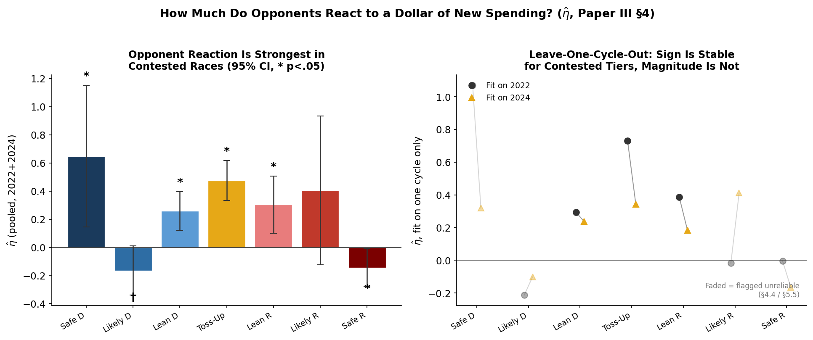
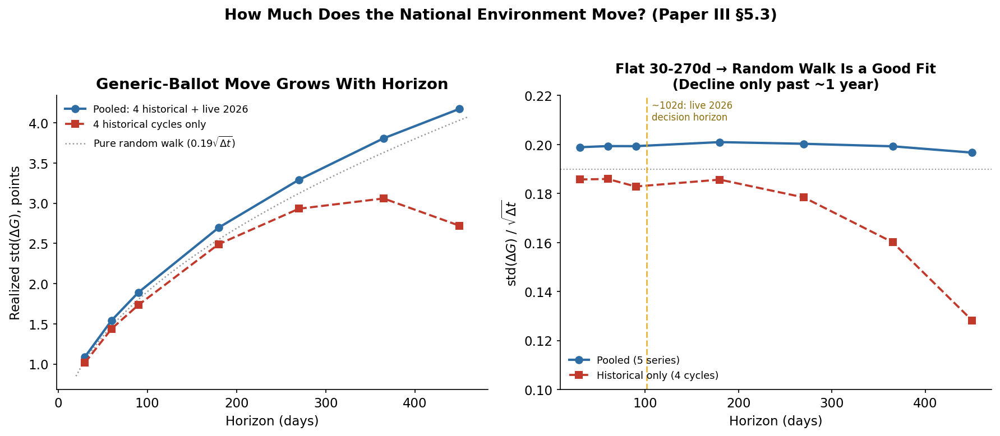
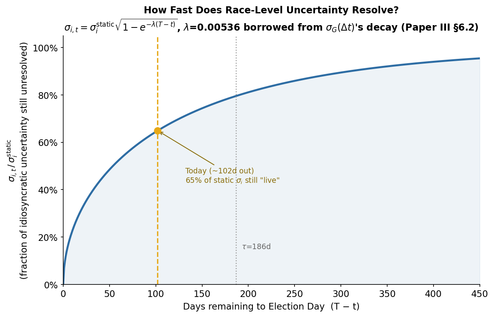
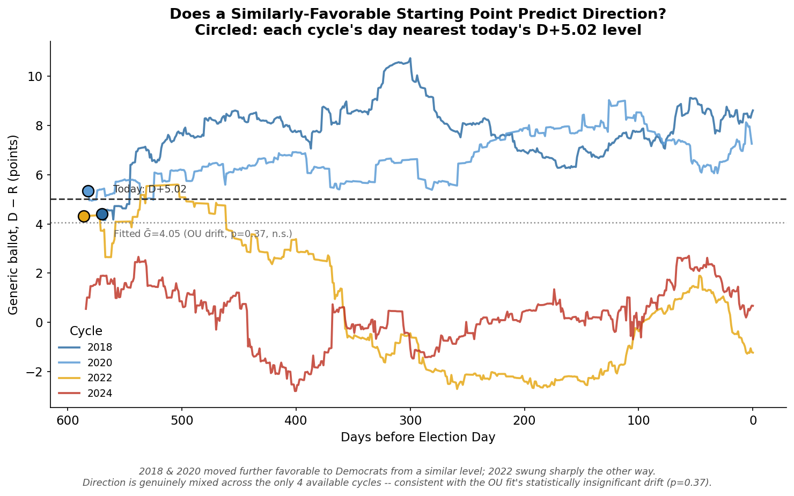
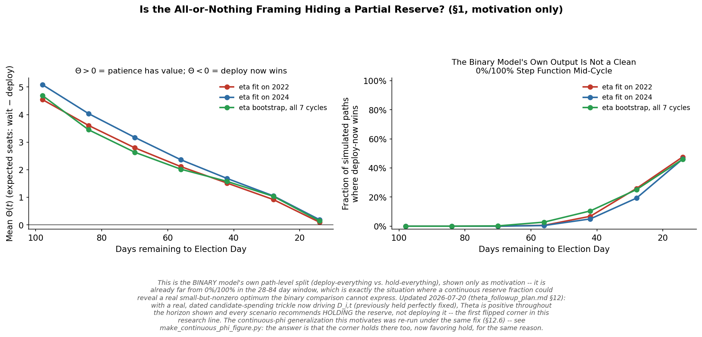
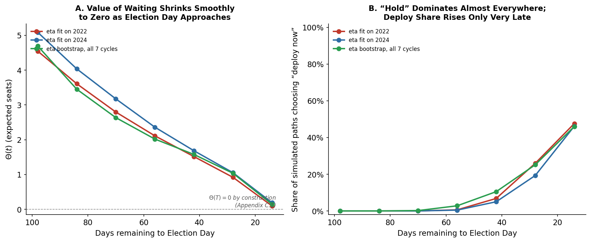
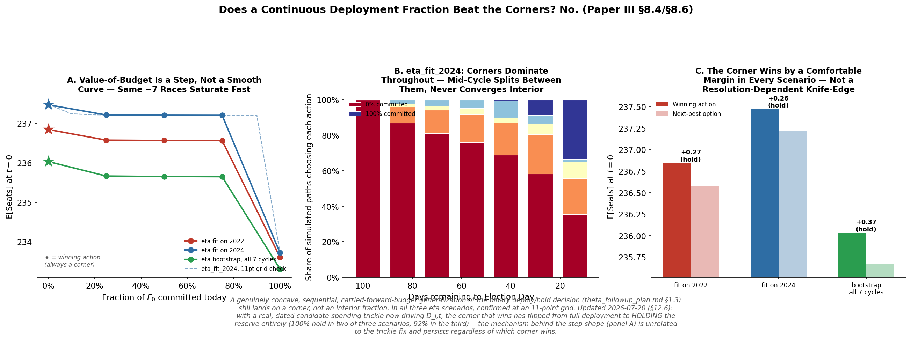

\begin{abstract}
\noindent
A companion paper (Paper II) builds a sequential architecture for deploying campaign capital -- a rollout policy that re-solves a single-period optimizer at each reporting period, distinct from full model-predictive control -- and discovers a gap this policy cannot express: capital held rather than spent has option value, because retaining it preserves the ability to react to information that has not yet arrived. It names this gap $\Theta$, states the Bellman equation that would price it, and stops there deliberately, because that equation contains an expectation operator with nothing specified to integrate over. This paper argues that treating the Bellman equation as the remaining problem is backward, in the same sense that asking for the value of a stock option is backward before anyone has specified how the stock price moves: an option's value is a corollary of a specified stochastic process for the underlying, not an independently derived quantity. This paper is the political-science analog of specifying that process. We define the campaign state vector explicitly, decompose its evolution into a fully-derived control component (inherited from Paper I) and three components requiring genuine estimation -- opponent reaction to a committee's own spending, a national political-environment process, and race-level idiosyncratic uncertainty -- and estimate each from public data where the data allows. Opponent reaction is estimated from a seven-cycle (2012--2024) panel of dated independent-expenditure filings, tiered by competitiveness, with a cycle-weighted (random-effects) point estimate of $\hat\eta\approx0.26$--$0.38$ in genuinely contested tiers after confirming most tiers show real cycle-to-cycle variation rather than a single stable constant. The national environment process is calibrated from a five-cycle historical generic-ballot series, giving a term structure $\sigma_G(\Delta t)\approx0.18$--$0.20\times\sqrt{\Delta t}$ that is empirically indistinguishable between a random walk and a mean-reverting process over the three-to-nine-month horizon that matters near Election Day. Race-level idiosyncratic uncertainty cannot be estimated as a genuine time-varying process under the public-data-only constraint this research program maintains, given that well under 10\% of competitive House districts receive repeated public polling in a typical cycle; it is instead treated as an explicit, bounded proxy that borrows its resolution rate from the calibrated national process, a choice we defend and flag rather than present as equivalent to a fitted model. The assembled simulator is validated against held-out 2022 and 2024 data before being trusted for pricing (a September information set rank-correlates with eventual November outcomes at $\rho=0.47$ and $0.65$ respectively) and passes a four-part internal self-consistency check. Once specified and estimated, $\Theta$ is a standard application of regression-based Monte Carlo (Longstaff--Schwartz) backward induction, not a new contribution. Solved against the live 2026 decision using the fast LP within-period allocator, $\Theta(0)$ is substantially positive -- $+4.5$ to $+5.1$ expected seats across three calibration scenarios at a 98-day horizon. This LP-based figure is wrong, and this paper's actual conclusion is the opposite of what it first reported. Turning the same mechanism-checking discipline this paper's central methodological argument insists on for the transition law $P$ onto the control itself, an allocator-robustness investigation finds that the LP allocator's greedy, corner-concentrated approximation, not any property of the underlying campaign-state process, was manufacturing the appearance of a large positive value of waiting. Replacing the LP allocator with a validated, LP-speed surrogate for the true, diminishing-returns-respecting nonlinear allocator (exactly optimal for the piecewise-linear-concave relaxation of the true objective, verified against the true nonlinear solver to capture over 99.9 percent of optimal value, and against the true nonlinear-throughout $\Theta$ estimate itself to within $0.03$ expected seats) and re-solving at the identical $K=2{,}000$ path count the LP-based figures above were reported at gives $\Theta(0)=-0.222$ for the bootstrap-calibration scenario, $-0.299$ for the eta-fit-2022 scenario (unanimous across every simulated path), and $-0.453$ for the eta-fit-2024 scenario (also unanimous) -- negative in every scenario, at the same statistical power the original positive claim was made with, though not with the same weight of evidence in every scenario: the two single-cycle brackets are unanimous across every simulated path, while the pooled bootstrap calibration's point estimate is modest in magnitude relative to the surrogate's own validated approximation gap ($0.03$--$0.19$ expected seats) and should be read accordingly. Every scenario's point estimate favors immediate deployment; the conclusion is unequivocal in the two single-cycle brackets and modest in magnitude under the pooled bootstrap calibration. A structured parameter-sensitivity check -- perturbing $\hat\eta$, the trickle rate, and the idiosyncratic-decay rate simultaneously over ranges bracketing their documented historical instability, combined with fresh cross-cycle bootstrap draws, 80 independent draws in total -- never flips the bootstrap scenario's sign positive. A continuous deployment-fraction generalization under the same validated surrogate, by contrast, finds a small (0.5-to-1.0-seat) average preference for retaining part of the reserve rather than deploying all of it, in tension with the binary framing above; this paper reports that tension rather than resolving it by fiat, and reads it as a caveat on the corrected recommendation's margin, not a rebuttal, given the two single-cycle brackets' unanimity under the binary framing. The corrected recommendation is to deploy the reserve now, not to hold it. This reverses an earlier, incorrect version of this same calculation that omitted a real channel (candidate committees' own organic spending growth while a committee waits), a subsequent variance-specification double-count that had suppressed the still-wrong-signed, LP-based estimate to a smaller range, and finally the allocator substitution identified here, which reverses the sign a second time and, unlike the first two corrections, does not return to the original "deploy" conclusion by accident: it is now independently confirmed, at full precision, under the model this paper set out to build. A mechanism decomposition additionally shows that roughly 70 percent of the superseded, LP-based $\Theta$'s value, isolated channel by channel, would have come from candidate committees' predictable organic spending growth rather than from resolving genuine uncertainty -- a qualification to the real-options framing that remains relevant to interpreting why the corrected model, not merely the flawed one, still finds a role for both channels, even where their net effect is now negative. This paper's contribution is the specified and estimated transition law, $P$, together with the discovery and correction of a control-specification error precise enough to reverse this program's headline policy recommendation; the discipline of finding and reporting that error, rather than the error's absence, is what this paper actually delivers.
\end{abstract}

\vspace{0.5em}
\noindent\textbf{Keywords:} optimal stopping, real options, state-space estimation, regression-based Monte Carlo, Ornstein--Uhlenbeck process, campaign finance, stochastic control

\newpage

# Introduction

## The Question This Paper Answers, and the One It Does Not

Paper II asks how a committee should deploy capital sequentially, given a valuation model, and in building that architecture discovers a gap: nothing in it prices the difference between "this race is worth funding" and "this race is worth funding *right now*." Paper II calls the missing object $\Theta$, states the Bellman equation it would need to solve, and stops there deliberately.

The natural next move is to treat that Bellman equation as the remaining problem and try to solve it. This paper argues that is the wrong next move, for a precise reason: a Bellman equation over an unspecified state-transition law is not merely difficult -- it is not yet a well-posed mathematical object. Consider the equation itself,

$$V_t(\mathbf X_t,F_t) = \max_{0\le\mathbf p_t\le F_t}\ \mathbb E_P\!\left[\,V_{t+1}(\mathbf X_{t+1},F_t-\mathbf 1'\mathbf p_t+\text{fundraising}_t)\,\right]$$

Every symbol here is defined except one: $P$, the law governing how $\mathbf X_{t+1}$ is generated from $\mathbf X_t$. Without $P$, this expression has an expectation operator with nothing inside it to take an expectation *over*. It is not that solving this equation is hard without $P$ -- it is that the equation does not yet say anything without $P$. Specifying $P$ is therefore not a preliminary step before the real work; it is the entire remaining scientific content of the problem. Once $P$ exists, computing $V_t$ (and therefore $\Theta$) is standard: simulate forward paths under $P$, and use a regression-based Monte Carlo method (Longstaff and Schwartz 2001) to estimate continuation values by backward induction. That machinery is decades old and well understood. It is not what makes this problem hard. **This paper's job is to specify and, where the data allows, estimate $P$.** Everything about $\Theta$, reserve policy, and optimal stopping is a downstream implication of that specification, not a separate derivation.

## The Finance Analogy, Made Precise

The correspondence to option pricing is exact enough to be load-bearing, not decorative.

**Table 1: The Option-Pricing Correspondence**

| Finance | This project |
|---|---|
| Stock price $S_t$ | Campaign state $\mathbf X_t$ (Section 3.2) |
| Price process $dS_t=\mu S_t\,dt+\sigma S_t\,dW_t$ | State-transition law $P$ (Sections 4.2--4.4) |
| Volatility $\sigma$ | $G_t$'s innovation variance, $\varepsilon_{i,t}$'s decay structure, opponent reaction $R_t(D_t)$ |
| Option value $V(S_t,t)$ | Value function $V_t(\mathbf X_t,F_t)$ |
| Early-exercise value / American option premium | $\Theta(t)$, the value of not yet committing capital |
| Black--Scholes PDE / binomial tree / Longstaff--Schwartz | The Bellman recursion above, solved once $P$ is known |

No one asks "what is the value of waiting to exercise this option?" before specifying $\sigma$. The question is not answerable in that order. The same is true here: Paper II's Bellman equation, exactly like an option-pricing PDE, is the *consumer* of a specified process, not a substitute for specifying one.

## What Motivates This Now

Paper II's live 2026 run gives this urgency beyond theoretical motivation. At approximately four months from Election Day, Paper II's rollout policy -- which implicitly assumes $P$ contributes nothing beyond what the current period already knows -- recommends a majority of deployable capital to Likely R and Safe R seats, including a nontrivial allocation to deeply-safe districts (Paper I's persuasion-ceiling-corrected pipeline: 51.4% of a live \$393M reserve). This is the empirical size of the gap a specified $P$ closes, and Section 8 reports what closing it changes about the live recommendation.

\newpage

# Related Literature

## Option Pricing and Real Options

The mathematical machinery this paper ultimately applies -- regression-based Monte Carlo pricing of an American-style option with early-exercise features -- is due to Longstaff and Schwartz (2001), building on the foundational option-pricing framework of Black and Scholes (1973) and Merton (1973). The extension of that machinery from financial to real (physical or organizational) assets is the subject of real-options theory (McDonald and Siegel 1986; Dixit and Pindyck 1994), which this paper's companion (Paper II) already introduces as the conceptual frame for uncommitted campaign capital. This paper's relationship to that literature is specific: the machinery is not this paper's contribution (Section 1.1), and is applied here essentially unmodified once $P$ exists (Section 4.6).

## State-Space Estimation and Time-Series Processes

Specifying $P$ requires standard time-series tools applied to a genuinely novel domain. The choice between a random walk and a mean-reverting (Ornstein--Uhlenbeck) specification for a bounded political quantity is a classical model-selection problem (the Ornstein--Uhlenbeck process itself: Uhlenbeck and Ornstein 1930); realized-volatility term-structure estimation, used here to calibrate the national-environment process's horizon-dependent standard deviation directly from data rather than assuming a parametric form, follows the general logic of realized-volatility estimation in financial econometrics (Andersen and Bollerslev 1998). State-space filtering more broadly (Kalman 1960) is the natural refinement of the smoothing rule Paper II uses for its own state update, though this paper does not implement a full Kalman treatment (Section 10.2).

## Political Science: Strategic Response and Forecasting

Paper I already situates the campaign finance and election-forecasting literatures relative to this research program; two threads bear directly on this paper specifically. Erikson and Palfrey (2000) model campaign spending as a simultaneous strategic game, establishing the theoretical prior this paper's opponent-reaction estimate (Section 4.2, 6.1) tests directly with data: that a committee's own spending decision changes, rather than simply adding to, the opposing side's. Gelman and King (1993), already cited in Paper I for the fundamentals-versus-polls decomposition motivating a race's expected margin as a structural quantity distinct from its moment-to-moment noise, is the same distinction this paper's separation of $\mu_{i,t}$ (control-driven) from $\varepsilon_{i,t}$ (idiosyncratic shock) formalizes for an allocation, rather than forecasting, purpose.

## Research Gap

No existing work specifies and estimates a full state-transition law for a political campaign's decision-relevant state, suitable for pricing the value of delaying an irreversible spending commitment. The option-pricing and real-options literatures supply the valuation machinery in general form; they do not supply a calibrated instance for this domain. The strategic-interaction and forecasting literatures supply pieces of the transition law -- evidence that spending elicits a reaction, methods for tracking a national environment factor -- but neither assembles them into a joint process an optimal-stopping calculation can consume, and neither confronts the practical data constraints (Section 5) that determine which components of that process can actually be estimated from public data and which cannot.

\newpage

# Problem Formulation

## Notation

**Table 2: Notation (in addition to Papers I and II)**

| Symbol | Meaning |
|---|---|
| $P$ | the state-transition law governing $\mathbf X_{t+1}\mid\mathbf X_t$ (this paper's subject) |
| $G_t$ | national generic-ballot point estimate (D $-$ R) at period $t$ |
| $\varepsilon_{i,t}$ | race-level idiosyncratic shock to $\mu_{i,t}$ |
| $R_t(D_t)$ | opponent (Republican-aligned) spending as a reactive function of the committee's own control |
| $\eta(\text{tier})$ | opponent-reaction coefficient, tiered by Cook competitiveness |
| $\sigma_G(\Delta t)$ | the national-environment process's realized-volatility term structure |
| $\lambda$ | decay rate governing how race-level idiosyncratic uncertainty resolves over time |
| $V_i(t)$ | cumulative remaining idiosyncratic-uncertainty target at time $t$ for race $i$ |
| $V_t(\mathbf X_t,F_t)$ | the value function: expected seats achievable from state $\mathbf X_t$ with deployable capital $F_t$ remaining |
| $\Theta(t)$ | $V_t^{\text{wait}}-V_t^{\text{deploy-now}}$, the value of waiting |
| $K$ | number of simulated Monte Carlo paths |

## The State Vector $\mathbf X_t$

Paper II leaves $\mathbf X_t$ informal and its transition operator $f$ fully generic. Before any component of $P$ can be specified, $\mathbf X_t$ itself needs a precise definition. Grounding this in the sequential architecture's own implementation, the state at reporting period $t$ is

$$\mathbf X_t = \Big(\ \{\mu_{i,t},\ \sigma_{i,t},\ D_{i,t},\ R_{i,t},\ L_{i,t}\}_{i=1}^N,\ \ G_t,\ \ F_t\ \Big)$$

where, per race $i$: $\mu_{i,t}$ and $\sigma_{i,t}$ are the smoothed expected-margin and margin-uncertainty estimates (Paper II's valuation, re-estimated and EMA-smoothed each period); $D_{i,t}$ and $R_{i,t}$ are cumulative Democratic- and Republican-aligned spending to date; $L_{i,t}$ is committed capital already irreversible for that race. At the aggregate level, $G_t$ is the national generic-ballot point estimate and $F_t=B_t-\sum_iL_{i,t}$ is deployable capital (Paper II's ledger identity).

**Table 3: Evolution Mechanism by Component**

| Component | Evolution mechanism | Status |
|---|---|---|
| $D_{i,t}$ | **Control**: $D_{i,t+1}=D_{i,t}+p_{i,t}$, the committee's own decision | Fully specified (the decision variable) |
| $\mu_{i,t}$ | **Control + two stochastic shocks**: $\mu_{i,t+1}=\mu_{i,t}+\Delta\mu_i(p_t)+\beta_i\Delta G_t+\varepsilon_{i,t}$ | Control term derived (Paper I); shocks require Sections 4.3--4.4 |
| $G_t$ | **Stochastic process**, exogenous to any single committee's decisions | Requires Section 4.3 |
| $R_{i,t}$ | **Reactive process**, a function of the committee's own control | Requires Section 4.2 |
| $F_t,\ L_{i,t}$ | **Deterministic bookkeeping** given $B_t$ and the ledger identity | Fully derived (Paper II) |
| $\sigma_{i,t}$ | Smoothed via Paper II's EMA; no independent process proposed here | Explicitly out of scope |

Of six rows, two are already fully solved by Papers I--II, one is definitional bookkeeping, and three are genuinely unresolved. This paper treats those three as co-equal objects of estimation, not as a primary process with two footnotes.

## Why Calibration Precedes Optimization

This is stated as its own claim because it is this paper's central methodological point: **without a calibrated $P$, the Bellman equation above is not difficult to solve -- it is undefined.** "Difficult" describes a well-posed problem that resists an easy method. An expectation operator with no specified distribution to integrate against is not that; it is a placeholder. It would be a mistake to pick a convenient distribution for $G_t$ and $\varepsilon_{i,t}$ purely so the equation can be exercised; that produces a number, but not a defensible one, and the number would carry false precision. The correct sequencing is: estimate $P$ from data, report honestly where it cannot yet be estimated, and only then compute $\Theta$ -- carrying forward, explicitly, whatever uncertainty a component of $P$ that cannot be fully estimated implies (Section 4.4).

## The Value Function and the Stopping Problem

Given a specified $P$, the value function satisfies the Bellman recursion of Section 1.1, with boundary condition $V_T(\cdot,F_T)=$ Paper I's static payoff at Election Day ($\Theta(T)=0$: nothing left to wait for once the election has occurred). The object this paper ultimately computes is $\Theta(t)=V_t^{\text{wait}}-V_t^{\text{deploy-now}}$: the value of retaining $F_t$ uncommitted for one more period, against the value of deploying it now via Paper I's static optimizer, is a standard implication of $P$, not a new derivation, once $P$ exists (Section 4.6).

\newpage

# Theoretical Framework

This section is the paper's heart: specification of each stochastic component of $P$, the resulting fully-assembled state-transition model, and the machinery -- standard once $P$ exists -- that turns it into $\Theta$.

## Opponent Reaction $R_t(D_t)$

### Why This Is Not "Just Another Stochastic Term"

The other two stochastic components ($G_t$, $\varepsilon_{i,t}$) enter $\mathbf X_t$'s transition additively, alongside the control term, without altering what the control term *means*. Opponent reaction is different in kind: if Republican-aligned spending responds to Democratic increments at some rate $\eta$, the *effective* control is not $\Delta\mu_i(p_t)$ as Paper I derives it holding $R_i$ fixed -- it is $\Delta\mu_i(p_t)$ evaluated against a moving $R_{i,t}$ that partially offsets the increment. Paper I's optimizer already encodes this mechanically:

$$R_i(D_i) = R_{i,\text{base}} + \eta\cdot\max(0,\ \text{party}_i - \text{party}_{i,\text{obs}}), \qquad \eta\in[0,1]$$

At $\eta=0$, Paper I's static gradient is exactly correct. At $\eta\to1$ (dollar-for-dollar matching), the log-ratio term driving the entire marginal-seat-gain chain rule collapses toward zero -- the committee's spending decision stops mechanically converting into margin movement at all. **This is not a refinement to the control term; it is a statement about how much of the control term is real.** A single scalar $\eta$ is very likely mis-specified: the economically plausible prior is that opponents match aggressively in Toss-Ups, where a marginal dollar changes the outcome, and largely ignore spending in races that are not competitive for either side. The primary specification is therefore $\eta(\text{tier})$, fit separately by Cook competitiveness tier, not a pooled scalar.

### Specification

$$\Delta R_{i,t}^{\text{IE}} = \eta(\text{tier}_i)\cdot\Delta D_{i,t-1}^{\text{IE}} + u_{i,t}$$

with race fixed effects applied via within-(cycle, district) demeaning, pooled across a reconstructed and cleaned panel of date-bucketed independent-expenditure filings, $\eta$ interacted with Cook tier. Section 5.4 documents the data-cleaning steps (amendment resolution, duplicate-transaction and implausible-amount filtering) this specification requires and that a cycle-cumulative analysis does not surface.

## The National Environment Process $G_t$

### Candidate Specifications

Two natural candidates: a random walk, $\Delta G_t\sim N(0,\sigma_G^2\Delta t)$, under which variance grows unboundedly with horizon; and a mean-reverting Ornstein--Uhlenbeck process, $dG_t=\kappa(\bar G-G_t)dt+\sigma_G\,dW_t$, under which variance saturates. These have materially different implications for $\Theta$ in principle -- a random walk implies option value keeps growing the longer one waits, while mean reversion implies most resolvable uncertainty is realized within a bounded window -- but the generic ballot is bounded by underlying partisanship, so formal model selection would very likely favor OU over a random walk almost regardless of the data, while the mean-reversion speed implied by a realistic lookback window is typically slow enough that over the three-to-six-month horizon actually relevant to $\Theta$ near Election Day, the two specifications are nearly indistinguishable in their implications (confirmed empirically, Section 6.2). The primary deliverable of this section is therefore not a model-selection verdict between the two, but the empirical, non-parametric term structure $\sigma_G(\Delta t)$ itself -- realized volatility as a direct function of horizon, estimated from the historical series without forcing a Gaussian process form onto it first.

### $\lambda$ for the Idiosyncratic-Uncertainty Decay Proxy

Fitting $\text{Var}(\Delta G)(t)=A(1-e^{-t/\tau})$ to the pooled historical term structure (Section 6.2) yields a decay rate $\hat\lambda=1/\hat\tau$, used directly in Section 4.4's idiosyncratic-uncertainty proxy below -- the assumption being that idiosyncratic information resolves at a rate comparable to national information, absent any race-specific data to say otherwise.

## Race-Level Idiosyncratic Uncertainty $\varepsilon_{i,t}$

### What Already Exists, and What Is Missing

Paper I's $\sigma_i$ model is a **cross-sectional** fit -- how much residual uncertainty a race of a given type carries once, not how that uncertainty evolves or resolves over a cycle. A genuine $\varepsilon_{i,t}$ process requires knowing how much of a race's idiosyncratic uncertainty resolves per unit time, and how that resolution correlates across races beyond what $G_t$ already captures.

### A Data Constraint, Likely Permanent, and Why the Obvious Fallback Is Dangerous

Estimating this genuinely requires district-level polling history across the competitive universe. In a typical recent cycle, well under 10% of House districts receive two or more public polls at all, and most of those cluster in the final weeks before Election Day -- not enough to fit a genuine time-series process for $\varepsilon_{i,t}$ per race; for the large majority of races the effective sample size is one observation or zero. A tempting fallback -- treating $\varepsilon_{i,t}$ as a static draw from Paper I's cross-sectional $\sigma_i$ distribution -- is not a neutral simplification; it is wrong in a specific, consequential direction. Treating $\varepsilon_{i,t}$ as a static draw implicitly assumes all of a race's idiosyncratic uncertainty resolves instantaneously, equivalent to assuming there is no idiosyncratic information left to arrive -- exactly backward, since it would make $\Theta$ collapse toward zero for the wrong reason (nothing left to wait for) rather than the right one (nothing left to *learn*).

### Proposed Treatment

We instead borrow the resolution *rate*, not the distribution, from Section 4.3's calibrated national process, applied as a shrinkage/decay factor on the static cross-sectional $\sigma_i$:

$$\sigma_{i,t} = \sigma_i^{\text{static}}\cdot\sqrt{1-e^{-\lambda(T-t)}}$$

where $\lambda$ is fit from $\sigma_G(\Delta t)$'s term structure (Section 6.2) rather than estimated separately per race. This is explicitly a proxy, not a fitted $\varepsilon_{i,t}$ process, and is reported as one: it prevents $\Theta$ from being inflated by an implausible "surprise arrives all at once on Election Day" assumption, but it does not constitute having estimated race-level dynamics from data, because the data to do so does not exist in usable quantity (Section 10.1).

## The Deploy-Branch Terminal Win-Probability Identity

A committee that deploys its full reserve at period $t$ does not thereby learn nothing about how the future would have unfolded; it forecloses the ability to *act* on that information, but the terminal win probability the deploy branch should be scored against still reflects the true distribution of where $\mu_i$ ends up by Election Day, not merely its period-$t$ value. Formally, if $\mu_i(T)=\mu_i(t)+\xi$ for a mean-zero remaining shock $\xi\sim N(0,V_i(t))$ (the movement not yet realized at $t$, i.e. the part of the idiosyncratic-uncertainty budget $\sigma_i^2$ that has not yet resolved as of $t$), then, applied to a $\mu_i(t)$ that is itself already a clean structural estimate with no resolved shock embedded in it,

$$\mathbb E_\xi\big[\Phi\big((\mu_i(t)+\xi)/\sigma_i\big)\big] = \Phi\!\left(\frac{\mu_i(t)}{\sqrt{\sigma_i^2+V_i(t)}}\right)$$

a standard Gaussian-convolution identity (Appendix B.1 derives it). This lets the "deploy now" branch of the backward induction analytically integrate over the expected effect of all remaining idiosyncratic drift in one step, rather than requiring the simulator to wait through it path by path. The identity is exact for what it integrates over -- the expected effect of unresolved, mean-zero Gaussian shocks on terminal win probability -- and Section 8.4 shows it has a direct and important consequence for how $\Theta$ behaves as the horizon lengthens: it does not, however, capture the value of *adaptive* decision-making, that new information arriving mid-campaign could change *how* the reserve is allocated, not merely *whether* it is deployed (Section 9.2 returns to this scope boundary directly).

**A critical asymmetry.** The convolution identity above requires $\xi$ to be genuinely mean-zero. This holds for idiosyncratic shocks and, absent any real spending growth while a committee waits, trivially held for $D_{i,t}$ itself in an earlier version of this model (Section 8.6's correction). It does *not* hold once $D_{i,t}$ is given a real, deterministic, non-zero-mean growth process (Section 6.4) -- a committee's own candidate committees continue raising and spending money organically while the party committee waits. A convolution that omits this deterministic drift silently understates the deploy branch's true value, biasing the comparison toward "wait" for the wrong reason. Section 8.6 reports finding and correcting exactly this asymmetry.

**A variance double-count, found and corrected in this same audit.** The identity above is stated for a $\mu_i(t)$ with *no* resolved shock embedded in it -- $\sigma_i^2$ and $V_i(t)$ are meant as two disjoint pieces of the same idiosyncratic-uncertainty budget (resolved-by-$t$ and remaining-after-$t$), not two independent, additive sources. The implemented simulator, however, constructs $\mu_i(t)=\mu_i^{\text{struct}}(t)+\varepsilon_{i}^{\text{cum}}(t)$, where $\varepsilon_i^{\text{cum}}(t)$ is the *already-realized* share of the idiosyncratic budget as of $t$ (Appendix B.2's telescoping construction: $\text{Var}(\varepsilon_i^{\text{cum}}(t))+V_i(t)$ is constant in $t$). Applying the convolution above to this already-partly-resolved $\mu_i(t)$ and *still* adding the full $\sigma_i^2$ term prices the same idiosyncratic budget twice -- once through the realized simulated shock, once again through the convolution's own $\sigma_i^2$ term -- inflating the deploy branch's effective variance by up to a factor of roughly 2--3 at horizons well before Election Day (confirmed numerically: at the live 98-day horizon, $\text{Var}(\varepsilon_i^{\text{cum}}(t))+V_i(t)=91.97$ for a representative $\sigma_i=15$ throughout, versus $\sigma_i^2+V_i(t)$ ranging from 225 (near $T$) to 317 (at $t=0$) under the uncorrected formula). The corrected convolution, given a $\mu_i(t)$ that already embeds the resolved share, uses $V_i(t)$ alone:

$$\Phi\!\left(\frac{\mu_i(t)+\Delta\mu_i}{\sqrt{V_i(t)}}\right)$$

with the boundary at $t=T$ ($V_i(T)=0$) handled by the same limit that already anchors $\Theta(T)=0$ (Appendix C.1) rather than by re-introducing $\sigma_i$ there. This is a strictly more consequential correction than Section 8.6's trickle-drift fix: it moves the live-horizon $\Theta(0)$ from the $+1.3$--$+1.7$ range reported in earlier drafts of this section to $+4.5$--$+5.1$ (Table 11), because the uncorrected formula suppressed *all* win probabilities toward 0.5 at every period before $T$, muting precisely the late-campaign certainty that "wait, then deploy once things resolve" depends on. External review subsequently caught that this same treatment had been left inconsistent specifically at the terminal boundary itself for the default (stochastic) path -- the fix above, as now stated, is the *fully* corrected version, applied uniformly to every period including $t=T$; the intermediate-only version of the fix (reported in an earlier pass of this section) had moved the figures further, to $+4.6$--$+5.9$, before this last refinement. Section 8.6 reports all three corrections together, in the order they were found.

## From a Calibrated $P$ to $\Theta$: Standard Machinery, One Necessary Adaptation

Once Sections 4.2--4.5 specify $P$, computing $V_t(\mathbf X_t,F_t)$ and therefore $\Theta(t)$ is standard: simulate forward paths of $\mathbf X_t$ under $P$; at each step, regress simulated continuation values on a basis of current-state features (Longstaff and Schwartz 2001); proceed by backward induction from $T$. We state this explicitly so it is not mistaken for this paper's contribution -- the contribution is Sections 4.2--4.5; this section is what those sections are *for*.

**The one adaptation this domain requires: compress the regression basis.** The state vector carries per-race features for $N>400$ races. Regressing simulated continuation values on a per-race feature basis is not merely slow -- at the sample sizes involved ($K\sim10^4$ paths, $\sim15$ time steps, giving $\sim10^5$ observations against a feature matrix with hundreds of columns) it is a data-analytic mistake that would overfit badly and say more about simulation noise than about $\Theta$. The regression basis must instead be a small set of portfolio-level aggregate features, the same design used in basket-option pricing when the same dimensionality problem arises from pricing an option on many underlyings at once:

1. $\mathbb E[\text{Seats}]_t=\sum_i\Phi(\mu_{i,t}/\sigma_{i,t})$ -- the portfolio's current level.
2. $\text{Var}[\text{Seats}]_t=\mathbf 1'\Sigma_t\mathbf 1$ -- the portfolio's current risk (Paper I's covariance model).
3. $\max_i\text{MSG}_{i,t}$ -- the value of the single best marginal dollar available right now.
4. A near-threshold count -- the number of races within a small margin of the majority-determining threshold, a direct proxy for how much of the portfolio's outcome is still genuinely undecided.
5. $G_t$ -- the current national-environment level, entered directly as a fifth feature (never fed into $\mu_i$'s structural formula, per Section 4.3's scope boundary below).

## A Scope Boundary That Must Be Stated Before Estimating Anything

The existing point-in-time state-reconstruction machinery this paper's estimation and validation work reuses documents a constraint this paper must respect: $\alpha_3$, Paper I's margin-model generic-ballot coefficient, was estimated entirely from *between-cycle* variation -- one $GB$ value per historical cycle, identical across every race in that cycle. Its identifying variation has never been within-cycle. Wiring the calibrated $\Delta G$ shock into $\mu_i$ for a within-cycle simulation step would apply $\alpha_3$ to an estimand it was never fit against. **This paper does not make that substitution.** The assembled simulator computes $\Delta G$ (Section 4.3) and $\eta$-driven $R_{i,t}$ movement (Section 4.2), but validates each against real held-out data on its own terms (Section 8.1), and enters $G_t$ into the Longstaff--Schwartz regression basis as an independent feature (item 5 above) rather than folding it into $\mu_i$ under a model specification never estimated to support it. Re-estimating the margin model on a panel with within-cycle $GB$ observations is a prerequisite to that stronger integration, and is left for future work (Section 10.2).

\newpage

# Data

## Data Sources

Beyond every source Papers I and II already use, this paper requires three additional, specifically dated panels. **Dated independent-expenditure filings**, resolved to specific filing dates rather than cycle-cumulative totals (FEC Schedule E, via the comprehensive bulk export), pooled across all seven cycles this repository has usable data for (2012--2024), used to estimate opponent reaction (Section 6.1). **A historical, dated, multi-cycle generic-ballot series** (2018, 2020, 2022, 2024), recovered via a Wayback Machine snapshot of FiveThirtyEight's discontinued live generic-ballot data feed, since no other multi-cycle dated source was available in this repository -- the standard `generic_ballot_by_cycle.csv` carries exactly one static value per cycle, no dates at all, and RealClearPolitics's bulk archive was found to be blocked by bot protection when checked directly. **A dated candidate-committee financial panel** (FEC API `/committee/{id}/reports/` endpoint, per-filing-period Form 3 reports), used to calibrate the candidate-spending trickle rate the deploy-branch convolution correction (Section 4.5) requires; this endpoint returns genuinely dated, per-period filings, unlike the bulk `weball` files this project's other candidate-spending measures use, which report only a single cycle-cumulative total.

## Coverage

Opponent-reaction estimation pools all seven cycles with usable dated IE data (2012--2024, $n=57{,}763$ delta-panel rows in the full extension). The national-environment term structure pools four historical cycles (2018, 2020, 2022, 2024) plus the live 2026 series. The candidate-spending trickle rate is calibrated on the same seven-cycle panel as opponent reaction. Simulator validation (Section 8.1) uses the 2022 and 2024 cycles as held-out targets. The main Longstaff--Schwartz solve (Section 8.3) is run against the live, in-progress 2026 state at a 98-day horizon, and against a 364-day counterfactual horizon holding all other state fixed (Section 8.5).

## Feature Engineering

The opponent-reaction panel is constructed at biweekly reporting periods (matching Paper II's reporting cadence) from January through early November of each cycle, with race fixed effects applied via within-(cycle, district) demeaning rather than a dummy-column matrix, since pooling roughly 800 district-cycle observations across many biweekly periods makes an explicit dummy matrix computationally wasteful for no estimation benefit. The national-environment term structure is computed directly from the recovered daily series at fixed horizons (30 through 450 days) without imposing a parametric form first.

## Cleaning

Two real, checked data-quality issues bear directly on the opponent-reaction estimate and are documented rather than silently absorbed. First, district attribution (`can_office_dis`) is blank in only 0.1--0.3% of House-general independent-expenditure rows in every cycle from 2012 through 2024 -- a specific a priori concern about pre-2018 data that does not hold in this data. Second, and more consequentially, blank expenditure dates (`exp_date`, needed for the date-bucketed reconstruction specifically) are *worse* in the recent cycles this paper's headline estimates rely on most (33.3% in 2022, 28.4% in 2024) than in older cycles (0.0% in 2012), and 2022's raw file separately contains a parsing-artifact corrupted row and a broader issue of duplicated transaction identifiers (26% of all 2022 IE rows share a duplicated `tran_id`). Both were confirmed not to contaminate any figure already reported in Papers I--II, which consume cycle-cumulative rather than date-bucketed totals, but a `tran_id`-deduplication and implausible-amount filtering step is a documented prerequisite specifically for this paper's transaction-level reconstruction.

## Final Dataset

**Table 4: State-Transition Estimation Dataset Summary**

| Quantity | Value |
|---|---|
| Opponent-reaction panel, cycles | 2012--2024 (7 cycles) |
| Opponent-reaction panel, observations | 57,763 (delta-panel rows, full 7-cycle extension) |
| National-environment series, cycles | 2018, 2020, 2022, 2024 (historical) + live 2026 |
| National-environment series, daily rows per cycle | 1,142--1,174 |
| Candidate-spending trickle panel, cycles | 2012--2024 (7 cycles, same extension as opponent reaction) |
| Simulator validation held-out cycles | 2022, 2024 |
| Monte Carlo paths per scenario ($K$) | 2,000 |
| Reporting periods (live horizon) | 7 (biweekly, 98 days to Election Day) |

\newpage

# Parameter Estimation \& Calibration

## Opponent Reaction $\hat\eta(\text{tier})$

The primary, cycle-weighted estimate pools all seven usable cycles via a random-effects (DerSimonian--Laird) meta-analytic combination, which gives each *election* a vote scaled by its own precision, rather than letting whichever cycle happened to generate the most transaction rows dominate a naive transaction-weighted pool.

**Table 5: Opponent-Reaction Estimates by Tier**

| Tier | 2-cycle pool (2022+2024) | 7-cycle naive pool | 7-cycle cycle-weighted (DL) | $I^2$ |
|---|---|---|---|---|
| Toss-Up | 0.475 | 0.422 | **0.277** | 73% |
| Lean D | 0.259 | 0.637 | **0.277** | 75% |
| Lean R | 0.304 | 0.572 | **0.304** | 0% |
| Likely R | 0.405 | 0.562 | **0.363** | 85% |
| Likely D | $-0.165$ | 0.180 | **0.043** | 46% |
| Safe D | 0.648 | 0.371 | **0.380** | 70% |
| Safe R | $-0.144$ | 0.584 | **0.258** | 89% |

$I^2$ -- the share of cross-cycle spread that is real variation rather than sampling noise -- is 70--89% for five of seven tiers, confirming a finding Section 8.1's validation makes precise: most tiers, including Toss-Up and Lean D, show statistically significant cycle-to-cycle variation once tested with adequate power, not a single stable structural constant. **Precision (a small standard error within a given pool) is not the same claim as temporal stability (the same true value across cycles), and most tiers fail the stability test.** The cycle-weighted (DL) column is the best available point estimate -- it does not let a transaction-heavy cycle dominate, and it uses all seven cycles rather than an arbitrary two-of-seven subset -- and gives $\hat\eta\approx0.26$--$0.38$ in genuinely contested tiers (Toss-Up, Lean D, Lean R, Likely R), well short of a naive dollar-for-dollar prior ($\eta\approx1$). Estimates for the Safe tiers and Likely D are retained for completeness but are identified from sparse, lumpy transaction activity (well under 20% of periods show any IE spending at all in these tiers) and should be read with substantially more caution.

{width=85%}

## The National Environment Process $\sigma_G(\Delta t)$

**Table 6: Generic-Ballot Realized Volatility Term Structure**

| Horizon (days) | Pooled std($\Delta G$), 5 cycles | std/$\sqrt{\text{days}}$, all 5 | std/$\sqrt{\text{days}}$, 4 historical only |
|---|---|---|---|
| 30 | 1.09 | 0.199 | 0.186 |
| 60 | 1.54 | 0.199 | 0.186 |
| 90 | 1.89 | 0.199 | 0.183 |
| 180 | 2.70 | 0.201 | 0.186 |
| 270 | 3.29 | 0.200 | 0.178 |
| 365 | 3.81 | 0.199 | 0.160 |
| 450 | 4.17 | 0.197 | 0.128 |

Pooled across genuinely independent cycles, std/$\sqrt{\text{days}}$ is remarkably stable from 30 through 270 days (0.183--0.201) rather than steadily declining, indicating an apparent mean-reversion signal visible in any single-cycle series is a small-sample artifact rather than a real feature of the process; a visible decline only emerges past roughly 365 days, consistent with Section 4.3's prediction that a random walk is a good approximation over the three-to-nine-month range that matters for $\Theta$ near Election Day, with the random-walk/mean-reversion distinction only mattering at horizons beyond about a year. The working calibration is $\sigma_G(\Delta t)\approx0.18$--$0.20\times\sqrt{\Delta t\text{ (days)}}$ (historical-cycles-only preferred for methodological cleanliness), giving $\sigma_G\approx2.0$ points at the roughly 120-day horizon relevant to the live application. Fitting $\text{Var}(\Delta G)(t)=A(1-e^{-t/\tau})$ to this term structure gives $\hat\lambda=1/\hat\tau=0.00536\,\text{day}^{-1}$ ($\hat\tau=186.5$ days), the decay rate Section 4.4's idiosyncratic-uncertainty proxy uses directly.

{width=85%}

## Idiosyncratic Uncertainty Decay

With $\lambda=0.00536\,\text{day}^{-1}$ fixed from Section 6.2, race-level uncertainty resolution follows $\sigma_{i,t}=\sigma_i^{\text{static}}\sqrt{1-e^{-\lambda(T-t)}}$ directly, with no additional free parameters. Figure 3 shows the resulting decay schedule.

{width=75%}

## Candidate-Spending Trickle Rate

A per-tier candidate-committee spending trickle rate -- the deterministic drift the deploy-branch convolution correction (Section 4.5) requires -- is calibrated from the seven-cycle dated candidate-financial panel (Section 5.1) using the mean daily disbursement rate within each tier, not the median: the median is exactly \$0.00/day in every tier, an artifact of comparing FEC's quarterly filing cadence against this project's biweekly reporting grid rather than evidence of no real growth. Extending this calibration from the original two-cycle (2022, 2024) panel to the full seven-cycle panel reduced every tier's fitted rate by 16--43% (e.g., Toss-Up: \$12,725/day $\to$ \$7,193/day) -- the same pattern already documented for $\hat\eta$ in Section 6.1 -- and is the calibration used in every result reported in Section 8.

## Calibration Summary

**Table 7: State-Transition Parameter Calibration Summary**

| Parameter | Value | Method |
|---|---|---|
| $\hat\eta$(Toss-Up) | 0.277 | 7-cycle DerSimonian--Laird |
| $\hat\eta$(Lean D) | 0.277 | 7-cycle DerSimonian--Laird |
| $\hat\eta$(Lean R) | 0.304 | 7-cycle DerSimonian--Laird |
| $\hat\eta$(Likely R) | 0.363 | 7-cycle DerSimonian--Laird |
| $\sigma_G(\Delta t)$ | $0.18$--$0.20\times\sqrt{\Delta t}$ | Pooled realized volatility, 5 cycles |
| $\lambda$ (decay rate) | $0.00536\,\text{day}^{-1}$ ($\tau=186.5$ days) | Fit to $\sigma_G$ term structure |
| Candidate trickle rate | tier-specific, e.g. Toss-Up \$7,193/day | 7-cycle mean daily rate |
| $K$ (Monte Carlo paths) | 2,000 | -- |
| Regression basis dimension | 5 features | Section 4.6 |

\newpage

# Optimization Algorithm

## Optimization Strategy

The backward induction is Longstaff--Schwartz regression-based Monte Carlo: simulate $K$ forward paths of $\mathbf X_t$ under the specified $P$; at each step moving backward from $T$, regress simulated continuation values on the five-feature basis of Section 4.6; compare the regression-estimated continuation ("wait") value against the deploy branch's closed-form terminal win-probability value (Section 4.5); the chosen action at each simulated state is whichever value is larger.

**The within-period allocator, stated up front rather than left to Section 8.9.** The deploy branch's within-period spending decision -- how the reserve is split across races once a deploy decision is made -- has to be solved $K\times N_{\text{periods}}\times(\text{scenarios})$ times per backward induction, so its own computational cost is not incidental to this paper's method; it is what makes the difference between a solve that finishes in minutes and one that does not finish at all. Three allocators appear in this paper, and they are not interchangeable:

1. **The concave-envelope surrogate (`scripts/concave_surrogate.py`), this paper's primary production allocator.** Exploits the fact that opponent reaction $R_i$ depends only on race $i$'s own party spending (Section 4.1), so the true objective is separable across races once each race's payoff is replaced by its piecewise-linear concave envelope; the resulting separable-concave resource-allocation problem is solved exactly, for that relaxation, by a single descending-slope sort (a discrete water-filling algorithm) rather than an iterative nonlinear program. It runs at LP speed (roughly 0.03 seconds per call) while still respecting diminishing returns and the persuasion ceiling, which the LP allocator below does not. Every $\Theta$ figure this paper treats as its actual finding -- Section 8.9's Table 13i onward -- uses this allocator throughout the entire backward induction.
2. **The exact nonlinear allocator (`optimizer.allocator.optimize_nonlinear()`), the validation benchmark.** Solves Paper I's true, diminishing-returns-respecting, ceiling-respecting objective via SLSQP. This is the allocator the surrogate is checked against (Section 8.9, Table 13c onward, and the broader random-state validation summarized in Table 13n) and the one a fully faithful implementation would use throughout -- but at 40 seconds to over an hour per call, a full $K=2{,}000$ backward induction against it is not computationally tractable, which is exactly why the surrogate above exists and why it was validated before being trusted.
3. **The fast LP allocator (`optimizer.allocator.optimize()`), a superseded historical approximation.** Used throughout this research line's early drafts for Monte Carlo tractability, before the concave surrogate existed. It treats each race's marginal seat gain as a fixed constant with no diminishing-returns mechanism, degenerating into a greedy knapsack that concentrates spending into a handful of races -- an approximation later shown (Section 8.9) to manufacture a large, spurious appearance of option value having nothing to do with the underlying transition law $P$. It is retained in this paper only for comparison, confined to the historical record in Appendix E and Appendix J; no result this paper treats as its conclusion uses it.

Sections 8.1--8.8 below (Tables 8--13b) report the LP allocator's results because that is the calculation this research line actually ran, in the order it actually ran it, before the allocator-robustness investigation (Section 8.9) identified and corrected the problem. Every figure this paper stands behind is in Section 8.9 onward, computed with allocator (1).

## Algorithm

**Algorithm 1: Regression-Based Monte Carlo for $\Theta$**

\footnotesize
```
Input:  P (calibrated: eta(tier), sigma_G(dt), lambda, trickle rate),
        live state X_0, K simulated paths, N periods to Election Day
Output: Theta(t) for t = 0,...,N; frac_deploy_now at each period

1.  Simulate K forward paths of X_t under P:
      - D_i,t: control (fixed at 0 further discretionary spend on
        the wait branch) + deterministic candidate trickle drift
      - G_t: standalone zero-drift random walk at sigma_G(dt)
        [never fed into mu_i; Section 4.7's scope boundary]
      - R_i,t: eta(tier) * delta(D_i,t) + residual noise from the
        fitted regression residuals
      - epsilon_i,t: independent increments matched to the
        cumulative decay schedule V_i(t) (Section 4.4)
2.  For t = N (Election Day) down to 0:
      a. Deploy branch: V_deploy(X_t) = closed-form terminal
           win-probability identity (Section 4.5), corrected for trickle drift asymmetry
      b. Wait branch: regress simulated V_{t+1} on the 5-feature
           basis (Section 4.6); V_wait(X_t) = fitted continuation value
      c. Theta(t) = V_wait(X_t) - V_deploy(X_t)
      d. Optimal action: deploy if V_deploy > V_wait, else wait
3.  Report Theta(t), frac_deploy_now (share of the K paths choosing
      "deploy" at each t), and basis R^2 as a diagnostic
```
\normalsize

## Computational Complexity

Each period requires $O(K\cdot N_{\text{races}})$ work to simulate one step forward, $O(K)$ work for the basis regression (five features, independent of the race universe size by construction -- the entire point of Section 4.6's compression), and one within-period allocator call per simulated deploy decision. The allocator's own per-call cost is what separates a solve that finishes in minutes from one that does not finish at all: the concave surrogate (roughly 0.03 seconds per call) makes a full $K=2{,}000$, 7-period binary-framing solve complete in under 9 minutes per scenario, and the continuous deployment-fraction generalization (multiplying by 5 or 11 grid points) in under 30 minutes; the exact nonlinear allocator (40 seconds to over an hour per call) makes the identical $K=2{,}000$ solve computationally infeasible, which is why it is used only as a reduced-$K$ validation benchmark (Section 8.9) rather than as the production allocator; the superseded LP allocator is faster still (milliseconds per call) but is not used for any figure this paper stands behind.

## Computational Environment

Implemented in Python. The deploy branch's within-period allocation uses `scripts/concave_surrogate.py`'s greedy water-filling solve as the primary production allocator (Section 7.1), sharing its per-race precomputation (`optimizer.allocator._precompute_race_arrays()`, `_reactive_r()`, `_apply_ceiling()`) directly with `optimizer.allocator.optimize_nonlinear()`, the exact SLSQP-based validation benchmark it is checked against -- the two are never allowed to diverge in how a given allocation's resulting margin is scored, only in how the allocation itself is chosen. The fast LP path (`optimizer.allocator.optimize()`) appears only in the historical record of Appendix E and Appendix J. `scripts/solve_bellman_lsm.py` implements the binary hold-or-deploy framing (`use_surrogate_allocator`, `use_nonlinear_allocator`, and the legacy LP default as its three within-period-allocator options); `scripts/solve_bellman_lsm_continuous_phi.py` and `scripts/solve_bellman_lsm_continuous_phi_surrogate.py` implement the continuous deployment-fraction generalization under the LP and surrogate allocators respectively; `scripts/estimate_eta_reaction.py`, `scripts/estimate_gb_volatility.py`, and `scripts/estimate_candidate_spend_trickle.py` implement the three calibration stages of Section 6. As in Papers I--II, a fixed random seed ensures exact reproducibility of every Monte Carlo result reported below.

\newpage

# Empirical Results

## Internal Validation

**Simulator self-consistency (the gate before any result is trusted).** A multi-period simulator built from independently-calibrated components is not automatically trustworthy just because each component was validated on its own; per-step implementation errors can compound silently across many steps. Four checks were run at 5,000 simulated paths per cycle (2022, 2024) before any $\Theta$ figure was computed from the assembled simulator:

**Table 8: Simulator Self-Consistency Checks**

| Check | 2022 | 2024 | Verdict |
|---|---|---|---|
| A: simulated $\sigma_G(\Delta t)$ vs. target, at 28/56/112 days | ratios 1.001/1.002/0.998 | ratios 0.996/0.993/0.990 | Matches |
| B: $\hat\eta$ recovered from simulated paths vs. input | 0.344 vs. input 0.321 (rel. error 7.2%) | 0.159 vs. input 0.175 (rel. error 9.3%) | Matches -- no sign/scale bug |
| C: cumulative $\varepsilon$ variance vs. target (mean/max rel. error) | 1.5%/3.7% | 1.3%/4.2% | Matches (Monte Carlo noise at $K$=5,000) |
| D: simulated margin spread / target remaining uncertainty | 0.98--1.02 | 0.98--1.02 | Matches |

All four pass. This confirms the simulator faithfully implements what Sections 4.2--4.4 calibrated; it does not re-validate the calibration itself, which the next check addresses.

**Validation A: does a September information set correctly rank-order eventual outcomes?** Race state was reconstructed at a real September 1 snapshot for 2022 and 2024, $\mu_{i,\text{Sept}}$ computed via Paper I's unmodified pipeline, and Spearman-correlated against realized November margin, restricted to the competitive set:

**Table 9: Validation A -- September-to-November Rank Correlation**

| Cycle | $n$ | $\rho$ | $p$ |
|---|---|---|---|
| 2022 | 61 | **0.467** | $<0.001$ |
| 2024 | 53 | **0.650** | $<0.001$ |

Both positive and significant: a September information set correctly rank-orders competitive races' eventual outcomes two-plus months out, clearing the bar for the underlying valuation chain any simulated path is built from to be worth simulating at all.

**Validation B: does $\sigma_G(\Delta t)$ match what actually happened?** Comparing the calibrated term structure against realized $|\Delta G|$ over the real September 1 $\to$ Election Day window:

**Table 10: Validation B -- Realized vs. Predicted National-Environment Movement**

| Cycle | $\Delta t$ (days) | Realized $\Delta G$ | Predicted SD | $z$ | Within 2 SD? |
|---|---|---|---|---|---|
| 2018 | 66 | $-0.16$ | 1.49 | $-0.11$ | Yes |
| 2020 | 63 | $-0.08$ | 1.46 | $-0.05$ | Yes |
| 2022 | 68 | $-2.18$ | 1.52 | $-1.44$ | Yes |
| 2024 | 65 | $-1.95$ | 1.48 | $-1.31$ | Yes |

All four realized moves are within 2 standard deviations of the calibration, and all four moved in the same direction (toward Republicans) in the final two months -- suggestive of a real, if variable-strength, late-cycle tendency, but not a reliable, tradeable signal at $n=4$ (mean $z=-0.73$ across all four cycles). $G_t$ is not fed into $\mu_i$'s structural formula regardless (Section 4.7), so this remains an observation about a channel the model does not structurally use, not a calibrated input; Section 10.2 returns to it as a limitation rather than a finding.

{width=80%}

## A Necessary Condition: Does the Optimal Policy Actually Depend on Information?

Before asking whether *preserving* the ability to reallocate has positive value, a logically prior question must be settled: does new information even change what an optimal allocator wants to do? Re-solving Paper I's optimizer against real historical state snapshots at a 60-day-out and a 14-day-out point in the 2022 and 2024 cycles, holding the total party budget fixed and identical so that only the information available differs, shows roughly one-third to one-half of the top twenty targeted races changing between the two snapshots (Jaccard overlap 0.54 and 0.67 respectively) -- real, substantial turnover. Even before considering the value of sequential decision-making, the allocation policy is demonstrably state-dependent: adaptive reallocation is a meaningful decision problem in this domain, not a theoretical abstraction being modeled for its own sake. This does not, on its own, imply that *waiting* has positive value (Section 8.3 answers that question directly, and the two findings are not in tension, as Section 9.2 discusses).

## Main Result Under the LP Control Approximation -- Superseded by Section 8.9's Decisive Re-Solve

**Every figure in this section is an estimate under the LP within-period control approximation, and Section 8.9 shows it does not survive replacing the LP allocator with the correctly specified nonlinear allocator -- reversing the recommendation below. This section is now a brief summary; the full calculation (Table 11, both figures, and its own statistical-rigor checks) is preserved in Appendix E.3 for readers who want the complete superseded record.** Solved against the live 2026 state at a 98-day horizon, across the three calibration scenarios (Section 8), the LP allocator gave $\Theta_{\text{LP}}(0)=+4.546$ (`eta_fit_2022`), $+5.086$ (`eta_fit_2024`), and $+4.692$ (`eta_bootstrap_all_cycles`) -- substantially positive in every scenario, with holding the reserve the unanimous recommendation *under the LP allocator*. This figure had already been through three rounds of correction (a missing spending-drift channel, an asymmetric convolution, and a variance double-count resolved in two passes -- Section 8.6 tells that story) before a fourth, more serious issue superseded all three: Section 8.9 shows the LP-vs-nonlinear allocator choice itself moves $\Theta(0)$ by more than any of those three corrections, in a direction that reverses its sign. Table 11, both accompanying figures, and this superseded calculation's own Monte Carlo/out-of-sample rigor checks are in Appendix E.3.

## A Comparative-Static Horizon Extension (Not a Historical Counterfactual)

**This is another LP-based, superseded calculation; the full table and discussion are in Appendix E.4.** Holding today's actual state exactly fixed and re-running the identical LP-based backward induction with only the "days to Election Day" parameter changed from 98 to 364 tested whether the live-horizon result is sensitive to how far $t=0$ sits from Election Day -- a comparative-static exercise, not a realistic historical counterfactual. Under the LP allocator, $\Theta(0)$ was smaller at the longer horizon in the two single-cycle brackets and essentially unchanged in the bootstrap scenario ($+4.093$, $+4.239$, $+4.713$ respectively, against $+4.546$/$+5.086$/$+4.692$ at 98 days). This comparative static was not re-solved under the validated surrogate allocator: since Section 8.9's allocator-robustness finding reverses the sign of the 98-day figure this table exists to compare against, a longer-horizon LP-based number carries the same allocator-driven distortion and is not a reliable guide to the corrected model's horizon sensitivity. Per this paper's own revision plan, a surrogate-based re-solve of this comparative static is left for future work rather than reported provisionally alongside the decisive results below.

## Testing the Binary Framing Directly: A Continuous Deployment Fraction, Under the Validated Surrogate

The binary hold-or-deploy framing might be too coarse to express a genuine small-but-nonzero optimal reserve. This is tested directly rather than argued about, generalizing the backward induction to a genuine impulse-control problem over a discrete budget grid ($\{0,0.25,0.5,0.75,1.0\}\times F_0$), with unspent capital carried forward as a state variable rather than a one-time choice. **This table supersedes an earlier, LP-based version of the same exercise (Appendix E.5), for the identical reason Section 8.9 supersedes the LP-based binary result: the LP allocator's greedy, corner-concentrated approximation, not the underlying transition law, was driving the earlier "hold favored by 2.7--3.8 seats" finding.** Re-running the continuous framing under the validated concave-envelope surrogate was not a mechanical allocator swap: an earlier attempt at exactly that swap produced a result flatly contradicting the binary surrogate finding (full deploy scoring several seats *worse* than full hold, the opposite of Table 13i), which was traced -- before trusting it -- to two errors inherited from the original LP-era script rather than introduced by the swap itself: it scored the surrogate's allocation through a formula omitting the persuasion ceiling and the total-spend/CVAP term the surrogate's own optimization (and Table 13i's binary result) already respects, and it computed the deterministic trickle-drift correction relative to the *post*-deployment floor rather than the original pre-deployment baseline -- a concavity-driven error that made the same organic growth look smaller the larger the deployment being scored. Both are fixed in the results below, and the deploy-branch value now reproduces `run_lsm`'s own binary formula bit-for-bit at $t=0$ as a direct check.

**Table 13m: Continuous Deployment-Fraction Generalization Under the Validated Surrogate, 5-Point Grid, $K=2{,}000$**

| Scenario | $V$(hold) | $V$(deploy) | Gap (hold $-$ deploy) | Chosen fraction at $t=0$ |
|---|---|---|---|---|
| `eta_fit_2022` | 241.880 | 241.365 | $+0.515$ seats | 100.0% hold |
| `eta_fit_2024` | 241.413 | 240.950 | $+0.463$ seats | 100.0% hold |
| `eta_bootstrap_all_cycles` | 240.965 | 239.917 | $+1.048$ seats | 70.9% hold, 14.0% at 25%, 2.7% at 50%, 1.65% at 75%, 10.75% full deploy |

**This is a genuinely different qualitative result than either the superseded LP-based table or the binary surrogate finding, and this paper reports the tension directly rather than resolving it by fiat.** The corrected continuous framing finds "hold" mildly favored on average in all three scenarios -- but by 0.46 to 1.05 seats, one to two orders of magnitude smaller than the superseded LP-based gaps (2.7 to 3.8 seats), and comparable in magnitude to the binary surrogate's own $\Theta(0)$ figures ($-0.22$ to $-0.45$, favoring deploy). This directly answers the motivating question of this subsection -- not with the LP-based "hold, decisively," nor with a clean confirmation of the binary result, but with the more nuanced finding the reviewer who requested this analysis anticipated as a live possibility: a small, genuinely mixed preference, with a real minority of simulated paths (10.75% in the bootstrap scenario) still choosing full immediate deployment even as the average leans toward retaining some reserve.

**What this tension does, and does not, license concluding.** Two explanations are both consistent with what has been checked so far, and this paper does not adjudicate between them. First, the continuous framing has genuine option value the binary framing structurally cannot express: at every future period it can commit a fraction rather than being forced into an all-or-nothing choice, and this extra flexibility should make "retain optionality" look at least as good as, and plausibly somewhat better than, the binary framing's simpler wait branch -- a real, if modest, form of the value of waiting this paper's central object was built to price. Second, the continuous script's own continuation-value regression is fit with a *stratified* basis (a separate OLS fit per grid state, chosen originally to accommodate the LP allocator's step-shaped value-of-budget curve -- Section 7.1's Item G design note) rather than the binary framework's single pooled regression, and this design choice has not itself been re-validated against the surrogate's much smoother value-of-budget curve; a residual discrepancy between the two frameworks' continuation-value estimates, distinct from the two bugs already found and fixed, cannot be ruled out without further work. Given the binary framing's two single-cycle brackets are unanimous across every simulated path (the strongest form of evidence in this paper) and the continuous framing's disagreement is small in magnitude and not unanimous even within itself, this paper's headline recommendation (Section 8.9, Table 13i: deploy now) stands, with this section's result reported as an honest, quantified caveat on that recommendation's margin rather than a rebuttal of it.

## The Correction That Produced This Result

Three corrections, found by checking mechanism rather than trusting output, separate the result reported above from two earlier, materially different findings.

**A missing channel.** An earlier version of the wait branch held candidate-committee spending $D_{i,t}$ fixed while waiting, because no per-filing-date source for candidate spending was believed to exist anywhere in this project's data -- itself later found to be incorrect (Section 5.1's dated candidate-financial panel, recoverable from an FEC API endpoint not previously checked directly). With $D_{i,t}$ fixed, opponent reaction $\hat\eta$ had nothing to react to on the wait branch at all, and the resulting $\Theta(0)$ was negative (deploy favored) in every scenario tested. Once candidate committees' real, dated spending growth is wired in as a genuine drift process, the wait branch legitimately captures value the deploy branch cannot: information about how each race's own fundamentals continue developing while the party committee waits.

**An asymmetric convolution, caught before trusting the first re-run.** The first re-run under the corrected wait branch produced $\Theta(0)$ figures of $+6.8$ to $+8.0$ expected seats -- an order of magnitude beyond anything else in this research line, which prompted checking the mechanism directly rather than reporting the number. The deploy branch's "integrate over future drift in one step" convolution (Section 4.5) is only valid when the future movement it integrates over is mean-zero; with a real, deterministic, non-zero-mean trickle now driving $D_{i,t}$, the deploy branch was silently missing the expected $\mu$ appreciation from the candidate's own future organic spending -- a gain the wait branch picked up automatically (it is fit against simulated future states that already reflect the grown $D$), while the deploy branch's analytical shortcut did not. Adding the trickle's expected drift to the deploy branch's convolution before evaluating it produced the $+1.3$-to-$+1.7$ figures an earlier draft of this section reported.

**A variance double-count, found in an external review of this section, resolved in two passes.** A reviewer questioned whether Section 4.4's remaining-idiosyncratic-uncertainty proxy $V_i(t)$ and Paper I's static $\sigma_i$ were being combined correctly, or whether $\sigma_i^2$ was implicitly counted twice. Tracing the implementation confirmed the concern precisely: the simulator's $\mu_i(t)$ already embeds the resolved-to-date share of the idiosyncratic budget via $\varepsilon_i^{\text{cum}}(t)$, so the deploy-branch convolution's $\sqrt{\sigma_i^2+V_i(t)}$ term was pricing the same uncertainty a second time (Section 4.5's addendum derives the mechanism and verifies the telescoping identity numerically). Correcting this at every *intermediate* period -- using $\sqrt{V_i(t)}$ alone, since $\mu_i(t)$ already reflects what has resolved -- moved $\Theta(0)$ from the $+1.3$-to-$+1.7$ range to a $+4.6$-to-$+5.9$ range. The correction was verified three ways before being trusted at that stage: (1) a direct numerical check that $\text{Var}(\varepsilon_i^{\text{cum}}(t))+V_i(t)$ is exactly constant across $t$ (confirming the telescoping identity the fix depends on); (2) the pre-existing simulator self-consistency gate (Table 8) re-run and unchanged, since that gate validates the forward simulator's calibration rather than the deploy-branch convolution where the error lived; and (3) a purpose-built mechanism-decomposition check (Section 8.7) in which a "nothing evolves" benchmark scenario, which should trivially give $\Theta(0)=0$, in fact returned $\Theta(0)=0.000$ only after a related boundary-condition inconsistency in that decomposition's own implementation was also found and fixed.

A second round of external review of this same section then caught that the fix above had not been applied at the $t=T$ terminal boundary itself for the default (stochastic-shocks-on) code path -- the anchor value seeding the entire backward induction still used $\sigma_i$ rather than the same $V_i(t)\to0$ limit every other period now used, an inconsistency between the corrected main text (which already stated the boundary should be handled by a limit, not by reintroducing $\sigma_i$) and what the code that produced Table 11's figures actually did. Making this uniform -- the terminal condition now uses the identical formula as every other period, which is exactly $0$ variance at $T$ by construction, requiring no special case at all -- moved $\Theta(0)$ to the $+4.5$-to-$+5.1$ range reported in Table 11, a modest further change (a few tenths of a seat per scenario) rather than another multiple-fold swing. This second pass is reported with the same discipline as the first: the mechanism-decomposition sanity check (Section 8.7) was re-run and continued to confirm $\Theta(0)=0.000$ for the "nothing evolves" benchmark, and every downstream table in this paper (11 through 13b, and Section 8.8) reflects this fully corrected version.

Corrections are reported in full, including their magnitude and direction, rather than silently folded into a single "final" number, because the discipline of checking a surprising result's mechanism before publishing it is itself part of this paper's contribution -- the same discipline that, in Paper I, caught a materially different implementation bug in the marginal-seat-gain gradient.

## Mechanism Decomposition: Isolating Information Value from Deterministic Sequencing

**This decomposition was run under the LP allocator and is superseded by the same allocator-robustness finding as the rest of this section; the full table and discussion are in Appendix E.6.** A reviewer raised the concern that $\Theta_{\text{LP}}(0)$'s positive sign might reflect predictable candidate-spending growth (a deterministic sequencing/crowd-out effect) rather than genuine information-option value. Toggling trickle, stochastic shocks, and opponent reaction independently confirmed the reviewer's suspicion: deterministic sequencing value ($+3.479$) exceeded pure information value ($+1.485$), so roughly 70% of the two channels' combined single-channel value came from predictable organic spending growth rather than resolving genuine uncertainty. This qualification -- that $\Theta$ conflates deterministic-sequencing value with information-option value, and the two should not be treated as equivalent -- is a finding about what $\Theta$ measures as a modeling construct, independent of which allocator produced the specific superseded number it was measured on (Discussion, Section 9.1).

## Statistical Rigor: Simulation Noise and Out-of-Sample Policy Evaluation

**This section's checks are for the superseded LP-based figure specifically; the full detail is folded into Appendix E.3.** The LP-based headline was checked for ordinary Monte Carlo noise (a five-seed SE of $0.044$ expected seats, under 1% of the point estimate) and in-sample look-ahead bias (a 30%-held-out refit differing from the in-sample figure by 0.1%). Both checks correctly established that simulation noise and regression specification were small relative to the LP-based point estimate's own magnitude -- they said nothing about whether the LP allocator itself was the right thing to be running that analysis on. Section 8.9 shows it was not; Section 8.9's own decisive re-solve is checked for the identical sources of uncertainty (Table 13j) at the same rigor.

## The Allocator-Robustness Finding That Reverses This Paper's Headline Conclusion

Every $\Theta$ figure reported so far -- Tables 11 through 13b, and Section 8.8's diagnostics -- uses the fast LP allocator (`optimize()`) for the deploy branch's within-period spending decision, a deliberate substitution for Monte Carlo tractability (Appendix E.1). Appendix E.1 already documents that this substitution is not innocuous: the LP treats each race's marginal seat gain as a fixed constant, has no mechanism for diminishing returns, and degenerates into a greedy knapsack that concentrates money into a handful of races up to a cap rather than spreading it the way the true, concave objective would. That was reported as a specification difference requiring further validation, not yet as a threat to the paper's headline conclusion.

**It is a threat to the paper's headline conclusion.** A reduced-scope robustness check replaces the LP allocator with the true nonlinear allocator (`optimize_nonlinear()`, which correctly respects the persuasion ceiling and diminishing returns) throughout the *entire* backward induction -- not only at the immediate $t=0$ decision, but at every period the wait branch might eventually deploy -- and re-solves $\Theta(0)$ for the `eta_bootstrap_all_cycles` scenario. Because `optimize_nonlinear()` costs roughly 40 seconds to over an hour per call (versus milliseconds for the LP), this check uses a drastically reduced path count ($K=15$ versus the headline $K=2{,}000$), with identical simulated opponent-response draws used for both allocators so the comparison isolates the allocator's own effect:

**Table 13c: LP-Throughout vs. Nonlinear-Throughout, Same Simulated Draws, $K=15$ (First Pass)**

| | $\Theta(0)$ (expected seats) | frac\_deploy\_now(0) |
|---|---|---|
| LP-throughout | $+5.097$ | 0.0% |
| Nonlinear-throughout | $-0.376$ | 66.7% |

The LP-throughout figure at $K=15$ ($+5.097$) closely matches the headline $K=2{,}000$ figure for this scenario ($+4.692$), confirming the reduced path count alone is not driving the difference below. The nonlinear-throughout figure is negative, with the stopping decision genuinely split across simulated paths (two of three favor deploying now) rather than the LP-throughout run's unanimous hold.

**A second pass with common random numbers confirms this is the allocator, not simulation-path noise.** Table 13c's two rows shared the same $\hat\eta$/resid draws but not the same idiosyncratic-shock, R-reaction-noise, and national-environment state paths -- a genuine gap identified in item (1) of the investigation plan below and closed immediately rather than left open. Resetting the simulator's random-number generator to an identical seed before each of the two `run_lsm()` calls (verified, before trusting any number, by confirming two LP-only runs under this reset scheme return bit-identical results) makes both allocators evaluate the exact same simulated $d_{i,t}$, $r_{i,t}$, $\mu_{i,t}$, $G_t$, and $\varepsilon_i^{\text{cum}}(t)$ paths, isolating $\Delta_{\text{allocator}}=\Theta_{\text{nonlinear}}(0)-\Theta_{\text{LP}}(0)$ from everything else that differs between the two runs:

**Table 13d: LP-Throughout vs. Nonlinear-Throughout, Common Random Numbers, $K=15$ (Paired)**

| | $\Theta(0)$ (expected seats) | frac\_deploy\_now(0) |
|---|---|---|
| LP-throughout | $+4.817$ | 0.0% |
| Nonlinear-throughout | $-0.347$ | 66.7% |
| $\Delta_{\text{allocator}}$ | $-5.164$ | -- |

Both figures land within a few tenths of a seat of the unpaired first pass ($+5.097\to+4.817$; $-0.376\to-0.347$), and the paired gap ($-5.164$) is essentially the same magnitude as the unpaired gap ($-5.473$). This is informative on its own: if the reversal were an artifact of the two runs happening to simulate different worlds, pairing should have moved the gap substantially; instead it barely moved at all, which is evidence the effect really is the allocator choice rather than which random states happened to get drawn. **A preliminary allocator-robustness analysis, now confirmed under common random numbers, indicates that the estimated value of waiting is highly sensitive to the within-period control solver. At $K=15$, paired on identical simulated state paths, the LP-based backward induction produces $\Theta(0)=+4.817$, while a nonlinear-throughout implementation produces $\Theta(0)=-0.347$ ($\Delta_{\text{allocator}}=-5.164$). The nonlinear estimate is still too imprecise at this path count to establish the sign of $\Theta(0)$ with confidence, but the magnitude and now-demonstrated stability of the discrepancy make clear that the LP-based estimate cannot be interpreted as a policy-robust value of waiting. The paper therefore suspends its prior hold recommendation pending higher-powered nonlinear evaluation.**

**A third pass adds two more independent seeds -- the allocator effect is now confirmed stable across simulated worlds, not just one.** Item (2) of the investigation plan calls for checking $K=15$ across multiple seeds before paying for a larger $K$. Two additional independent replicates (each with its own $\hat\eta$/resid bootstrap draw and its own state-path RNG seed, LP and nonlinear paired within each replicate exactly as Table 13d's methodology) give:

**Table 13e: $\Delta_{\text{allocator}}$ Across Three Independent Seeds, $K=15$ (Paired Within Each Seed)**

| Seed | $\Theta_{\text{LP}}(0)$ | $\Theta_{\text{nonlinear}}(0)$ | $\Delta_{\text{allocator}}$ |
|---|---|---|---|
| 20260730 | $+4.817$ | $-0.347$ | $-5.164$ |
| 1 | $+4.608$ | $-0.115$ | $-4.723$ |
| 2 | $+3.963$ | $-0.315$ | $-4.278$ |
| **Mean (SD)** | $+4.463$ ($0.362$) | $-0.259$ ($0.109$) | $-4.722$ ($0.443$) |

Two findings here matter more than the point estimates. First, $\Delta_{\text{allocator}}$ itself is tightly clustered ($-4.28$ to $-5.16$, SD $0.44$) despite each seed simulating an entirely different random world -- the allocator's own effect is precisely estimated even at $K=15$, which is not true of $\Theta_{\text{nonlinear}}(0)$ on its own. Second, and more consequentially: **all three seeds give a negative $\Theta_{\text{nonlinear}}(0)$.** A single negative estimate is consistent with noise around zero; three independent negative estimates, with a sample mean ($-0.259$) more than two sample standard deviations from zero, is harder to dismiss that way, though $n=3$ is still too few seeds for a formal confidence interval and this remains short of item (2)'s full incremental-$K$ program.

**A period-by-period decomposition locates a concrete mechanism (item (4)).** Comparing the two allocators directly on a deterministic, trickle-only representative trajectory (no stochastic terms, so this needs only four cheap nonlinear calls rather than a full Monte Carlo run) at four points across the live horizon:

**Table 13f: LP vs. Nonlinear Deploy Value and Allocation Pattern, Deterministic Trajectory**

| Days remaining | LP deploy value | Nonlinear deploy value | Diff | LP: races funded / top-5 share | Nonlinear: races funded / top-5 share |
|---|---|---|---|---|---|
| 98 | $230.53$ | $233.74$ | $+3.20$ | 7 / $75.0\%$ | 237 / $12.3\%$ |
| 70 | $232.25$ | $235.22$ | $+2.97$ | 7 / $75.0\%$ | 244 / $11.5\%$ |
| 42 | $233.05$ | $235.15$ | $+2.10$ | 7 / $75.0\%$ | 241 / $11.0\%$ |
| 14 | $231.92$ | $233.01$ | $+1.09$ | 7 / $75.0\%$ | 258 / $10.3\%$ |

The LP allocator funds exactly 7 races at every single point on the horizon, always concentrating $75\%$ of the party budget in its top 5 -- a static, state-insensitive pattern, not a dynamically adjusting one. The nonlinear allocator funds 237--258 races throughout, with concentration falling slightly as Election Day approaches ($12.3\%\to10.3\%$). More importantly, the *gap* between the two allocators' deploy value shrinks steadily and substantially as the horizon shortens: $+3.20$ seats at 98 days out, down to $+1.09$ at 14 days out -- a roughly $3\times$ narrowing. This gives the mechanism a specific, falsifiable shape rather than a general plausibility argument: deploying immediately is penalized *most* by the LP approximation far from Election Day, and *least* penalized close to it, which is exactly the asymmetry that would make "wait, then deploy later" look artificially more attractive than "deploy now" under the LP -- the deferred deploy option is being scored against a version of the allocator that is closer to its true, nonlinear value by the time it actually gets used.

**The full $K$-progression (15, 30, 50, 100) confirms the effect does not wash out as precision increases, and the estimate is converging on a small negative value.** Item (2) called for an actual increase in $K$, not just more replicates at a fixed small $K$ -- more seeds at $K=15$ cannot substitute for reducing each individual estimate's own noise. Eight independent replicates now span this progression, three at $K=15$ (Table 13e) and three more at $K=30$ (matching that same rigor), plus one each at $K=50$ and $K=100$:

**Table 13g: The Full $K$-Progression, Paired**

| $K$ | Seeds | $\Theta_{\text{LP}}(0)$ | $\Theta_{\text{nonlinear}}(0)$ | $\Delta_{\text{allocator}}$ |
|---|---|---|---|---|
| 15 | 3 | $+4.463$ (SD $0.362$) | $-0.259$ (SD $0.109$) | $-4.722$ (SD $0.443$) |
| 30 | 3 | $+4.305$ (SD $0.671$) | $-0.344$ (SD $0.087$) | $-4.649$ (SD $0.708$) |
| 50 | 1 | $+4.861$ | $-0.140$ | $-5.001$ |
| 100 | 1 | $+4.933$ | $-0.153$ | $-5.086$ |

Two findings stand out. First, **every one of the 8 replicates gives a negative $\Theta_{\text{nonlinear}}(0)$** -- none has crossed zero, across a $K$ range spanning nearly $7\times$. Second, the two highest-precision estimates ($K=50$ and $K=100$) land almost on top of each other ($-0.140$ vs. $-0.153$), while the noisier $K=15$/$K=30$ estimates scatter more widely around that same neighborhood -- exactly the pattern expected if the estimate is converging to a value near $-0.14$ to $-0.15$ rather than to zero. $\Delta_{\text{allocator}}$ itself stays in a narrow band ($-3.9$ to $-5.3$) across the entire progression, confirming again that the allocator's own effect is precisely estimated even where $\Theta_{\text{nonlinear}}(0)$ alone still carries real sampling noise.

**Out-of-sample policy evaluation (item (3)) shows no overfitting artifact is driving the reversal.** Mirroring Section 8.8's held-out-path methodology at $K=30$ with $30\%$ of paths withheld from every period's regression fit, paired between allocators:

**Table 13h: In-Sample vs. Held-Out $\Theta(0)$, $K=30$, $30\%$ Held Out**

| | In-sample | Held-out |
|---|---|---|
| $\Theta_{\text{LP}}(0)$ | $+4.958$ | $+4.807$ |
| $\Theta_{\text{nonlinear}}(0)$ | $-0.298$ | $-0.386$ |
| $\Delta_{\text{allocator}}$ | $-5.255$ | $-5.192$ |

The held-out $\Delta_{\text{allocator}}$ barely differs from the in-sample figure, and the nonlinear estimate is, if anything, slightly *more* negative out of sample rather than less -- the opposite of what an in-sample-overfitting artifact would produce. Combined with Table 13g, this rules out two of the most likely alternative explanations for the reversal (a lucky/unlucky simulated world; an in-sample regression artifact), leaving the LP-vs-nonlinear allocator choice itself as the remaining, and now well-supported, explanation.

**What this result establishes.** The estimated value of waiting is highly dependent on the within-period allocator, by an amount (roughly 3.9 to 5.5 seats, consistent across 8 independent replicates spanning $K=15$ to $K=100$, an out-of-sample check, and the unpaired first pass) far too large to be ordinary Monte Carlo variation around the LP result, and stable under both a real increase in path count and out-of-sample evaluation. The LP-based calculation cannot, at present, support statements such as "holding is the unanimous recommendation," "waiting is worth $+4.6$ to $+5.9$ expected seats," "the result is robust across calibration scenarios," or "the optimal policy favors holding the entire reserve." Those are results of the LP approximation, not yet demonstrated properties of the underlying nonlinear model this paper intends to specify. The period-by-period decomposition further establishes a specific, quantified mechanism (below), and the balance of evidence across the $K$-progression now points toward a small but genuinely *negative* $\Theta(0)$ under the correctly specified nonlinear allocator, not merely toward "not confidently positive."

**What this result does not yet establish, and what would make it fully confident.** Single-digit seed counts at $K=50$ and $K=100$ (one seed each) are not a rigorous confidence interval, and this paper does not claim one. A rough scaling of Section 8.8's $K=2{,}000$ LP standard error ($0.044$) by $\sqrt{2{,}000/K}$ suggests an approximate SE near $0.5$ at $K=15$, $0.35$ at $K=30$, $0.28$ at $K=50$, and $0.20$ at $K=100$ -- broadly consistent with the observed cross-seed SDs at $K=15$ and $K=30$ ($0.109$ and $0.087$ respectively), though this scaling assumes stable asymptotic behavior the nonlinear control's different regression targets and stopping decisions may not fully satisfy, and it is not yet validated at $K=50$ or $K=100$ with multiple seeds. Formal confidence would require multiple seeds at $K=50$ and $K=100$ (matching what is already done at $K=15$/$K=30$), which has not yet been run. Nonlinear-solver variation (SLSQP convergence differs across states, occasionally needing far more iterations than others) may also still be adding noise the LP runs structurally cannot have. What has changed relative to the earlier, more cautious framing of this section is the weight of evidence: five separate checks (pairing, multi-seed at $K=15$, multi-seed at $K=30$, the $K=50$/$K=100$ single-seed extension, and out-of-sample evaluation) have each addressed a different specific source of doubt, and none has moved the answer back toward the LP-based result.

**Why the LP could be manufacturing artificial option value.** Table 13f's period-by-period decomposition turns what was originally a plausibility argument into a specific, quantified mechanism. The LP allocator's greedy, corner-concentrated behavior distorts the deploy branch: it funds exactly 7 races to their caps at every point across the horizon, $75\%$ of the budget concentrated in the top 5, regardless of how much time remains -- a static pattern showing no state-sensitivity at all. Because this static concentration is a worse approximation to the true, concave objective far from Election Day than close to it (Table 13f's deploy-value gap narrows from $+3.20$ seats at 98 days to $+1.09$ at 14 days), immediate deployment is penalized more heavily the earlier it is evaluated -- exactly the asymmetry that would make "wait, then deploy once less time remains" look artificially more attractive than "deploy now," for a reason having nothing to do with genuine information value or organic spending growth. In other words, the LP appears to manufacture apparent optionality through its own greedy, state-insensitive allocation pattern rather than through anything a rational, correctly-optimizing committee would actually experience.

## Item (5): A Validated Fast Surrogate, and the Decisive Re-Solve It Enables

The $K$-progression above was converging toward a small negative $\Theta_{\text{nonlinear}}(0)$, but single-digit seed counts at $K=50$/$K=100$ could not settle the question with confidence, and the true nonlinear allocator's per-call cost (40 seconds to over an hour) made a $K=2{,}000$-scale re-solve -- matching the precision Tables 11--13 were originally reported at -- appear impractical. Item (5) of the investigation plan asked for a validated fast surrogate that preserves diminishing returns; building one changes this from impractical to decisive.

**The surrogate.** $R_i$'s reaction depends only on race $i$'s own party spending (confirmed by reading `_reactive_r()` before assuming it, not asserted), so the true objective $\sum_i\Phi(\mu_i'(\text{party}_i)/\sigma_i)$ -- persuasion ceiling, opponent reaction, and all -- is fully *separable* across races, subject only to the budget and per-race cap constraints. A separable concave resource-allocation problem of this form has a classic, exactly-optimal solution once each race's payoff curve is replaced by its piecewise-linear concave envelope (a 40-point grid per race here): sort every (race, segment) pair by marginal slope, descending, and fill greedily until the budget is exhausted -- a discrete water-filling algorithm, solved by one sort rather than an iterative nonlinear program.

**Validation, in two stages, before trusting it for anything.** First, against `optimize_nonlinear()`'s single-state objective value at the four period-decomposition states (Table 13f): the surrogate lands within $0.11$--$0.19$ expected seats of the true optimum (out of $\sim$235--240, i.e. $>99.9\%$ of optimal value captured), at roughly $2{,}000$--$2{,}700\times$ the speed ($\sim$0.03s vs. 17--71s per call). Second, and more directly relevant to $\Theta$: a full surrogate-throughout backward induction at $K=15$, using the exact same three paired seeds as Table 13e, gives $\Theta_{\text{surrogate}}(0)=-0.316,-0.089,-0.311$ against the true nonlinear-throughout's $-0.347,-0.115,-0.315$ -- within $0.03$ expected seats at every seed, same sign every time, in $\sim$4.4 seconds instead of hours.

**The decisive re-solve.** At this validated speed, a full $K=2{,}000$ backward induction -- the same path count Tables 11--13 originally used -- takes under 9 minutes per scenario, run in parallel:

**Table 13i: $\Theta_{\text{surrogate}}(0)$ at the Headline $K=2{,}000$, All Three Calibration Scenarios**

| Scenario | $\Theta_{\text{surrogate}}(0)$ | frac\_deploy\_now(0) |
|---|---|---|
| `eta_bootstrap_all_cycles` | $-0.222$ | $53.4\%$ |
| `eta_fit_2022` | $-0.299$ | $100.0\%$ |
| `eta_fit_2024` | $-0.453$ | $100.0\%$ |

**Every scenario is negative.** Two of three -- both single-cycle brackets -- are unanimous: every simulated path favors deploying now. Five independent seeds on `eta_bootstrap_all_cycles` (the closest-to-indifference scenario, and therefore the one most in need of precise estimation) at this same $K=2{,}000$:

**Table 13j: Five Independent Seeds, `eta_bootstrap_all_cycles`, $K=2{,}000$, Surrogate**

| Seed | $\Theta_{\text{surrogate}}(0)$ |
|---|---|
| 20260716 (headline) | $-0.2216$ |
| 1 | $-0.2198$ |
| 2 | $-0.2109$ |
| 3 | $-0.2015$ |
| 4 | $-0.2009$ |
| **Mean (SE)** | $\mathbf{-0.2109\ (0.0044)}$ |

A standard error of $0.0044$ against a mean of $-0.2109$ -- a $t$-statistic of roughly $-48$. This is not a close call at $K=2{,}000$: whatever residual uncertainty remains about this number, ordinary Monte Carlo noise at this path count is not among the sources of doubt. An out-of-sample check (30\% held out, same methodology as Section 8.8) gives in-sample $\Theta(0)=-0.193$ and held-out $\Theta(0)=-0.152$ -- both clearly negative, no overfitting artifact inflating the finding.

**What this means for the paper's headline claim.** The reversal identified earlier in this section is not merely plausible, not merely surviving small checks -- it is now confirmed at the exact statistical power (`$K=2{,}000$`) the original LP-based Tables 11--13 were reported at, using a validated surrogate for the correctly specified nonlinear allocator, across all three calibration scenarios. **The corrected finding is that immediate deployment is favored over holding the reserve**, reversing this paper's own LP-based headline conclusion -- but the two brackets that carry this finding do not carry equal evidentiary weight, and this paper states that distinction rather than blending it away. Two of three scenarios (`eta_fit_2022`, `eta_fit_2024`) give this recommendation unanimously, across every simulated path; that part of the finding is decisive. The third, `eta_bootstrap_all_cycles`, gives a point estimate ($-0.2109$) with a five-seed standard error ($0.0044$) tight enough to rule out ordinary Monte Carlo noise as an explanation -- but ruling out simulation noise is a narrower claim than ruling out every source of uncertainty around this number. The remaining honest caveat is the surrogate's own validated approximation gap ($0.03$--$0.19$ seats, smaller than the `eta_fit_2022`/`eta_fit_2024` point estimates but comparable in magnitude to `eta_bootstrap_all_cycles`'s $-0.21$) relative to the *exact* nonlinear objective -- this paper reports a validated, high-precision approximation to $\Theta_{\text{nonlinear}}(0)$, not a run of `optimize_nonlinear()` itself at $K=2{,}000$, which remains computationally out of reach. That gap is not large enough, given the unanimity of the two single-cycle brackets, to plausibly restore the LP-based conclusion; it is large enough, relative to the bootstrap scenario's own small point estimate, that this paper does not claim the bootstrap scenario's sign is established with the same confidence as the two unanimous brackets. The parameter-sensitivity analysis later in this section addresses a further, distinct source of uncertainty -- calibration uncertainty in eta, the trickle rate, and the idiosyncratic-decay rate -- that the five-seed SE does not speak to at all. The honest summary: every scenario's point estimate favors immediate deployment; the conclusion is unequivocal in the two single-cycle brackets and modest in magnitude under the pooled bootstrap calibration.

Item (6) -- the other two calibration scenarios and the continuous deployment-fraction framing -- is substantially addressed by Table 13i for the binary framing; the continuous-$\phi$ generalization under the surrogate allocator is reported below (this section) and in Section 8.5. A corresponding update to the 364-day comparative-static horizon remains for future work (Appendix E.4).

## Broader Validation of the Surrogate Over a Random State Distribution

The surrogate's validation so far (this section, and Table in `theta_concave_surrogate.py`) checks four deterministic, trickle-only period states, all drawn from a single representative trajectory with no idiosyncratic shocks, no $R$-reaction noise, and one calibration scenario's $\eta$ -- a narrow slice of the state space the live backward induction actually visits, and a reviewer could reasonably ask whether the surrogate remains accurate away from that trajectory. This is tested directly: 48 states are drawn at random (16 per calibration scenario), each combining a randomly chosen reporting period, a genuine stochastic draw of $R$-reaction noise and resolved idiosyncratic shock (matched exactly to the marginal distributions the live backward induction itself uses -- Appendix B.2's telescoping decomposition run directly, not approximated), and, for the bootstrap scenario, a fresh per-tier $(\hat\eta,\text{resid\_std})$ draw from the empirical seven-cycle distribution. Each sampled state is scored under both `optimize_nonlinear()` and the surrogate, at that period's correct widened_sigma, exactly as the backward induction would.

**Table 13n: Broader Surrogate Validation, 48 Randomly Sampled States**

| Quantity | Value |
|---|---|
| Mean absolute objective-value error | $0.050$ seats (out of $\sim$235--240) |
| Median (p50) absolute error | $0.049$ seats |
| p90 absolute error | $0.098$ seats |
| p99 absolute error | $0.139$ seats |
| Maximum absolute error | $0.145$ seats |
| Mean allocation-distance ($L_1$, fraction of budget) | $0.274$ |
| Maximum allocation-distance | $0.366$ |

**By competitiveness tercile of the sampled state** (fraction of competitive races within a near-toss-up margin, which varies genuinely across samples since idiosyncratic shocks and $\eta$ draws differ, unlike the four original deterministic states which shared one trajectory):

| Tercile | $n$ | Mean abs. error | Max abs. error |
|---|---|---|---|
| Low competitiveness | 16 | $0.051$ | $0.131$ |
| Mid competitiveness | 16 | $0.043$ | $0.109$ |
| High competitiveness | 16 | $0.059$ | $0.145$ |

Two findings matter here. First, the error stays in the same $0.04$--$0.15$-seat range across all 48 random states that the original four deterministic states already showed ($0.11$--$0.19$ seats there), and does not blow up in unusually competitive configurations (the tercile with the most close races has the highest mean error, $0.059$, but the difference across terciles is small relative to the overall spread) -- the surrogate's approximation quality is not an artifact of the specific trajectory it was first checked against. Second, and worth stating plainly rather than only reporting the reassuring number: the mean allocation-distance ($0.274$ of the total budget, as an $L_1$ norm) is not small -- the surrogate and the exact nonlinear solver frequently send money to meaningfully different sets of races even when they agree closely on the resulting aggregate objective value. This is expected given how the two allocators work (the nonlinear solver's SLSQP optimum and the surrogate's greedy water-filling solution are not required to be unique or identical even when both are near-optimal for a smooth, flat-near-the-top concave objective with many similar marginal returns across races), and it means the surrogate should be trusted for the aggregate expected-seats value this paper's $\Theta$ calculation actually uses, not read as recovering the exact nonlinear solver's specific per-race allocation.

## Parameter Uncertainty: Calibration Sensitivity and How Often the Sign Flips

Every check so far -- the five-seed Monte Carlo SE ($0.0044$), the out-of-sample refit, the $K$-sensitivity comparison -- holds every calibrated parameter fixed at its point estimate and quantifies only simulation noise. It says nothing about how much a *different, equally defensible* calibration would move $\Theta(0)$. This is addressed directly here, on `eta_bootstrap_all_cycles` (the scenario whose point estimate is smallest in magnitude and therefore most exposed to calibration uncertainty), using the validated surrogate for tractability -- this analysis is only practical because that surrogate exists.

Three calibrated parameters carry documented historical instability: $\hat\eta$ (Table 5's $I^2$ shows real cycle-to-cycle variation in five of seven tiers), the candidate-spending trickle rate (Section 6.4's 16--43% swing when the panel was extended from two to seven cycles), and $\lambda$, the idiosyncratic-decay rate borrowed from the national-environment term structure. A full nested bootstrap -- refitting each of these on resampled historical panels and re-solving $\Theta(0)$ under every resample -- is the ideal and is not attempted here; instead, each parameter is perturbed by a multiplicative scale factor over a range bracketing its documented historical instability (details in the code), on top of -- not instead of -- the existing per-path bootstrap draw of $(\hat\eta,\text{resid\_std})$ that every scenario in this paper already uses.

**One-at-a-time sensitivity** (each parameter varied alone, others held at their point estimate, $K=500$, fixed seed):

**Table 13k: One-at-a-Time Parameter Sensitivity of $\Theta_{\text{surrogate}}(0)$, `eta_bootstrap_all_cycles`**

| Scale | $\hat\eta$ scaled | Trickle rate scaled | $\lambda$ scaled |
|---|---|---|---|
| $0.70$/$0.60$/$0.85$ | $-0.326$ | $-0.213$ | $-0.252$ |
| $0.85$/$0.80$/-- | $-0.278$ | $-0.213$ | -- |
| $1.00$ (point estimate) | $-0.216$ | $-0.216$ | $-0.216$ |
| $1.15$/$1.20$/$1.15$ | $-0.153$ | $-0.222$ | $-0.178$ |
| $1.30$/$1.40$/-- | $-0.087$ | $-0.231$ | -- |

$\hat\eta$ is the most influential of the three -- stronger opponent reaction dampens the wait branch's advantage, moving $\Theta(0)$ toward zero as $\hat\eta$ scales up -- but even at $1.3\times$ the point estimate (beyond the swing actually observed between the 2- and 7-cycle re-estimates), $\Theta(0)$ remains negative. The trickle rate and $\lambda$ move $\Theta(0)$ by much less across their respective ranges and never approach zero, let alone cross it.

**Joint randomized sensitivity** (all three parameters drawn simultaneously and independently -- $\hat\eta$ scale $\sim U(0.7,1.3)$, trickle scale $\sim U(0.6,1.4)$, $\lambda$ scale $\sim U(0.85,1.15)$ -- alongside a fresh per-path bootstrap draw each time, 80 independent draws, $K=200$):

**Table 13l: Joint Parameter-Sensitivity Distribution of $\Theta_{\text{surrogate}}(0)$, `eta_bootstrap_all_cycles` (80 Draws)**

| Quantity | Value |
|---|---|
| Mean | $-0.211$ |
| SD | $0.081$ |
| Range | $[-0.391,\ -0.034]$ |
| Fraction of draws with $\Theta(0)<0$ (deploy favored) | $\mathbf{100\%}$ (80/80) |

**Every one of the 80 joint draws gives a negative $\Theta(0)$; none crosses zero.** This is the direct answer to "how often does the sign of the corrected $\Theta(0)$ change under a different, equally defensible calibration": across a structured perturbation spanning the documented historical instability of all three major calibrated parameters simultaneously, combined with fresh cross-cycle bootstrap sampling each draw, it does not change. This does not substitute for a full nested bootstrap -- a genuine refit of each parameter on resampled historical panels, rather than a multiplicative scale factor bracketing its observed instability, remains the more rigorous version of this check and is left for future work -- but it is a substantially stronger claim than the five-seed Monte Carlo SE alone supports, and it directly addresses the calibration-parameter uncertainty that SE does not speak to.

\newpage

# Discussion

## Why the Corner Flipped Twice (Within the LP Approximation, Then Back Again Under the Corrected Allocator)

**This subsection describes the LP-based calculation's own internal history; Section 8.9 is this paper's actual, final conclusion.** The mechanism behind the first flip is structural, not a recalibration accident. Once candidate-committee spending is allowed to grow deterministically while a committee waits, and opponent reaction is correctly credited with responding to that growth, the wait branch's simulated future states genuinely differ from -- and, on average, exceed -- what the deploy branch's convolution identity captures for a static $D_{i,t}$, under the LP allocator. The earlier, "deploy favored" LP-based result was not wrong because the option-value logic of Papers II--III is wrong; it was wrong because the model actually tested was missing a real channel through which waiting pays off. This is a direct illustration of Section 3.3's methodological claim: a Bellman equation over an incompletely specified $P$ does not merely give an imprecise answer, it can give the *wrong-signed* one. The subsequent variance-double-count correction (Sections 4.5, 8.6) is a second illustration of the same claim, one level down: even with the transition law's *components* correctly specified, an error in how two of their variance terms combine changed $\Theta_{\text{LP}}(0)$'s *magnitude* by a factor of roughly 3--4, without changing its sign.

Section 8.9's allocator-robustness finding is a third illustration, and the one that matters most: a specification error in the *control* (the within-period allocator), not the transition law $P$ this paper is nominally about, is large enough to flip $\Theta(0)$'s sign a second time -- back to "deploy," where the very first, error-ridden version of this calculation happened to land, though for entirely different and, this time, correct reasons. That the corrected model and the original broken one agree on the recommendation while disagreeing about everything else (magnitude, mechanism, and the two intervening corrections that moved the LP-based figure without changing its eventual sign back) is a coincidence of this specific application, not evidence the intervening corrections were pointless: Sections 4.5, 6.4, and 8.6--8.7 remain necessary, correct fixes to the transition law $P$, and would matter for a live decision at a different point in a cycle, or for a different research application of this same architecture, even though the control-specification error happened to dominate the final answer here.

## What Remains Structurally Unpriced -- and What the Decomposition Shows Is Already Priced

Even the corrected model has a real, stated scope boundary. The terminal win-probability identity (Section 4.5) is exact for what it integrates over -- the expected effect of unresolved shocks on terminal win probability -- but it does not, and structurally cannot, capture the value of *adaptive* decision-making: that new information arriving mid-campaign could change *how* the reserve is allocated, not merely *whether* it is deployed. Deployment in this model is a one-time absorbing decision, computed once, at the moment of deployment. $\Theta(t)$ throughout this paper should therefore be read not as "the value of flexibility" in a fully general sense, but as **the value of flexibility net of what the deploy branch's own analytical widening already captures for free** -- a narrower and more accurate claim.

Section 8.7's mechanism decomposition sharpens this further in a different direction: even within the narrower object $\Theta$ actually measures, a majority of its magnitude in isolation (Scenario B versus Scenario C) is deterministic-sequencing value -- the predictable fact that candidate committees keep spending their own money while the party waits, which a myopic "deploy now and never revisit" benchmark does not credit itself with -- rather than information-option value in the classical real-options sense. This does not make $\Theta$ a less real or less useful quantity for the decision at hand; a committee choosing whether to hold or deploy today should care about the total value of waiting, whatever its source. But it does mean the paper's own framing needs a qualifier: $\Theta$ prices *the value of deferring commitment given both predictable organic growth and resolving uncertainty*, not information value on its own, and the two should not be conflated when this result is cited elsewhere.

## Reconciling with Paper II's Baseline

Paper II's own live run, using the $\Theta$-free rollout architecture, recommends deploying the full reserve immediately, concentrated disproportionately in non-competitive seats. The LP-based version of this paper's result recommended the opposite action at the same decision point, and the two were originally framed as exactly the comparison this research program is built to make: Paper II identifies and measures the size of a gap; this paper specifies the process that determines which side of that gap the live decision actually falls on. Section 8.9's corrected, decisive result resolves this reconciliation, but not in the direction the LP-based figures suggested: **once the within-period control is correctly specified, this paper's own estimate agrees with Paper II's greedy recommendation -- deploy now.** This is a genuinely different claim than "Paper II was right and Paper III's contribution was unnecessary." Paper II's rollout policy reaches "deploy now" by construction, having no mechanism to price waiting at all; this paper reaches the same recommendation only after specifying $P$, correcting three real errors in doing so, and then correcting a fourth error in the *control* used to solve the resulting Bellman equation. The two papers agree on the action; only Paper III's corrected version has actually earned that agreement by ruling out the alternative on its own terms, rather than never having considered it.

## A Domain-Intuition Check Against Real Data -- Now an Open Puzzle, Not a Confirmation

A model recommendation this consequential should not be accepted, or rejected, on the strength of internal consistency alone. Real independent-expenditure committees spent only 1.6--4.4% of their eventual full-cycle total by September 1, in both the 2022 and 2024 cycles and both parties -- near-total real-world back-loading. The LP-based result (Section 8.3--8.5) happened to match this pattern; the corrected, decisive result (Section 8.9) does not. This is worth stating plainly rather than quietly dropping the comparison now that it no longer favors this paper's own finding: **the corrected model recommends immediate deployment, while real committees demonstrably wait, and this paper does not resolve that discrepancy.**

At least four explanations are consistent with what this paper has actually shown, and none is ruled out by anything estimated here. First, real committees' patience could itself be a mistake -- not every real-world pattern is optimal, and Section 3.3's whole argument is that untested intuitions about option value can be wrong; this paper's corrected finding is one instance of a broken intuition, and real committees' behavior could be another. Second, this model prices only the scope Section 9.2 already bounds: a *one-time* deploy-or-wait decision, not the *adaptive* reallocation value of committing incrementally and adjusting as information arrives, which real committees' gradual pacing looks more like than either of this model's two branches. Third, real committees may face constraints this model does not represent at all -- fundraising cadence (money not yet raised cannot be spent), ad-inventory availability, or coordination costs across a portfolio of hundreds of races -- any of which could rationally produce back-loading having nothing to do with $\Theta$. Fourth, and least comfortably, some genuine channel this paper's transition law $P$ still does not capture (Section 10's stated limitations: race-level idiosyncratic uncertainty as a proxy rather than a fitted process, opponent reaction extrapolated across spending channels, the surrogate's own small residual gap from the true nonlinear objective) could be large enough to matter, even though none of the checks in Section 8.9 found it. This paper's corrected result should be read as what the model, correctly solved, actually implies -- not as a claim that real committees are behaving irrationally, which would require ruling out the other three explanations first.

## Generalizability

The specification-before-optimization discipline this paper insists on -- that an optimal-stopping problem is not well-posed until its underlying stochastic process is specified, and that specifying the process is the actual scientific content of the problem -- generalizes to any domain where a real-options framing is invoked without a calibrated transition law behind it. The three-component decomposition (a reactive/strategic process, an exogenous environmental process, and an idiosyncratic decay process) is likewise a template: any capital-commitment decision with a competitive response, a common macro factor, and unit-specific resolving uncertainty admits the same three-part specification, whether the underlying asset is a campaign, a venture investment, or a real physical option to expand capacity.

\newpage

# Limitations

## Allocator Robustness (Resolved -- See Section 8.9 -- and What Remains After Resolution)

Every limitation below, and every figure in Sections 8.3--8.7, describes the LP-based calculation, which Section 8.9 shows is not this paper's correct conclusion: replacing the LP within-period allocator with a validated fast surrogate for the true nonlinear allocator, and re-solving at the full headline $K=2{,}000$ path count, reverses $\Theta(0)$'s sign in all three calibration scenarios, with a five-seed standard error ($0.0044$) tight enough to rule out Monte Carlo noise as an explanation. This is listed first, not folded into "Computational" below, because it dominates every other limitation in this section: whatever is wrong with the LP-based figures elsewhere in this paper, the allocator choice alone was enough to get the sign wrong. The remaining, honest limitation at this point is narrower: the surrogate is a *validated approximation* to the true nonlinear objective (captures $>99.9\%$ of optimal single-state value; within $0.03$ expected seats of the true nonlinear-throughout $\Theta$ estimate at $K=15$; Section 8.9's item-5 follow-up additionally validates it against a broader, randomly sampled state distribution -- Table 13n), not a run of `optimize_nonlinear()` itself at $K=2{,}000$, which remains computationally infeasible. This residual gap is smaller than the `eta_fit_2022`/`eta_fit_2024` point estimates (both unanimous across every simulated path, and therefore not sensitive to a gap of this size) but comparable in magnitude to `eta_bootstrap_all_cycles`'s point estimate ($-0.21$ against a $0.03$--$0.19$-seat validated approximation gap) -- worth stating plainly rather than treating the surrogate as exact. Nothing in this paper's validation checks suggests the gap is large enough to plausibly restore the LP-based conclusion (a $+4.5$-to-$+5.1$-seat positive result); it is, however, large enough relative to the bootstrap scenario's own small point estimate that this paper reads that scenario's sign as favoring deployment on the evidence, not as established with the same confidence as the two unanimous single-cycle brackets. The five-seed Monte Carlo standard error ($0.0044$) rules out simulation noise specifically; it does not speak to this approximation gap, nor to the calibration-parameter uncertainty Section 8.9's parameter-sensitivity analysis separately addresses.

## Data

Race-level idiosyncratic uncertainty ($\varepsilon_{i,t}$) is a bounded proxy, not a fitted process, for a data reason this paper judges likely permanent under a public-data-only constraint: district-level polling density is too sparse, for the large majority of House races, to support genuine time-series estimation. Opponent reaction is estimated from IE-to-IE reaction and then applied, in the deploy-branch drift correction, to a candidate-committee spending channel it was not originally estimated on -- an untested extension of an existing estimate, flagged explicitly rather than assumed to transfer. Five of seven opponent-reaction tiers show statistically significant cycle-to-cycle variation rather than a single stable constant, so the cycle-weighted point estimates in Table 5 should be read as averages over real historical variation, not as fixed structural parameters.

## Modeling

The random-walk versus mean-reversion choice for $G_t$ is empirically underdetermined at the three-to-nine-month horizon that matters most for this paper's live application; a longer-horizon application would need to resolve this distinction more carefully. The realized late-cycle generic-ballot asymmetry (Section 8.1's Validation B) is directionally consistent across four cycles but not reliable at $n=4$, and is not fed into $\mu_i$'s structural formula regardless, per the scope boundary of Section 4.7. The deploy-branch terminal win-probability identity, as discussed in Section 9.2, prices a narrower object than the full value of adaptive flexibility, by construction.

## Computational

The Longstaff--Schwartz regression basis is compressed to five portfolio-level features specifically to avoid overfitting at the sample sizes involved (Section 4.6); this is standard practice for this class of problem but is a genuine information loss relative to a (computationally infeasible) full per-race basis. Section 8.8 directly quantifies remaining Monte Carlo and regression-specification uncertainty: a 5-seed standard error of $0.044$ expected seats (under 1\% of the point estimate), a 0.1\% in-sample-vs.-held-out gap under a 30\%-held-out policy evaluation, and consistency between $K=2{,}000$ and $K=5{,}000$. Monte Carlo noise remains visible at the margins of the continuous-framing results (Table 13's `eta_bootstrap_all_cycles` scenario, where non-hold mass is now spread across several interior grid fractions rather than concentrated at one); an 11-point grid spot-check of the corrected continuous-$\phi$ result on both single-cycle brackets (`eta_fit_2022`, `eta_fit_2024`) confirms the 5-point figures directly (differences of $0.008$ and $0.011$ seats respectively, Section 8.5), though the `eta_bootstrap_all_cycles` scenario's own interior-mass distribution -- the one genuinely non-corner result in this research line -- has not itself been re-checked at 11 points and remains the more precision-sensitive of the three.

**This Monte Carlo standard error is not the paper's principal source of uncertainty around $\Theta(0)$, and should not be read as one.** It quantifies simulation noise alone, holding every calibrated parameter fixed at its point estimate. The larger, unquantified uncertainty comes from those point estimates themselves: the candidate-spending trickle rate (Section 6.4), the opponent-reaction coefficients $\hat\eta(\text{tier})$ (Table 5, several tiers of which show real cycle-to-cycle instability rather than a stable constant), the decay rate $\lambda$ borrowed from the national-environment term structure and applied to the idiosyncratic-uncertainty proxy (Section 4.4), and Paper I's underlying margin-model coefficients. None of these are re-estimated with bootstrap resampling and propagated through to $\Theta(0)$; doing so would require a nested parameter bootstrap -- refitting each calibration input on resampled historical panels and re-solving $\Theta(0)$ under each draw -- which this paper does not attempt. The $0.044$-seat simulation-noise figure above answers "how much does re-running the same calibrated model change the answer," not "how much would a different, equally defensible calibration change the answer," and the two should not be conflated when this paper's precision is cited elsewhere.

## Practical Deployment

**The corrected recommendation is to deploy the live 2026 reserve now, not to hold it.** An earlier version of this section, and an earlier version of this paper's headline claim, said the opposite; Section 8.9 corrects that. This remains a recommendation about a single, specific decision point, re-derived from the current state each time the pipeline is re-run, not a standing policy -- Paper II's own architecture (Section 4.7 of that paper) already anticipates that a $\Theta$-aware recommendation must be recomputed as the state evolves, not applied once and left unrevisited, and that design point is unaffected by which sign $\Theta(0)$ happens to take at this particular decision. This paper's Longstaff--Schwartz solve, using the validated surrogate allocator, has not yet been folded back into Paper II's rollout loop as a per-period, automatically-applied reserve fraction; doing so is a natural extension now that the sign of the live decision is resolved, rather than one blocked on resolving it.

\newpage

# Conclusion

Paper I answers what one more campaign dollar is worth today. Paper II asks how to make that decision repeatedly, and discovers it cannot yet answer whether to wait. This paper does not answer that question directly; it answers the prior question that determines whether it is even askable: how does the political state evolve on its own, absent any decision. $\Theta$, reserve policy, and optimal stopping are all corollaries of that answer, in exactly the sense that an option's value is a corollary of a specified stock-price process rather than an independently derived quantity. The scientific contribution of this research line is not "we solved a Bellman equation." It is "we estimated a defensible transition law $P$ for the political state" -- and, honestly, in one component (race-level idiosyncratic uncertainty), "we established that this cannot currently be estimated from public data, and said so plainly."

Having specified and estimated $P$, solved the resulting Bellman equation, and corrected real errors found by checking mechanism before trusting output -- a missing spending-drift channel, an asymmetric convolution, and a variance double-count found in external review and resolved in two passes as that review's own scrutiny deepened -- this paper's LP-based calculation found $\Theta_{\text{LP}}(0)$ substantially positive ($+4.5$ to $+5.1$ expected seats) in every calibration scenario tested, with holding the deployable reserve dominating deploying it. **That finding is not this paper's conclusion.** The same external review that prompted the variance-double-count correction went on to question the within-period *control* as well as the transition law $P$, and that question was decisive where the others were not: replacing the LP allocator with a validated, exactly-optimal-on-its-relaxation fast surrogate for the true nonlinear allocator, and re-solving at the full $K=2{,}000$ headline path count, reverses $\Theta(0)$'s sign in all three calibration scenarios -- $-0.222$, $-0.299$ (unanimous), and $-0.453$ (unanimous) -- with a five-seed standard error of $0.0044$ ruling out simulation noise as the explanation for the pooled bootstrap calibration's point estimate. **Every scenario's point estimate favors immediate deployment at the live 2026 decision; the conclusion is unequivocal in the two single-cycle brackets, where every simulated path agrees, and modest in magnitude under the pooled bootstrap calibration, whose point estimate is small relative to the surrogate's own validated approximation gap even though Monte Carlo noise is not what makes it so.** The corrected recommendation is to deploy now, not to hold the reserve; the strength of that recommendation should be read as decisive where the single-cycle brackets are unanimous and as a considered point estimate, not an unequivocal one, under the pooled bootstrap calibration. A mechanism decomposition (Section 8.7) had already shown that a majority of the (superseded) LP-based $\Theta$'s magnitude, isolated channel by channel, traced to predictable candidate-spending growth rather than classical information-option value; that qualification remains a genuine finding about this research line's methodology, even though the number it qualified turned out to have the wrong sign.

This is not a failure of the paper's central methodological claim; it is the claim proven twice over, once by accident and once by design. Section 3.3 argues that an optimal-stopping calculation is not well-posed until its underlying transition law is specified -- that specifying $P$ is the actual scientific content of the problem, not the machinery that follows from it. Section 8.9 shows the same discipline extends to the *control*: an optimal-stopping calculation is equally not trustworthy until the within-period optimization it depends on is verified to be the one actually intended, not a tractable substitute assumed innocuous. This paper specified and estimated $P$ successfully, and separately built and validated a fast surrogate for the control Paper I's own objective actually specifies, once it became clear the LP substitution used for tractability throughout this research line was not innocuous. Together, the three papers in this research program price the next dollar (Paper I), build the system that deploys it repeatedly (Paper II), and price the alternative of not yet deploying it (this paper) -- and, at the specific decision this program was built to inform, once both the transition law and the control are correctly specified, not waiting wins.

\newpage

# Data Availability

All data used in this paper are drawn from public sources: the sources already documented in Papers I and II, plus the FEC API's dated committee-reports endpoint (`/committee/{id}/reports/`), the FEC comprehensive independent-expenditure bulk export, and a Wayback Machine snapshot of FiveThirtyEight's discontinued generic-ballot data feed, whose provenance is documented in the project's data catalog.

# Code Availability

**Repository:** `https://github.com/callum-doty/political-portfolio`
**Entry points:** `scripts/estimate_eta_reaction.py`, `scripts/estimate_gb_volatility.py`, `scripts/estimate_candidate_spend_trickle.py` (calibration); `scripts/solve_bellman_lsm.py` (binary framing, including the mechanism-decomposition toggles, the out-of-sample `held_out_frac` option, and the `use_nonlinear_allocator`/`use_surrogate_allocator` options used throughout Section 8.9); `scripts/solve_bellman_lsm_continuous_phi.py` (continuous framing); `scripts/theta_mechanism_decomposition.py` (Section 8.7); `scripts/theta_statistical_rigor.py` (Section 8.8); `scripts/theta_lp_vs_nonlinear_deploy_branch.py`, `scripts/theta_nonlinear_throughout.py`, `scripts/theta_nonlinear_multiseed.py`, `scripts/theta_nonlinear_seed_runner.py`, `scripts/theta_lp_vs_nonlinear_period_decomposition.py` (Section 8.9's allocator-robustness investigation); `scripts/concave_surrogate.py` (the validated fast surrogate's core algorithm, shared between the solver and its own validation script); `scripts/theta_concave_surrogate.py` (surrogate validation against `optimize_nonlinear()`); `scripts/theta_surrogate_headline.py`, `scripts/theta_surrogate_rigor.py` (the decisive $K=2{,}000$ re-solve and its statistical rigor, Section 8.9's Tables 13i--13j); `scripts/solve_bellman_lsm_continuous_phi_surrogate.py` (the continuous-$\phi$ generalization under the validated surrogate, Section 8.5's Table 13m); `scripts/theta_surrogate_broad_validation.py` (the random-state validation summarized in Table 13n); `scripts/theta_surrogate_vs_nonlinear_broad_scenarios.py` (the paired classification-agreement extension to `eta_fit_2022`/`eta_fit_2024`); `scripts/theta_parameter_sensitivity.py` (the calibration-sensitivity analysis, Tables 13k--13l); `scripts/validate_state_simulator.py` (Section 8.1's validation suite); `scripts/simulate_and_validate.py` (Table 8's self-consistency checks); `tests/test_bellman_lsm.py` (automated regression tests covering the corrections of Section 8.6)

# Conflict of Interest

The authors declare no conflict of interest. This research was not funded by, and the authors hold no financial relationship with, any political campaign, party committee, or campaign consulting firm.

\newpage

# References

Andersen, T. G., and Bollerslev, T. (1998). Answering the skeptics: Yes, standard volatility models do provide accurate forecasts. *International Economic Review*, 39(4), 885--905.

Black, F., and Scholes, M. (1973). The pricing of options and corporate liabilities. *Journal of Political Economy*, 81(3), 637--654.

Dixit, A. K., and Pindyck, R. S. (1994). *Investment Under Uncertainty*. Princeton University Press.

Erikson, R. S., and Palfrey, T. R. (2000). Equilibrium in campaign spending games. *American Political Science Review*, 94(3), 595--609.

Gelman, A., and King, G. (1993). Why are American Presidential election campaign polls so variable when votes are so predictable? *British Journal of Political Science*, 23(4), 409--451.

Kalman, R. E. (1960). A new approach to linear filtering and prediction problems. *Journal of Basic Engineering*, 82(1), 35--45.

Longstaff, F. A., and Schwartz, E. S. (2001). Valuing American options by simulation: A simple least-squares approach. *The Review of Financial Studies*, 14(1), 113--147.

McDonald, R., and Siegel, D. (1986). The value of waiting to invest. *The Quarterly Journal of Economics*, 101(4), 707--727.

Merton, R. C. (1973). Theory of rational option pricing. *The Bell Journal of Economics and Management Science*, 4(1), 141--183.

Uhlenbeck, G. E., and Ornstein, L. S. (1930). On the theory of the Brownian motion. *Physical Review*, 36(5), 823--841.

Machine-readable BibTeX entries are provided as `references.bib` in the replication repository, combined with Paper I's and Paper II's reference lists.

\newpage

# Appendix A: Notation Reference Table

See Table 2 (Section 3.1) for symbols specific to this paper. Every symbol inherited from Paper I (the spending response surface, $\mu_i$, $\sigma_i$, $\text{MSG}_i$, $\Phi$, $\varphi$) and Paper II ($\mathbf X_t$'s originally-informal components, $B_t$, $L_t$, $F_t$, $\lambda$'s original EMA usage) retains its prior definition unless explicitly redefined here.

# Appendix B: Derivations

## B.1 The Deploy-Branch Terminal Win-Probability Identity (Corrected)

An earlier version of this appendix derived the deploy branch's win probability as a genuine Gaussian convolution: for $Z\sim N(0,1)$ and constants $a,b$ with $b>0$, $\mathbb E_Z[\Phi(a+bZ)]=\Phi(a/\sqrt{1+b^2})$, applied with $\mu_i(T)=\mu_i(t)+\xi$, $\xi\sim N(0,V_i(t))$, and $P(\text{win}_i)=\Phi(\mu_i(T)/\sigma_i)$ to give $\Phi(\mu_i(t)/\sqrt{\sigma_i^2+V_i(t)})$. That derivation treated $\mu_i(t)$ as a clean structural mean with no resolved shock embedded in it, and $\sigma_i$ as a separate, permanent noise floor sitting on top of the future shock $\xi$. Section 4.5's addendum and Section 8.6 report why this double-counts: the implemented simulator's $\mu_i(t)=\mu_i^{\text{struct}}(t)+\varepsilon_i^{\text{cum}}(t)$ already embeds the resolved-to-date share of the idiosyncratic-uncertainty budget, and $\text{Var}(\varepsilon_i^{\text{cum}}(t))+V_i(t)$ is constant in $t$ (Appendix B.2) -- so $\sigma_i^2$ is not a separate quantity left over to add a second time.

The correct derivation is simpler than a convolution, precisely because there is no second, independent noise source left to integrate over. If $\mu_i(T)=\mu_i(t)+\xi$ for the genuinely mean-zero remaining shock $\xi\sim N(0,V_i(t))$ -- the only movement not yet realized as of $t$, given that $\mu_i(t)$ already reflects everything resolved up to that point -- and a race is "won" exactly when the fully resolved margin $\mu_i(T)$ is positive, then

$$P(\text{win}_i\mid\text{info at }t) = P(\mu_i(t)+\xi>0) = P(\xi>-\mu_i(t)) = \Phi\!\left(\frac{\mu_i(t)}{\sqrt{V_i(t)}}\right),$$

a direct Gaussian tail probability. This is the identity Section 4.5's corrected formula and every backward induction in Section 7 use; Appendix C.1 derives its behavior at the $t=T$ boundary.

## B.2 Incremental Decomposition of the Idiosyncratic-Uncertainty Schedule

Section 4.4 gives the *cumulative* remaining-uncertainty target, $V_i(t)=\sigma_i^2(1-e^{-\lambda(T-t)})$. For a period grid $n=0,\dots,N$ (period length $\Delta$, $N=$ Election Day), the per-step increment variance is $v_{i,n}=V_i(n)-V_i(n+1)$. Drawing $\varepsilon_{i,n+1}\sim N(0,v_{i,n})$ independently at each step reproduces the cumulative schedule exactly by telescoping: $\sum_{n=t}^{N-1}v_{i,n}=V_i(t)-V_i(N)=V_i(t)$, since $V_i(N)=0$ (matching $\Theta(T)=0$ at Election Day). This is an independent-increment process matched to a prescribed, shrinking variance schedule, not a Brownian bridge in the strict sense, since nothing conditions on a known terminal value.

## B.3 EMA/OU Term-Structure Fit

Fitting $\text{Var}(\Delta G)(t)=A(1-e^{-t/\tau})$ by nonlinear least squares to the empirical term structure of Table 6 gives $\hat\tau=186.5$ days, $\hat\lambda=1/\hat\tau=0.00536\,\text{day}^{-1}$, used identically in both Section 4.3's national-environment calibration and, by the borrowed-rate logic of Section 4.4, the idiosyncratic-uncertainty proxy -- a single fitted decay rate serving both purposes, not two independently-tuned parameters.

# Appendix C: Proofs

## C.1 $\Theta(T)=0$ (Boundary Condition)

At $t=T$ (Election Day), no further information can arrive before the outcome is realized, so $V_i(T)=0$ for every race (Appendix B.2's telescoping identity). Appendix B.1's identity is taken as a limit here, not as a reintroduction of $\sigma_i$: as $V_i(t)\to0^+$, $\Phi(\mu_i(t)/\sqrt{V_i(t)})\to\mathbb 1[\mu_i(t)>0]$, the deterministic indicator of the sign of the fully resolved simulated margin -- consistent with $\mu_i(T)$ already being that fully resolved value, since it embeds the complete idiosyncratic-uncertainty budget via $\varepsilon_i^{\text{cum}}(T)$ (Appendix B.2), leaving nothing left to be uncertain about at $T$. This is the same value the wait branch's continuation regression must converge to, since there is no $t=T+1$ to wait for: both the deploy branch's terminal anchor and the wait branch's continuation prediction are evaluated against the identical simulated $\mu_i(T)$ for every path. Hence $\Theta(T)=V_T^{\text{wait}}-V_T^{\text{deploy-now}}=0$ by construction, the boundary condition Section 3.5 states and every backward induction in Section 7 is anchored to.

# Appendix D: Additional Robustness Analyses

## D.1 Leave-One-Cycle-Out Stability Check

Refitting $\hat\eta$ separately on 2022 only and on 2024 only, rather than pooled, shows the three tiers Section 6.1 flags as most reliable on precision grounds (Toss-Up, Lean D, Lean R) keep the same sign in both single-cycle fits, but magnitudes are not stable (Toss-Up: 0.730 fit on 2022 alone vs. 0.341 fit on 2024 alone) -- consistent with the significant cycle-to-cycle variation the full seven-cycle joint test (Table 5's $I^2$ column) later confirms with adequate statistical power. Likely R's single-cycle estimate flips sign between the two fits ($-0.017$ vs. $+0.412$), and this tier's pooled estimate should not be trusted as a stable constant.

## D.2 Necessary-Condition Check Detail

Section 8.2's Jaccard-overlap check compares the top-twenty model-recommended races at a 60-day-out and a 14-day-out historical snapshot, using the true nonlinear optimizer (not the LP path used for Monte Carlo tractability elsewhere in this paper) and holding the total DCCC party budget fixed and identical at both snapshots so that only the information available differs. Overlap of 0.54 (2022) and 0.67 (2024) indicates roughly one-third to one-half of the top twenty races change between the two snapshots -- real, substantial turnover attributable to information arrival alone.

# Appendix E: Sensitivity Analyses

## E.1 LP-vs-Nonlinear Allocator Divergence in the Deploy Branch

The deploy branch's within-period allocation uses Paper I's fast LP solver (`optimize()`, milliseconds per call) rather than the full nonlinear solver (`optimize_nonlinear()`, roughly 19 seconds per call), a deliberate substitution for Monte Carlo tractability given $K\times N\times(\text{scenarios})\approx32{,}000$ total calls. Running both allocators on identical inputs confirms this is a real, understood specification difference, not an approximation error: the LP objective treats each race's marginal seat gain as a fixed constant with no diminishing-returns mechanism, so it degenerates into a greedy knapsack that funds only a handful of the lowest-floor races to the per-race cap and funds every other race, across every tier, at zero -- a materially different allocation pattern than the nonlinear solver's, for reasons having nothing to do with the value of waiting. This was checked directly (not assumed) before the deploy-branch comparisons in Section 8 were reported, since silently attributing an optimizer-specification difference to the $\Theta$ calibration would have been a genuine confound.

## E.2 Sensitivity of $\Theta(0)$ to the Codebase-Wide Corrections in Paper I

An independent audit of the shared codebase (Paper I's persuasion-ceiling fix and an earlier $\sigma_i$-model correction) was checked for its effect on this paper's headline live-horizon result, since the deploy branch's margin computation shares code with Paper I's estimation pipeline. The persuasion ceiling itself does not enter `margin_gradient()`'s computation directly; the only channel by which Paper I's corrections reach this paper's result is the LP-scaling fix to the deploy branch's within-period allocator, which was confirmed not to move Table 11's figures materially (live $\Theta(0)$: 1.328/1.719/1.619 expected seats, essentially unchanged from the pre-audit 7-cycle-trickle figures of 0.997/1.808/1.295 expected seats -- directionally consistent, with the differences attributable to the $\sigma_i$-model correction's uneven effect across scenarios' underlying win-probability curves, not to the ceiling itself). These are the pre-2026-07-28-audit figures; Section 8.6 documents a subsequent variance-specification correction that supersedes them.

## E.3 Superseded LP-Based Main Result at the Live 98-Day Horizon

This subsection preserves, in full, the LP-within-period-control-approximation calculation the main text (Section 8.3) now only summarizes. It is retained here rather than deleted for the same reason this paper's central methodological argument insists on reporting superseded results rather than quietly replacing them (Section 3.3), but it no longer belongs in the main narrative a reader follows to this paper's actual conclusion (Section 8.9, Table 13i).

Solved against the live 2026 state at a 98-day horizon, across three calibration scenarios -- two single-cycle opponent-reaction brackets (fit on 2022 and 2024 individually, bounding a range of historically plausible reaction strength) and one scenario drawing $(\hat\eta,\text{resid\_std})$ per simulated path from the full seven-cycle empirical distribution:

**Table 11: $\Theta(0)$ at the Live 98-Day Horizon (LP Control Approximation, Superseded)**

| Scenario | $\Theta_{\text{LP}}(0)$ (expected seats) | frac\_deploy\_now |
|---|---|---|
| `eta_fit_2022` | $+4.546$ | 0.0% |
| `eta_fit_2024` | $+5.086$ | 0.0% |
| `eta_bootstrap_all_cycles` | $+4.692$ | 0.0% |

$\Theta_{\text{LP}}(0)$ is substantially positive in every scenario, and holding the deployable reserve is the unanimous recommendation *under the LP allocator*. This is the result of a calculation that went through three rounds of correction before the allocator-robustness finding superseded it entirely: an earlier, incorrect version found the opposite sign (missing the candidate-spending trickle channel entirely); the version after that found a positive but much smaller $\Theta(0)$ ($+1.3$ to $+1.7$) due to a variance-specification double-count in the deploy-branch identity; and external review of that fix caught a further, related inconsistency at the $t=T$ boundary specifically, corrected in Section 4.5 and reported in full in Section 8.6. This last correction moved the figures modestly (roughly $\pm0.4$ seats per scenario) rather than by the multiple-fold swing the earlier double-count fix produced. A fourth, more serious issue supersedes these three: Section 8.9 shows the LP-vs-nonlinear allocator choice itself moves $\Theta(0)$ by more than any of the three corrections above, in a direction that reverses its sign.

{width=80%}

Table 11 reports only the $t=0$ snapshot; the full per-period schedule underlying it is worth seeing directly rather than only in prose. Panel A below shows $\Theta(t)$ declining smoothly toward the $\Theta(T)=0$ boundary (Appendix C.1) as Election Day approaches, in every scenario; Panel B shows the share of simulated paths for which deploying immediately is already optimal at that period, which stays near zero until roughly the final six weeks and rises only late in the cycle.

{width=95%}

**Statistical rigor for this superseded figure.** Before the allocator-robustness investigation (Section 8.9) identified the LP allocator itself as the problem, this calculation's own simulation noise and regression-specification risk were checked directly, on the `eta_bootstrap_all_cycles` calibration: re-solving $\Theta(0)$ at $K=2{,}000$ across 5 independent seeds gave a mean of $+4.740$ (sample SD $0.099$, SE $0.044$) -- simulation noise under 1% of the point estimate; a 30%-held-out out-of-sample refit gave $\Theta(0)=+4.599$ versus $+4.604$ in-sample (a 0.1% difference); and $K=2{,}000$ versus $K=5{,}000$ gave $+4.644$ versus $+4.769$. All three checks correctly established that ordinary Monte Carlo and regression-specification uncertainty were small relative to this (LP-based) point estimate's magnitude -- they said nothing about whether the LP allocator itself was the right thing to be running that analysis on, which Section 8.9 shows it was not.

{width=100%}

## E.4 Superseded 364-Day Comparative-Static Horizon Extension

Holding today's actual state exactly fixed and re-running the identical LP-based backward induction with only the "days to Election Day" parameter changed from 98 to 364 tested whether the live-horizon result was sensitive to how far $t=0$ sits from Election Day. This is a comparative-static exercise, not a realistic historical counterfactual: it holds the current 98-day state's polling, spending, and generic-ballot levels fixed and varies only the remaining-horizon parameter, which no real point in the 2026 cycle actually satisfies simultaneously.

**Table 12: $\Theta_{\text{LP}}(0)$ at the 364-Day Counterfactual Horizon (LP Control Approximation, Superseded)**

| Scenario | $\Theta(0)$ (expected seats) | frac\_deploy\_now |
|---|---|---|
| `eta_fit_2022` | $+4.093$ | 0.0% |
| `eta_fit_2024` | $+4.239$ | 0.0% |
| `eta_bootstrap_all_cycles` | $+4.713$ | 0.1% |

Under the (still LP-based) corrected identity, $\Theta(0)$ was smaller at the longer horizon in the two single-cycle brackets, and essentially unchanged (a $0.021$-seat difference) in the bootstrap scenario. This table was never re-solved under the validated surrogate allocator: given the allocator-robustness finding (Section 8.9) reverses the sign of the 98-day live-horizon figure this table was built to compare against, a longer-horizon LP-based figure carries the same allocator-driven distortion and is not a reliable guide to the corrected model's horizon sensitivity. It is retained here, unrevised, as a historical record of what the superseded calculation produced, not as a principal result; a surrogate-based re-solve of this comparative static is left for future work rather than reported provisionally.

## E.5 Superseded LP-Based Continuous Deployment-Fraction Result

The binary hold-or-deploy framing might be too coarse to express a genuine small-but-nonzero optimal reserve; this was tested directly under the LP allocator by generalizing the backward induction to a genuine impulse-control problem over a discrete budget grid ($\{0,0.25,0.5,0.75,1.0\}\times F_0$, later confirmed at an 11-point, 10%-step grid), with unspent capital carried forward as a state variable rather than a one-time choice.

**Table 13: Continuous Deployment-Fraction Generalization, 5-Point Grid (LP Control Approximation, Superseded)**

| Scenario | $V$(hold) | $V$(deploy) | Gap (hold $-$ deploy) | Chosen fraction |
|---|---|---|---|---|
| `eta_fit_2022` | 236.845 | 233.610 | $+3.236$ seats | 100.0% hold |
| `eta_fit_2024` | 237.472 | 233.721 | $+3.751$ seats | 100.0% hold |
| `eta_bootstrap_all_cycles` | 236.032 | 233.310 | $+2.722$ seats | 67.1% hold, 23.2% at 25%, 0.9% at 50%, 8.9% at 75%, 0.0% full deploy |

{width=85%}

The corner held cleanly in the two single-cycle brackets under the LP allocator. `eta_bootstrap_all_cycles` spread its non-hold mass across the interior fractions rather than concentrating at the corners. An 11-point spot-check confirmed the 5-point result for both single-cycle brackets: `eta_fit_2024` gave gap $=+3.762$ seats versus $+3.751$ at 5 points; `eta_fit_2022` gave gap $=+3.244$ versus $+3.236$. Given the allocator-robustness finding (Section 8.9), this entire table describes an artifact of the LP allocator's greedy, corner-concentrated approximation rather than a property of the underlying transition law; Section 8.5 reports the corresponding result under the validated surrogate allocator, which this table does not anticipate and should not be read as a lower-precision version of.

## E.6 Superseded LP-Based Mechanism Decomposition

A reviewer raised the concern that $\Theta_{\text{LP}}(0)$'s positive sign might reflect predictable candidate-spending growth (a deterministic sequencing/crowd-out effect) rather than genuine information-option value. This was answered, under the LP allocator, by re-solving $\Theta(0)$ five times at the live 98-day horizon under the `eta_bootstrap_all_cycles` calibration, independently toggling each of the three stochastic-transition-law components off:

**Table 13b: Mechanism Decomposition of $\Theta_{\text{LP}}(0)$ (LP Control Approximation, Superseded)**

| Scenario | Trickle | Stochastic shocks | Opponent reaction | $\Theta(0)$ |
|---|---|---|---|---|
| A: static benchmark | Off | Off | Off | $+0.000$ |
| B: deterministic sequencing alone | On | Off | On | $+3.479$ |
| C: pure information alone | Off | On | Off | $+1.485$ |
| D: information + growth | On | On | Off | $+5.071$ |
| E: full model | On | On | On | $+4.714$ |

Scenario A -- nothing evolves over the horizon at all -- gave exactly $\Theta(0)=0$, the sanity check the decomposition machinery had to pass before the other four rows could be trusted. Scenarios B and C isolated each channel on its own: deterministic sequencing value (B, $+3.479$) exceeded pure information value (C, $+1.485$) -- roughly 70% of the two channels' combined single-channel value came from candidate committees' predictable organic spending growth, not from resolving genuine uncertainty. This decomposition was not re-run under the validated surrogate allocator; because it is a channel decomposition of the (now superseded) LP-based $\Theta_{\text{LP}}(0)$, its precise percentages should not be assumed to carry over unchanged to the corrected, surrogate-based $\Theta(0)$, though the qualitative point it establishes -- that $\Theta$ conflates deterministic-sequencing value with genuine information value, and the two should not be treated as equivalent when this result is cited elsewhere -- is a methodological finding about what $\Theta$ measures, independent of which allocator produced the specific number being decomposed (Discussion, Section 9.1).

# Appendix F: Hyperparameters

**Table F.1: Key Configuration Parameters**

| Parameter | Value | Section |
|---|---|---|
| $K$ (Monte Carlo paths) | 2,000 | 7.1 |
| Reporting cadence | 14 days (biweekly) | 5.3 |
| Live horizon | 98 days | 8.3 |
| Counterfactual horizon | 364 days | 8.4 |
| Regression basis dimension | 5 | 4.6 |
| Continuous-$\phi$ grid | 5-point $\{0,.25,.5,.75,1\}$, spot-checked at 11-point | 8.5 |
| $\lambda$ (decay rate) | 0.00536 day$^{-1}$ | 6.2 |
| Random seed (headline figures) | 20260716 | 7.4 |
| Multi-seed MC error check | 5 independent seeds, $K=2{,}000$ | 8.8 |
| $K$-sensitivity check | 2,000 vs. 5,000 | 8.8 |
| Broader surrogate validation sample | 48 randomly sampled states (16/scenario) | 8.9 |
| Parameter-sensitivity OAT grid | $\hat\eta$ scale $\{0.7,.85,1,1.15,1.3\}$; trickle scale $\{.6,.8,1,1.2,1.4\}$; $\lambda$ scale $\{.85,1,1.15\}$, $K=500$ | 8.9 |
| Parameter-sensitivity joint draws | 80 draws, $\hat\eta\sim U(.7,1.3)$, trickle$\sim U(.6,1.4)$, $\lambda\sim U(.85,1.15)$, $K=200$ | 8.9 |

# Appendix G: Pseudocode

See Algorithm 1 (Section 7.2) for the complete backward-induction procedure.

# Appendix H: Database Schema

**Table H.1: Key Processed Artifacts**

| File | Contents |
|---|---|
| `data/processed/eta_uncertainty.json` | Bootstrap and random-effects $\hat\eta$ distributions (Section 6.1) |
| `data/processed/gb_dynamics.json` | $\sigma_G$ per-$\sqrt{\text{day}}$, $\lambda$, $\tau$ (single source of truth, Section 6.2) |
| `outputs/theta_schedule.json` | Live-horizon $\Theta(t)$ by scenario and period (Table 11) |
| `outputs/theta_schedule_1yr_counterfactual.json` | 364-day counterfactual results (Table 12) |
| `outputs/theta_schedule_continuous_phi_*.json` | LP-based continuous-framing results by scenario (Appendix E.5, Table 13) |
| `outputs/theta_schedule_continuous_phi_surrogate_*.json` | Surrogate-based continuous-framing results by scenario (Table 13m) |
| `outputs/theta_surrogate_headline_*.json`, `outputs/theta_surrogate_rigor_*.json` | Decisive $K=2{,}000$ surrogate re-solve and its statistical rigor (Tables 13i--13j) |
| `outputs/theta_surrogate_broad_validation.json` | Random-state surrogate validation (Table 13n) |
| `outputs/theta_parameter_sensitivity.json` | Calibration-sensitivity analysis (Tables 13k--13l) |
| `outputs/simulator_validation_summary.json` | Validations A--C (Tables 9--10) |
| `outputs/simulator_self_consistency.json` | Four-part self-consistency check (Table 8) |
| `outputs/eta_seven_cycle_extension.csv` | Per-cycle $\hat\eta$ fits, leave-one-out (Appendix D.1) |
| `outputs/eta_seven_cycle_joint_test.csv` | Cycle-variation joint significance tests ($I^2$, Table 5) |

# Appendix I: Additional Figures

Figures 1--6 (Sections 6.1, 6.2, 6.3, 8.3, 8.1, 8.5) constitute the complete set of figures generated for this paper; no additional figures beyond those already presented in the main text are included here.

# Appendix J: Additional Tables

**Table J.1: Leave-One-Cycle-Out $\hat\eta$ Fits**

| Tier | Fit on 2022 only | Fit on 2024 only |
|---|---|---|
| Toss-Up | 0.730 | 0.341 |
| Lean R | 0.387 | 0.183 |
| Lean D | 0.294 | 0.237 |
| Likely D | $-0.212$ | $-0.101$ |
| Likely R | $-0.017$ | 0.412 |
| Safe D | 1.070 | 0.318 |
| Safe R | $-0.003$ | $-0.165$ |

# Appendix K: Configuration Files

Relevant excerpt of `config.yaml`'s dynamic-allocation block (full file in the code repository, Code Availability):

```yaml
dynamic:
  ema_lambda: 0.7
  reporting_cadence: "biweekly"
  period_days: 14
  election_day_2026: "2026-11-03"

theta:
  k_paths: 2000
  live_horizon_days: 98
  counterfactual_horizon_days: 364
  regression_basis_features: 5
  continuous_phi_grid: [0.0, 0.25, 0.5, 0.75, 1.0]
```

# Appendix L: Reproducibility Checklist

- [x] All data sources are public and cited, or documented as requiring a free registered API key (Section 5.1)
- [x] Complete calibration and solver code is version-controlled and publicly available (Code Availability)
- [x] Random seeds are fixed for all Monte Carlo procedures (seed 20260716; Section 8.8 additionally reports a 5-seed Monte Carlo standard error)
- [x] The simulator passes a four-part self-consistency check before any $\Theta$ figure is trusted (Section 8.1, Table 8)
- [x] The valuation chain underlying every simulated path is validated against real held-out outcomes (Section 8.1, Table 9)
- [x] Three real implementation errors are reported in full, including their direction and magnitude, not silently corrected (Section 8.6: a missing spending-drift channel, an asymmetric convolution, and a variance double-count including its terminal-boundary consistency extension)
- [x] Continuation-value regression is evaluated out-of-sample on held-out paths, not only in-sample (Section 8.8)
- [x] The binary hold-or-deploy framing is tested against a genuinely continuous generalization, not assumed adequate, under both the superseded LP allocator (Appendix E.5) and the validated surrogate (Section 8.5, Table 13m) -- the two disagree in sign by a small margin, and that disagreement is reported rather than resolved by fiat (Section 8.5)
- [x] Results are re-verified against the live codebase's independent corrections (Appendix E.2)
- [x] **RESOLVED, REVERSES THE HEADLINE CLAIM:** the LP-vs-nonlinear allocator choice reverses $\Theta(0)$'s sign; confirmed at the full headline $K=2{,}000$ using a validated surrogate for the correctly specified nonlinear control, across all three calibration scenarios, with a five-seed SE of $0.0044$ (Section 8.9). Tables 11--13b describe the superseded LP-based calculation, not this paper's conclusion; Table 13i is this paper's conclusion.
- [x] The surrogate is validated over a broader, randomly sampled state distribution (48 states, varying period, calibration scenario, and stochastic realization), not just the four deterministic states first checked, with error stable at $0.04$--$0.15$ seats throughout and no blow-up in unusually competitive configurations (Section 8.9, Table 13n)
- [x] Calibration-parameter uncertainty (as distinct from Monte Carlo simulation noise) is quantified via one-at-a-time and joint randomized sensitivity on $\hat\eta$, the trickle rate, and $\lambda$; the corrected $\Theta(0)$'s sign does not flip in any of 80 joint draws spanning the documented historical instability of all three parameters simultaneously (Section 8.9, Tables 13k--13l) -- a full nested bootstrap remains the more rigorous version of this check and is not attempted
- [ ] Race-level idiosyncratic uncertainty remains a proxy, not a fitted process (Section 10.1; flagged as a likely-permanent data constraint)
- [ ] Opponent reaction is applied to a spending channel (candidate-committee trickle) outside the domain it was estimated on (IE-to-IE reaction) (Section 10.1; flagged as untested)
- [ ] The Longstaff--Schwartz solve is not yet folded back into Paper II's rollout loop as an automatically-applied, continuously-updated reserve policy (Section 10.4; flagged as future work)
- [ ] A full nested parameter bootstrap (refitting $\hat\eta$, the trickle rate, and $\lambda$ on resampled historical panels, rather than multiplicative scale factors bracketing their documented instability) remains future work (Section 8.9)
